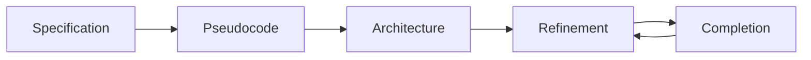

# Global Educator Nexus

**AI-Powered Native English Teacher & International School ESL/EFL Recruitment Platform**

이 프로젝트는 **영어 원어민 교사 전문 채용 플랫폼**으로, SPARC Framework를 사용하여 체계적으로 개발됩니다.

## 🎯 프로젝트 개요

- **타겟**: 영어 원어민 언어 강사 (ESL/EFL/IELTS/TOEFL) 및 국제학교 영어 교사
- **핵심 기능**: 비디오 이력서 AI 분석으로 **억양, 원어민 여부, 발음** 자동 검증
- **차별화 포인트**:
  - 🎯 억양 타입별 매칭 (미국/영국/호주)
  - 🛡️ 원어민 국적 기반 비자 자동 체크
  - 🤖 AI 기반 ESL 교사-학교 자동 매칭

## 🚀 SPARC Framework 사용 가이드

### SPARC란?
SPARC는 AI 기반 소프트웨어 개발을 위한 체계적인 방법론입니다:
- **S**pecification (명세)
- **P**seudocode (의사코드)
- **A**rchitecture (아키텍처)
- **R**efinement (개선)
- **C**ompletion (완성)

### 프로젝트 구조

```
aijox.com/
├── sparc/                  # SPARC CLI 툴 (서브모듈)
├── specification/          # SPARC 방법론 문서
│   ├── Specification.md    # 1단계: 프로젝트 명세
│   ├── Pseudocode.md       # 2단계: 의사코드 설계
│   ├── Architecture.md     # 3단계: 시스템 아키텍처
│   ├── Refinement.md       # 4단계: 개선 및 최적화
│   └── Completion.md       # 5단계: 완성 및 배포
├── .env.example            # 환경변수 템플릿
└── README.md               # 이 파일
```

## 📋 SPARC 시작하기

### 1. 환경 설정

#### API 키 설정
```bash
# .env.example을 .env로 복사
cp .env.example .env

# .env 파일 편집하여 API 키 입력
# ANTHROPIC_API_KEY 또는 OPENAI_API_KEY 중 하나는 필수
```

#### SPARC CLI 설치 (선택사항)
```bash
# 서브모듈에서 개발 모드로 설치
cd sparc
pip install -e .

# 또는 PyPI에서 설치
pip install sparc
```

### 2. SPARC 워크플로우

#### 방법 1: 문서 기반 접근 (권장)
각 단계별로 문서를 작성하며 프로젝트를 진행합니다:

```bash
# 1단계: specification/Specification.md 작성
# - 프로젝트 목표, 요구사항, 사용자 시나리오 정의

# 2단계: specification/Pseudocode.md 작성
# - 핵심 로직을 의사코드로 표현

# 3단계: specification/Architecture.md 작성
# - 시스템 구조, 기술 스택, 컴포넌트 설계

# 4단계: specification/Refinement.md 작성
# - 개선사항 기록 및 최적화

# 5단계: specification/Completion.md 작성
# - 테스트, 문서화, 배포 계획
```

#### 방법 2: SPARC CLI 사용
AI와 대화하며 자동으로 작업을 수행합니다:

```bash
# 코드 분석 (변경 없이 리서치만)
sparc -m "프로젝트 구조를 분석하고 개선점을 찾아줘" --research-only

# AI와 대화하며 작업
sparc -m "사용자 인증 기능을 추가해줘" --hil

# 대화형 모드
sparc --chat

# 특정 AI 모델 사용
sparc -m "코드 리뷰해줘" --provider anthropic --model claude-3-5-sonnet-20241022
```

### 3. SPARC CLI 주요 명령어

```bash
# 리서치 모드 (코드 변경 없음)
sparc -m "질문 또는 분석 요청" --research-only

# Human-in-the-loop (승인 후 실행)
sparc -m "작업 내용" --hil

# 특정 AI 제공자 사용
sparc -m "작업 내용" --provider anthropic
sparc -m "작업 내용" --provider openai --model gpt-4

# 대화형 모드
sparc --chat

# 전문가 모드 (복잡한 질문)
sparc -m "질문" --expert-provider openai --expert-model o1-preview
```

### 4. 안전한 사용을 위한 팁

✅ **권장사항**
- 항상 Git으로 버전 관리하기
- 처음에는 `--research-only` 또는 `--hil` 모드 사용
- 중요한 작업 전 백업 생성
- 변경사항을 커밋 전에 `git diff`로 확인

⚠️ **주의사항**
- `--cowboy-mode`는 매우 위험 (모든 승인 건너뜀)
- SPARC는 자동으로 코드를 수정하고 명령어를 실행할 수 있음
- 민감한 정보(API 키 등)를 커밋하지 않도록 주의

## 🔧 Claude Code CLI와 함께 사용

```bash
# Claude Code CLI에서 SPARC 활용
# 1. 문서 작성 요청
"specification/Specification.md 파일에 프로젝트 명세를 작성해줘"

# 2. SPARC CLI 실행
"sparc를 사용해서 코드베이스를 분석해줘"

# 3. 단계별 진행
"SPARC 2단계(Pseudocode)를 진행해줘"
```

## 📚 추가 리소스

- [SPARC Framework 문서](./sparc/README.md)
- [SPARC GitHub](https://github.com/ruvnet/sparc)
- [예제 프로젝트](./sparc/example/)

## 🤝 개발 워크플로우



## 📝 다음 단계

1. ✅ SPARC 환경 설정 완료
2. ⏳ `Global_Educator_Nexus.md` 파일 추가
3. ⏳ `specification/Specification.md` 작성 시작
4. ⏳ 프로젝트 개발 진행

---

**Note**: 이 프로젝트는 SPARC Framework를 사용하여 체계적이고 문서화된 개발 프로세스를 따릅니다.
