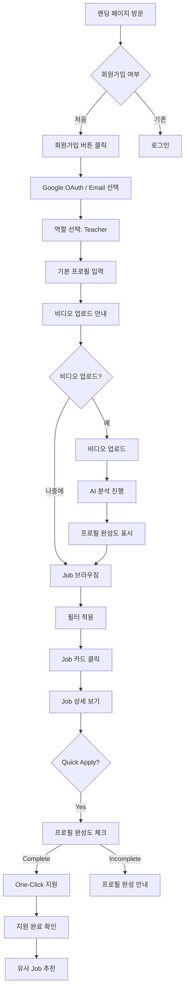
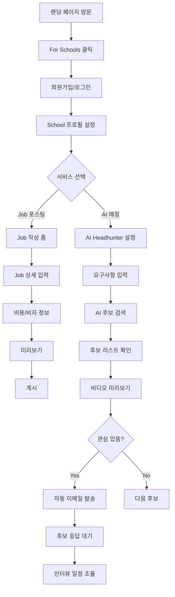

# Wellfound 완전 클론 명세서

**문서 목적**: Wellfound 홈페이지를 최대한 동일하게 재현하기 위한 상세 명세
**대상 플랫폼**: Global Educator Nexus (aijobx)
**작성일**: 2025-11-26
**버전**: 1.0

---

## 목차

1. [전체 페이지 구조](#1-전체-페이지-구조)
2. [섹션별 완전 명세](#2-섹션별-완전-명세)
3. [애니메이션 시스템](#3-애니메이션-시스템)
4. [색상 시스템](#4-색상-시스템)
5. [타이포그래피](#5-타이포그래피)
6. [네비게이션 구조](#6-네비게이션-구조)
7. [블로그 페이지 명세](#7-블로그-페이지-명세)
8. [반응형 브레이크포인트](#8-반응형-브레이크포인트)
9. [구현 코드](#9-구현-코드)

---

## 1. 전체 페이지 구조

### 1.1 섹션 순서 (위에서 아래로)

```
┌─────────────────────────────────────────────────────────────────┐
│ 1. ANNOUNCEMENT BAR (옵션)                                       │
├─────────────────────────────────────────────────────────────────┤
│ 2. NAVIGATION HEADER                                             │
├─────────────────────────────────────────────────────────────────┤
│ 3. HERO SECTION                                                  │
│    - Floating animated tags                                      │
│    - Main headline with rotating text                            │
│    - Subheadline                                                 │
│    - Dual CTA buttons                                            │
│    - Scroll indicator                                            │
├─────────────────────────────────────────────────────────────────┤
│ 4. SOCIAL PROOF SECTION                                          │
│    - Animated counters (3개)                                     │
│    - Partner logo carousel                                       │
├─────────────────────────────────────────────────────────────────┤
│ 5. VALUE PROPOSITION SECTION                                     │
│    - For Job Seekers (좌측)                                      │
│    - For Recruiters (우측)                                       │
├─────────────────────────────────────────────────────────────────┤
│ 6. AI FEATURE SECTION (Autopilot)                                │
│    - Feature description                                         │
│    - Dashboard preview                                           │
├─────────────────────────────────────────────────────────────────┤
│ 7. TESTIMONIALS SECTION                                          │
│    - User quotes (3-4개)                                         │
├─────────────────────────────────────────────────────────────────┤
│ 8. DUAL CTA CARDS SECTION                                        │
│    - Get Featured card                                           │
│    - Salary Calculator card                                      │
├─────────────────────────────────────────────────────────────────┤
│ 9. FEATURED BANNER (10 of 10)                                    │
├─────────────────────────────────────────────────────────────────┤
│ 10. BLOG/CONTENT LIST SECTION                                    │
│     - Job Collections                                            │
│     - Blog Posts                                                 │
├─────────────────────────────────────────────────────────────────┤
│ 11. FOOTER                                                       │
│     - Link dropdowns                                             │
│     - Multi-column links                                         │
│     - Social icons                                               │
└─────────────────────────────────────────────────────────────────┘
```

### 1.2 전체 레이아웃 그리드

```css
/* Container 설정 */
.container {
  max-width: 1280px;
  margin: 0 auto;
  padding: 0 24px;
}

/* 섹션 패딩 */
section {
  padding: 80px 0;  /* Desktop */
  padding: 48px 0;  /* Mobile */
}
```

---

## 2. 섹션별 완전 명세

### 2.1 Announcement Bar

**Wellfound 원본**:
```
┌─────────────────────────────────────────────────────────────────────────────┐
│ 🔔 Introducing Autopilot: Our expert recruiters backed by AI deliver       │
│    qualified candidates to your calendar.                     [Learn more] │
└─────────────────────────────────────────────────────────────────────────────┘
```

**스타일 명세**:
| 속성 | 값 |
|------|-----|
| 배경색 | `#2D1B54` (Deep Purple) |
| 텍스트 색상 | `#FFFFFF` |
| 높이 | `44px` |
| 폰트 크기 | `14px` |
| 폰트 무게 | `400` (본문), `600` (강조) |
| 패딩 | `12px 24px` |
| 아이콘 | Sparkle/Star emoji 또는 SVG |
| CTA 링크 | Underline on hover |
| 닫기 버튼 | `X` 아이콘, 우측 정렬 |

**aijobx 적용**:
```tsx
<AnnouncementBar
  icon="✨"
  highlight="AI Screener"
  message="Our AI analyzes your teaching videos and matches you with perfect schools instantly."
  ctaText="Try it free"
  ctaHref="/profile/video"
  backgroundColor="#1E3A8A"
/>
```

---

### 2.2 Navigation Header

**Wellfound 원본 구조**:
```
┌─────────────────────────────────────────────────────────────────────────────┐
│                                                                             │
│  [W: wellfound]     Discover ▼    For job seekers ▼    For companies ▼     │
│                                                          [Log In] [Sign Up]│
│                                                                             │
└─────────────────────────────────────────────────────────────────────────────┘
```

**스타일 명세**:
| 속성 | 값 |
|------|-----|
| 배경색 | `#FFFFFF` |
| 높이 | `72px` |
| 그림자 | 스크롤 시 `0 2px 8px rgba(0,0,0,0.08)` |
| 로고 크기 | `120px` width |
| 메뉴 간격 | `32px` |
| 메뉴 폰트 | `15px`, `500` |
| 메뉴 색상 | `#171717` |
| 메뉴 호버 | `#525252` |
| Log In 버튼 | Ghost style |
| Sign Up 버튼 | `#000000` 배경, `#FFFFFF` 텍스트 |

**드롭다운 메뉴 상세**:

```
Discover ▼
├─ Overview
├─ Startup Jobs
├─ Remote Jobs
├─ Web3 Jobs
├─ ───────────
├─ Browse by Location
│   ├─ San Francisco
│   ├─ New York
│   ├─ Los Angeles
│   └─ See all →
├─ Browse by Role
│   ├─ Engineering
│   ├─ Design
│   ├─ Product
│   └─ See all →
└─ Job Collections

For job seekers ▼
├─ Overview
├─ Find Jobs
├─ Salary Calculator
├─ ───────────
├─ Resources
│   ├─ Blog
│   ├─ Career Guides
│   └─ Interview Tips
└─ Get Featured

For companies ▼
├─ Overview
├─ Post a Job
├─ Browse Candidates
├─ ───────────
├─ Products
│   ├─ Curated
│   ├─ Sourcer
│   ├─ RecruiterCloud
│   └─ Autopilot
├─ Pricing
└─ Customer Stories
```

**aijobx 단순화 적용**:
```
Discover ▼                    For Teachers ▼              For Schools ▼
├─ Browse All Jobs            ├─ Find Jobs                ├─ Post a Job
├─ Jobs by Country            ├─ Upload Video Resume      ├─ Browse Teachers
│   ├─ Japan                  ├─ Visa Guide               ├─ AI Matching
│   ├─ South Korea            ├─ Salary Info              ├─ Pricing
│   ├─ China                  └─ Blog                     └─ Success Stories
│   ├─ UAE
│   └─ See all →
├─ Jobs by Subject
│   ├─ English/ESL
│   ├─ Math
│   ├─ Science
│   └─ See all →
└─ Job Collections
    ├─ Visa Sponsored
    ├─ International Schools
    └─ High Salary
```

---

### 2.3 Hero Section (핵심 섹션)

**Wellfound 원본**:
```
┌─────────────────────────────────────────────────────────────────────────────┐
│                                                                             │
│        [Flask]              [Remote]           [iOS]                        │
│                  [Python Developers]                    [Buyers]            │
│    [Los Angeles]                         [Artificial Intelligence]          │
│                                                                             │
│                                                                             │
│                    ┌───────────────────────────────┐                        │
│                    │  W:  Find what's next         │                        │
│                    └───────────────────────────────┘                        │
│                         ↑ 단어가 슬라이드 업으로 변경                        │
│                           (next → dream job → co-founder → talent)          │
│                                                                             │
│               Where startups and job seekers connect                        │
│                                                                             │
│            [Find your next hire]    [Find your next job]                    │
│                 (검정 배경)              (흰색 테두리)                        │
│                                                                             │
│                              ↓                                              │
│                        (스크롤 힌트)                                         │
│                                                                             │
└─────────────────────────────────────────────────────────────────────────────┘
```

**Floating Tags 상세**:

| 태그 텍스트 | 위치 | 크기 | 스타일 | 애니메이션 속도 |
|-------------|------|------|--------|----------------|
| Flask | top: 15%, left: 20% | Small | Border only | 2.5s |
| Remote | top: 20%, right: 25% | Medium | Pink accent bg | 3s |
| iOS | top: 10%, right: 15% | Small | Gray bg | 2s |
| Python Developers | top: 40%, left: 10% | Large | Border only | 4s |
| Los Angeles | bottom: 30%, left: 25% | Medium | Gray bg | 3.5s |
| Artificial Intelligence | top: 35%, right: 10% | Large | Border only | 3s |
| Buyers | top: 25%, left: 35% | Small | Gray bg | 2.5s |

**태그 스타일**:
```css
.floating-tag {
  padding: 8px 16px;
  border-radius: 20px;
  font-size: 14px;
  font-weight: 500;
  position: absolute;
  animation: float 3s ease-in-out infinite;
}

.floating-tag--border {
  border: 1px solid #E5E5E5;
  background: transparent;
}

.floating-tag--gray {
  background: #F5F5F5;
  border: none;
}

.floating-tag--accent {
  background: #FFE4E1;
  border: none;
}
```

**메인 헤드라인 애니메이션**:

```
"Find what's next"
        ↓
"Find your dream job"
        ↓
"Find your co-founder"
        ↓
"Find amazing talent"
        ↓
(반복)
```

**aijobx 적용**:

Floating Tags:
| 태그 | 위치 | 스타일 |
|------|------|--------|
| Japan | top-left | Border |
| South Korea | top-right | Gray bg |
| ESL Teaching | center-left | Border |
| Visa Sponsored | right | Pink accent |
| International Schools | bottom-left | Gray bg |
| High Salary | top-center | Border |
| IB Curriculum | bottom-right | Gray bg |

Rotating Headlines:
```
"Find your next teaching adventure"
        ↓
"Find your dream school"
        ↓
"Find visa-sponsored jobs"
        ↓
"Find opportunities worldwide"
```

---

### 2.4 Social Proof Section

**Wellfound 원본**:
```
┌─────────────────────────────────────────────────────────────────────────────┐
│                                                                             │
│          8M+                    150K+                    10M+               │
│      Matches Made             Tech Jobs          Startup Ready Candidates   │
│                                                                             │
├─────────────────────────────────────────────────────────────────────────────┤
│                                                                             │
│  [DoorDash] [Roblox] [Honey] [Peloton] [IFTTT] [Airtable] [Plaid] [...]    │
│                                                                             │
│                    "Startups who used our platform"                         │
│                                                                             │
└─────────────────────────────────────────────────────────────────────────────┘
```

**숫자 스타일**:
| 속성 | 값 |
|------|-----|
| 폰트 크기 | `72px` (Desktop), `48px` (Mobile) |
| 폰트 무게 | `700` |
| 색상 | `#171717` |
| 라벨 크기 | `16px` |
| 라벨 색상 | `#525252` |
| 간격 | `80px` between items |

**로고 캐러셀**:
- 자동 스크롤 (무한 루프)
- 호버 시 일시정지
- 로고 높이: `32px`
- 로고 간격: `48px`
- 그레이스케일 → 호버 시 컬러

**aijobx 적용**:
```
     10,000+                   500+                      50+
  Teachers Placed         Partner Schools            Countries
```

Partner Schools:
- International School of Bangkok
- German School Seoul
- American School in Japan
- Dubai American Academy
- etc.

---

### 2.5 Value Proposition Section (2열 레이아웃)

**Wellfound 원본**:
```
┌────────────────────────────────┬────────────────────────────────┐
│                                │                                │
│  Questions?                    │  Need talent?                  │
│  Why job seekers love us       │  Why recruiters love us        │
│                                │                                │
│  ✓ Connect directly with       │  ✓ Tap into a community of    │
│    founders at top startups    │    10M+ engaged, startup-ready │
│    - no third party            │    candidates                  │
│    recruiters allowed.         │                                │
│                                │  ✓ Everything you need to      │
│  ✓ Everything you need to      │    kickstart your recruiting   │
│    know, all upfront. View     │    — set up job posts, company │
│    salary, stock options,      │    branding, and HR tools      │
│    and more before you apply.  │    within 10 minutes, all      │
│                                │    for free.                   │
│  ✓ Say goodbye to cover        │                                │
│    letters - your profile is   │  ✓ A free applicant tracking   │
│    all you need. And apply     │    system, or free integration │
│    to jobs with just one       │    with any ATS you already    │
│    click.                      │    use.                        │
│                                │                                │
│  ✓ Unique jobs at startups     │  ✓ Go totally fee-free hiring  │
│    and tech companies you      │    with Wellfound Discover, or │
│    can't find anywhere else.   │    let us handle the heavy-    │
│                                │    lifting with RecruiterCloud │
│                                │    and source candidates in a  │
│                                │    matter of days.             │
│                                │                                │
│  [Learn more] [Sign up]        │  [Learn more] [Sign up]        │
│                                │                                │
│  배경: #FFFFFF                  │  배경: #FAFAFA                 │
│                                │                                │
└────────────────────────────────┴────────────────────────────────┘
```

**스타일 명세**:

| 요소 | 좌측 (Job Seekers) | 우측 (Recruiters) |
|------|-------------------|-------------------|
| 배경색 | `#FFFFFF` | `#FAFAFA` |
| 라벨 | 14px, uppercase, `#737373` | 14px, uppercase, `#737373` |
| 제목 | 32px, bold, `#171717` | 32px, bold, `#171717` |
| 체크마크 | `#22C55E` (green) | `#22C55E` (green) |
| 본문 | 16px, `#525252` | 16px, `#525252` |
| Learn more | Text link, underline | Text link, underline |
| Sign up | Black button | Black button |

**aijobx 적용**:

좌측 (For Teachers):
```
Looking for your next adventure?
Why teachers love us

✓ Video Resume First
  Stand out with your personality, not just paper. Schools see the
  real you before the first interview.

✓ AI-Powered Matching
  Our AI analyzes your teaching style and experience to match you
  with schools looking for exactly what you offer.

✓ Visa Support Guaranteed
  Every listing shows visa sponsorship status clearly. No surprises,
  no wasted applications, no hidden requirements.

✓ Global Opportunities
  Access teaching positions in 50+ countries that you won't find on
  generic job boards. ESL, IB, and international schools.

[Learn more] [Create Profile]
```

우측 (For Schools):
```
Hiring international teachers?
Why schools love us

✓ See Candidates in Action
  Watch video introductions before scheduling interviews. Know teaching
  style and classroom presence from day one.

✓ AI Headhunter
  Let our AI find qualified teachers automatically. Get personalized
  outreach sent to matching candidates on your behalf.

✓ Verified Credentials
  All teachers have verified qualifications, background checks, and
  professional references. Quality guaranteed.

✓ Global Talent Pool
  Access 10,000+ teachers from 100+ countries, all actively seeking
  international positions. Fresh candidates daily.

[Learn more] [Post a Job]
```

---

### 2.6 AI Feature Section (Autopilot)

**Wellfound 원본**:
```
┌─────────────────────────────────────────────────────────────────────────────┐
│                                                                             │
│  ┌───────────────────────────────────────────────────────────────────────┐  │
│  │                                                                       │  │
│  │  Meet Autopilot:                                                      │  │
│  │  Wellfound's AI recruiter              ┌─────────────────────────┐    │  │
│  │                                        │                         │    │  │
│  │  Just tell us what you need.           │  Your qualified         │    │  │
│  │  Our expert recruiters backed          │  candidate review list  │    │  │
│  │  by AI deliver qualified               │                         │    │  │
│  │  candidates to your calendar.          │  [👤] [👤] [👤] [👤]    │    │  │
│  │                                        │                         │    │  │
│  │  All at a fraction of the              │  ┌─────────────────┐    │    │  │
│  │  cost of an agency.                    │  │ Sarah Johnson   │    │    │  │
│  │                                        │  │ Product Designer│    │    │  │
│  │  [Learn more]                          │  │ ⭐ 92% Match    │    │    │  │
│  │                                        │  │ [Schedule]      │    │    │  │
│  │                                        │  └─────────────────┘    │    │  │
│  │                                        └─────────────────────────┘    │  │
│  │                                                                       │  │
│  │  배경: Gradient #2D1B54 → #4A1942                                    │  │
│  │  텍스트: #FFFFFF                                                      │  │
│  │                                                                       │  │
│  └───────────────────────────────────────────────────────────────────────┘  │
│                                                                             │
└─────────────────────────────────────────────────────────────────────────────┘
```

**스타일 명세**:
| 속성 | 값 |
|------|-----|
| 배경 | `linear-gradient(135deg, #2D1B54 0%, #4A1942 100%)` |
| 컨테이너 radius | `24px` |
| 패딩 | `64px` |
| 제목 크기 | `14px` uppercase (Meet Autopilot:) |
| 부제목 크기 | `40px` bold |
| 본문 크기 | `18px` |
| 텍스트 색상 | `#FFFFFF` |
| CTA 버튼 | White outline |
| 대시보드 프리뷰 | White card, shadow, rounded |

**aijobx 적용**:
```tsx
<section className="py-16">
  <div className="container">
    <div className="bg-gradient-to-br from-blue-900 to-indigo-900 rounded-3xl p-16 text-white">
      <div className="grid md:grid-cols-2 gap-12 items-center">
        <div>
          <p className="text-sm uppercase tracking-wider mb-2 text-blue-300">
            Meet AI Screener
          </p>
          <h2 className="text-4xl font-bold mb-6">
            Your 24/7 Video Analysis Assistant
          </h2>
          <p className="text-xl mb-6 text-white/80">
            Upload teacher videos. Get instant AI analysis of teaching style,
            communication skills, and classroom presence. Structured feedback
            in minutes, not days.
          </p>
          <ul className="space-y-3 mb-8">
            <li className="flex items-center gap-3">
              <CheckCircle className="h-5 w-5 text-green-400" />
              <span>Analyze teaching demonstrations</span>
            </li>
            <li className="flex items-center gap-3">
              <CheckCircle className="h-5 w-5 text-green-400" />
              <span>Score presentation and engagement</span>
            </li>
            <li className="flex items-center gap-3">
              <CheckCircle className="h-5 w-5 text-green-400" />
              <span>Generate personalized reports</span>
            </li>
          </ul>
          <Button variant="outline" className="border-white text-white">
            Try AI Screener Free
          </Button>
        </div>

        {/* Dashboard Preview */}
        <div className="bg-white rounded-xl shadow-2xl p-6 text-gray-900">
          <h3 className="font-semibold text-lg mb-4">AI Screening Results</h3>
          <div className="flex gap-2 mb-4">
            {[1,2,3,4].map(i => (
              <div key={i} className="w-10 h-10 rounded-full bg-gray-200" />
            ))}
            <div className="w-10 h-10 rounded-full bg-gray-100 flex items-center justify-center text-sm">
              +12
            </div>
          </div>
          <div className="border rounded-lg p-4">
            <div className="flex items-center gap-3 mb-2">
              <div className="w-12 h-12 rounded-full bg-blue-100" />
              <div>
                <p className="font-semibold">Sarah Johnson</p>
                <p className="text-sm text-gray-500">ESL Teacher • 5 yrs exp</p>
              </div>
            </div>
            <div className="flex items-center gap-2 mb-3">
              <span className="text-green-600 font-semibold">92% Match</span>
              <Badge>Visa Ready</Badge>
            </div>
            <Button className="w-full">Schedule Interview</Button>
          </div>
        </div>
      </div>
    </div>
  </div>
</section>
```

---

### 2.7 Testimonials Section

**Wellfound 원본**:
```
┌─────────────────────────────────────────────────────────────────────────────┐
│                                                                             │
│                           From our users                                    │
│                                                                             │
│  ┌─────────────────────┐ ┌─────────────────────┐ ┌─────────────────────┐   │
│  │         "           │ │         "           │ │         "           │   │
│  │                     │ │                     │ │                     │   │
│  │  I love Wellfound.  │ │  I can't imagine    │ │  Half of the        │   │
│  │  I got my current   │ │  my day to day      │ │  offers I give are  │   │
│  │  job at a startup   │ │  without this       │ │  sourced from       │   │
│  │  entirely through   │ │  platform. Life     │ │  Wellfound. It's    │   │
│  │  the site last      │ │  would be a lot     │ │  the best product   │   │
│  │  year - it's super  │ │  more difficult.    │ │  for anyone looking │   │
│  │  easy to use and    │ │                     │ │  for startup        │   │
│  │  I love the UI.     │ │                     │ │  talent.            │   │
│  │                     │ │                     │ │                     │   │
│  └─────────────────────┘ └─────────────────────┘ └─────────────────────┘   │
│                                                                             │
└─────────────────────────────────────────────────────────────────────────────┘
```

**카드 스타일**:
| 속성 | 값 |
|------|-----|
| 배경색 | `#FFFFFF` |
| Border | `1px solid #E5E5E5` |
| Border Radius | `16px` |
| Padding | `32px` |
| Quote Icon | `48px`, `#E5E5E5` |
| Quote 텍스트 | `18px`, `#171717` |
| Line Height | `1.6` |
| Shadow | None (기본), `0 8px 24px rgba(0,0,0,0.1)` (호버) |

**aijobx 적용**:
```tsx
const testimonials = [
  {
    quote: "I found my dream teaching job in Tokyo within 3 weeks. The video resume feature helped me stand out - the school loved seeing my teaching style before the interview.",
    author: "Sarah M.",
    role: "ESL Teacher, Japan"
  },
  {
    quote: "As a recruiter, the AI matching saves me 10+ hours every week. Instead of reviewing hundreds of resumes, I get pre-qualified candidates with video introductions.",
    author: "Park Ji-hoon",
    role: "HR Director, GSIS Seoul"
  },
  {
    quote: "The visa guidance was invaluable. I knew exactly what documents I needed, and the school handled my work permit smoothly. No surprises.",
    author: "David L.",
    role: "Math Teacher, Dubai"
  },
  {
    quote: "Best platform for international teaching jobs. The salary transparency alone makes it worth using - no more guessing games about compensation.",
    author: "Emma K.",
    role: "IB Teacher, Singapore"
  }
];
```

---

### 2.8 Dual CTA Cards Section

**Wellfound 원본**:
```
┌─────────────────────────────────────────────────────────────────────────────┐
│                                                                             │
│  ┌─────────────────────────────┐   ┌─────────────────────────────┐         │
│  │                             │   │                             │         │
│  │  Get Featured               │   │  Salary Calculator          │         │
│  │  ─────────────              │   │  ─────────────────          │         │
│  │  Let us show you off        │   │  Know your worth            │         │
│  │                             │   │                             │         │
│  │  [Illustration:             │   │  Use our salary             │         │
│  │   People standing]          │   │  calculator to find your    │         │
│  │                             │   │  salary range and be        │         │
│  │                             │   │  prepared for your next     │         │
│  │                             │   │  negotiation.               │         │
│  │                             │   │                             │         │
│  │  [Join here →]              │   │  [Calculate]                │         │
│  │                             │   │                             │         │
│  │  배경: #FFF0EB (Peach)      │   │  배경: #FFF8E7 (Cream)      │         │
│  │                             │   │                             │         │
│  └─────────────────────────────┘   └─────────────────────────────┘         │
│                                                                             │
└─────────────────────────────────────────────────────────────────────────────┘
```

**스타일 명세**:
| 속성 | 좌측 카드 | 우측 카드 |
|------|----------|----------|
| 배경색 | `#FFF0EB` | `#FFF8E7` |
| Border Radius | `24px` | `24px` |
| Padding | `48px` | `48px` |
| 라벨 | 12px, uppercase, bold | 12px, uppercase, bold |
| 제목 | 28px, bold | 28px, bold |
| 본문 | 16px | 16px |
| CTA | Text link with arrow | Button |

**aijobx 적용**:
```
┌─────────────────────────────┐   ┌─────────────────────────────┐
│  For Teachers               │   │  For Schools                │
│  ───────────────            │   │  ─────────────              │
│  Stand Out with Video       │   │  Find Perfect Matches       │
│                             │   │                             │
│  [Video camera illustration]│   │  [AI matching illustration] │
│                             │   │                             │
│  Upload your video resume   │   │  Let our AI find teachers   │
│  and let schools see the    │   │  matching your exact        │
│  real you before the        │   │  requirements. Save hours   │
│  interview.                 │   │  of sourcing time.          │
│                             │   │                             │
│  [Upload Video →]           │   │  [Start Matching]           │
│                             │   │                             │
│  배경: #EFF6FF (Light Blue) │   │  배경: #FEF3C7 (Light Amber)│
└─────────────────────────────┘   └─────────────────────────────┘
```

---

### 2.9 Featured Banner (10 of 10)

**Wellfound 원본**:
```
┌─────────────────────────────────────────────────────────────────────────────┐
│                                                                             │
│  ┌───────────────────────────────────────────────────────────────────────┐  │
│  │                                                                       │  │
│  │   [wellfound logo]                                                    │  │
│  │   10 of 10                 Our top picks for 2025 are here...        │  │
│  │   in 2025                                                             │  │
│  │                            Wellfound has selected 10 startups across │  │
│  │   ★★★★★                   10 trending industries that should be on   │  │
│  │                            your radar in 2025. See what teams our    │  │
│  │                            community is most excited about in the    │  │
│  │                            year ahead!                                │  │
│  │                                                                       │  │
│  │                            [Explore 10 of 10]                         │  │
│  │                                                                       │  │
│  │   배경: Gradient (Dark Purple #2D1B54 → Wine #6B2449)                │  │
│  │                                                                       │  │
│  └───────────────────────────────────────────────────────────────────────┘  │
│                                                                             │
└─────────────────────────────────────────────────────────────────────────────┘
```

**aijobx 적용**:
```tsx
<section className="py-12">
  <div className="container">
    <Card className="bg-gradient-to-r from-blue-900 via-indigo-900 to-purple-900 text-white border-0 p-12 rounded-3xl">
      <div className="grid md:grid-cols-2 gap-8 items-center">
        <div>
          <p className="text-6xl font-bold mb-2">Top 10</p>
          <p className="text-2xl mb-4">Teaching Destinations<br/>for 2025</p>
          <div className="flex text-amber-400">
            {[1,2,3,4,5].map(i => <Star key={i} className="h-5 w-5 fill-current" />)}
          </div>
        </div>
        <div>
          <p className="text-xl mb-6 text-white/90">
            We've analyzed salary data, visa policies, cost of living, and teacher
            satisfaction to bring you the definitive ranking of the best countries
            for teaching abroad in 2025.
          </p>
          <Button variant="outline" className="border-white text-white hover:bg-white hover:text-blue-900">
            Explore Rankings →
          </Button>
        </div>
      </div>
    </Card>
  </div>
</section>
```

---

### 2.10 Blog/Content List Section

**Wellfound 원본**:
```
┌─────────────────────────────────────────────────────────────────────────────┐
│                                                                             │
│  At a loss where to begin?                                                  │
│                                                                             │
│  ┌──────────────────────────────────────────────────────────────────────┐  │
│  │ Job Collection    20 Women-Led Startups Expanding Their      [→]    │  │
│  │                   Remote Teams in 2022                               │  │
│  │                   We're showcasing how five female-led pre-seed...   │  │
│  └──────────────────────────────────────────────────────────────────────┘  │
│  ┌──────────────────────────────────────────────────────────────────────┐  │
│  │ Job Collection    19 Hot Crypto Startups Hiring Remotely     [→]    │  │
│  │                   in 2022                                            │  │
│  │                   Crypto has had a great 10 years, as the decen...   │  │
│  └──────────────────────────────────────────────────────────────────────┘  │
│  ┌──────────────────────────────────────────────────────────────────────┐  │
│  │ Blog Post         The Truth About Finding Your First         [⚡]   │  │
│  │                   Engineering Job                                    │  │
│  │                   Gate 10, where engineers job searches can be...    │  │
│  └──────────────────────────────────────────────────────────────────────┘  │
│  ┌──────────────────────────────────────────────────────────────────────┐  │
│  │ Blog Post         Why Remote Work Is The Future              [⚡]   │  │
│  │                   It feels like the rise of remote work has been...  │  │
│  └──────────────────────────────────────────────────────────────────────┘  │
│                                                                             │
└─────────────────────────────────────────────────────────────────────────────┘
```

**리스트 아이템 스타일**:
| 속성 | 값 |
|------|-----|
| 배경색 | `#FFFFFF` |
| Border Bottom | `1px solid #E5E5E5` |
| Padding | `24px 0` |
| Badge 색상 | `#F5F5F5` 배경, `#525252` 텍스트 |
| 제목 크기 | `18px`, bold |
| 설명 크기 | `14px`, `#737373` |
| 아이콘 | `→` (Collection), `⚡` (Blog) |
| Hover | 배경 `#FAFAFA` |

**aijobx 적용**:
```tsx
const featuredContent = [
  {
    type: "collection",
    title: "50 Schools Offering Visa Sponsorship in Japan",
    description: "Complete list of international schools actively sponsoring work visas for 2025...",
    href: "/collections/japan-visa-sponsored"
  },
  {
    type: "collection",
    title: "Top IB Schools Hiring for 2025-2026 Academic Year",
    description: "Premium International Baccalaureate schools with competitive salary packages...",
    href: "/collections/ib-schools-2025"
  },
  {
    type: "guide",
    title: "Complete Guide to E-2 Teaching Visa in South Korea",
    description: "Step-by-step visa requirements, application process, and timeline for 2025...",
    href: "/guides/korea-e2-visa"
  },
  {
    type: "blog",
    title: "How I Landed a $60,000 Teaching Job in Dubai",
    description: "One teacher's journey from application to signing a tax-free contract...",
    href: "/blog/dubai-teaching-job-story"
  },
  {
    type: "blog",
    title: "5 Mistakes to Avoid in Your Teaching Demo Video",
    description: "Common pitfalls that cost teachers their dream international positions...",
    href: "/blog/video-demo-mistakes"
  }
];
```

---

### 2.11 Footer

**Wellfound 원본 구조**:
```
┌─────────────────────────────────────────────────────────────────────────────┐
│                                                                             │
│  [Job Collections ▼] [Remote Jobs ▼] [Jobs by Location ▼] [Jobs by Role ▼] │
│                                                                             │
├─────────────────────────────────────────────────────────────────────────────┤
│                                                                             │
│  wellfound.ai                                                               │
│                                                                             │
│  For Candidates        For Recruiters        Company                        │
│  ─────────────        ──────────────        ───────                        │
│  Overview             Recruit                About                          │
│  Startup Jobs         Curated                Help                           │
│  Web3 Jobs            Sourcer                Blog                           │
│  Featured             Pricing                Careers (We're hiring!)        │
│  Salary Calculator    Customer Stories       Terms & Risks                  │
│                                              Privacy Policy                 │
│                                                                             │
│  [Twitter] [LinkedIn] [Instagram]                                           │
│                                                                             │
│  배경: #171717                                                              │
│  텍스트: #A3A3A3 (링크), #FFFFFF (제목)                                     │
│                                                                             │
└─────────────────────────────────────────────────────────────────────────────┘
```

**aijobx 적용**:
```tsx
const footerConfig = {
  dropdowns: [
    {
      label: "Jobs by Country",
      items: ["Japan", "South Korea", "China", "UAE", "Thailand", "Vietnam", "See all"]
    },
    {
      label: "Jobs by Subject",
      items: ["ESL/English", "Math", "Science", "IB Programs", "Elementary", "See all"]
    },
    {
      label: "Job Collections",
      items: ["Visa Sponsored", "High Salary", "International Schools", "Language Schools"]
    }
  ],
  columns: {
    forTeachers: {
      title: "For Teachers",
      links: [
        { label: "Find Jobs", href: "/jobs" },
        { label: "Video Resume", href: "/profile/video" },
        { label: "Visa Guide", href: "/resources/visa" },
        { label: "Salary Info", href: "/resources/salary" },
        { label: "Blog", href: "/blog" }
      ]
    },
    forSchools: {
      title: "For Schools",
      links: [
        { label: "Post a Job", href: "/recruiter/post" },
        { label: "Browse Teachers", href: "/recruiter/browse" },
        { label: "AI Matching", href: "/recruiter/ai" },
        { label: "Pricing", href: "/pricing" },
        { label: "Success Stories", href: "/case-studies" }
      ]
    },
    company: {
      title: "Company",
      links: [
        { label: "About", href: "/about" },
        { label: "Contact", href: "/contact" },
        { label: "Careers", href: "/careers", badge: "Hiring!" },
        { label: "Help Center", href: "/help" },
        { label: "Terms", href: "/terms" },
        { label: "Privacy", href: "/privacy" }
      ]
    }
  },
  social: [
    { icon: "twitter", href: "https://twitter.com/..." },
    { icon: "linkedin", href: "https://linkedin.com/..." },
    { icon: "instagram", href: "https://instagram.com/..." }
  ]
};
```

---

## 3. 애니메이션 시스템

### 3.1 사용하는 애니메이션 종류

| 애니메이션 | 사용 위치 | 라이브러리 | 트리거 |
|------------|----------|-----------|--------|
| **Text Slide Up** | Hero headline | GSAP/Framer | 페이지 로드 |
| **Text Rotation** | Hero rotating words | GSAP | 자동 (3초 간격) |
| **Float/Bob** | Floating tags | CSS/GSAP | 무한 반복 |
| **Parallax** | Floating tags | GSAP | 마우스 이동 |
| **Count Up** | Social proof numbers | GSAP | Scroll trigger |
| **Fade In Up** | 모든 섹션 | GSAP | Scroll trigger |
| **Logo Slide** | Partner logos | CSS | 자동 무한 |
| **Card Hover** | 모든 카드 | CSS | 호버 |
| **Dropdown** | Navigation | Framer | 클릭 |

### 3.2 애니메이션 코드

#### Hero Text Animation
```typescript
// lib/animations/hero.ts
import gsap from 'gsap';
import { SplitText } from 'gsap/SplitText';

gsap.registerPlugin(SplitText);

export const animateHeroHeadline = (element: HTMLElement) => {
  const split = new SplitText(element, { type: "chars, words" });

  gsap.from(split.chars, {
    y: 100,
    opacity: 0,
    duration: 0.8,
    stagger: 0.02,
    ease: "power4.out",
    delay: 0.5
  });
};

export const animateRotatingText = (
  element: HTMLElement,
  words: string[],
  interval: number = 3000
) => {
  let currentIndex = 0;

  const animate = () => {
    gsap.to(element, {
      y: -30,
      opacity: 0,
      duration: 0.4,
      ease: "power2.in",
      onComplete: () => {
        currentIndex = (currentIndex + 1) % words.length;
        element.textContent = words[currentIndex];
        gsap.fromTo(element,
          { y: 30, opacity: 0 },
          { y: 0, opacity: 1, duration: 0.4, ease: "power2.out" }
        );
      }
    });
  };

  setInterval(animate, interval);
};
```

#### Floating Tags Animation
```typescript
// lib/animations/floating-tags.ts
import gsap from 'gsap';

export const animateFloatingTags = (container: HTMLElement) => {
  const tags = container.querySelectorAll('.floating-tag');

  // Bob animation (위아래)
  tags.forEach((tag, index) => {
    const duration = 2 + Math.random() * 2; // 2-4초
    const yDistance = 10 + Math.random() * 15; // 10-25px
    const delay = Math.random() * 2;

    gsap.to(tag, {
      y: `+=${yDistance}`,
      duration,
      repeat: -1,
      yoyo: true,
      ease: "sine.inOut",
      delay
    });
  });
};

export const addParallaxToTags = (container: HTMLElement) => {
  const tags = container.querySelectorAll('.floating-tag');

  const handleMouseMove = (e: MouseEvent) => {
    const { clientX, clientY } = e;
    const centerX = window.innerWidth / 2;
    const centerY = window.innerHeight / 2;

    tags.forEach((tag, index) => {
      const depth = 0.01 + (index % 5) * 0.005; // 다양한 깊이
      const moveX = (clientX - centerX) * depth;
      const moveY = (clientY - centerY) * depth;

      gsap.to(tag, {
        x: moveX,
        y: moveY,
        duration: 0.6,
        ease: "power2.out"
      });
    });
  };

  window.addEventListener('mousemove', handleMouseMove);
  return () => window.removeEventListener('mousemove', handleMouseMove);
};
```

#### Count Up Animation
```typescript
// lib/animations/count-up.ts
import gsap from 'gsap';
import { ScrollTrigger } from 'gsap/ScrollTrigger';

gsap.registerPlugin(ScrollTrigger);

export const animateCountUp = (
  element: HTMLElement,
  target: number,
  suffix: string = ''
) => {
  const counter = { value: 0 };

  gsap.to(counter, {
    value: target,
    duration: 2.5,
    ease: "power2.out",
    scrollTrigger: {
      trigger: element,
      start: "top 80%",
      once: true
    },
    onUpdate: () => {
      const value = Math.floor(counter.value);
      const formatted = value >= 1000000
        ? (value / 1000000).toFixed(1) + 'M'
        : value >= 1000
          ? (value / 1000).toFixed(0) + 'K'
          : value.toString();
      element.textContent = formatted + suffix;
    }
  });
};
```

#### Scroll Reveal Animation
```typescript
// lib/animations/scroll-reveal.ts
import gsap from 'gsap';
import { ScrollTrigger } from 'gsap/ScrollTrigger';

gsap.registerPlugin(ScrollTrigger);

export const setupScrollReveal = () => {
  // 모든 섹션에 fade-in-up 적용
  gsap.utils.toArray('.reveal').forEach((element: any) => {
    gsap.from(element, {
      y: 60,
      opacity: 0,
      duration: 1,
      ease: "power3.out",
      scrollTrigger: {
        trigger: element,
        start: "top 85%",
        once: true
      }
    });
  });
};
```

#### Logo Carousel Animation
```css
/* CSS-only infinite scroll */
.logo-carousel {
  display: flex;
  animation: scroll 30s linear infinite;
}

.logo-carousel:hover {
  animation-play-state: paused;
}

@keyframes scroll {
  0% {
    transform: translateX(0);
  }
  100% {
    transform: translateX(-50%);
  }
}
```

#### Card Hover Animation
```css
.card-hover {
  transition: transform 0.3s ease, box-shadow 0.3s ease;
}

.card-hover:hover {
  transform: translateY(-8px);
  box-shadow: 0 20px 40px rgba(0, 0, 0, 0.12);
}
```

---

## 4. 색상 시스템

### 4.1 Wellfound 원본 색상

```scss
// Primary Colors
$black: #000000;
$white: #FFFFFF;

// Grays (Neutral Scale)
$gray-50: #FAFAFA;
$gray-100: #F5F5F5;
$gray-200: #E5E5E5;
$gray-300: #D4D4D4;
$gray-400: #A3A3A3;
$gray-500: #737373;
$gray-600: #525252;
$gray-700: #404040;
$gray-800: #262626;
$gray-900: #171717;

// Accent Colors
$purple-deep: #2D1B54;      // Feature sections
$purple-wine: #4A1942;      // Gradients
$pink-peach: #FFF0EB;       // CTA cards
$amber-cream: #FFF8E7;      // CTA cards
$pink-accent: #FFE4E1;      // Tags

// Semantic
$success: #22C55E;
$warning: #F59E0B;
$error: #EF4444;
$info: #3B82F6;
```

### 4.2 aijobx 적용 색상

```scss
// Brand Colors (교육 테마)
$brand-primary: #1E40AF;     // Royal Blue (신뢰, 전문성)
$brand-secondary: #059669;   // Emerald (성장, 기회)
$brand-accent: #F59E0B;      // Amber (따뜻함)

// Deep Accent (Feature sections)
$deep-blue: #1E3A8A;
$deep-indigo: #312E81;
$deep-purple: #4C1D95;

// Light Accent (CTA cards)
$light-blue: #EFF6FF;
$light-amber: #FEF3C7;
$light-green: #ECFDF5;
$light-pink: #FDF2F8;

// Tag Colors
$tag-japan: #FECACA;        // Red-ish
$tag-korea: #BFDBFE;        // Blue-ish
$tag-visa: #D1FAE5;         // Green-ish
$tag-salary: #FDE68A;       // Yellow-ish

// Keep Wellfound's gray scale (동일하게 유지)
```

### 4.3 Tailwind 설정

```javascript
// tailwind.config.js
module.exports = {
  theme: {
    extend: {
      colors: {
        // Brand
        brand: {
          primary: '#1E40AF',
          secondary: '#059669',
          accent: '#F59E0B',
        },
        // Deep (Feature sections)
        deep: {
          blue: '#1E3A8A',
          indigo: '#312E81',
          purple: '#4C1D95',
        },
        // Wellfound-style neutrals
        neutral: {
          50: '#FAFAFA',
          100: '#F5F5F5',
          200: '#E5E5E5',
          300: '#D4D4D4',
          400: '#A3A3A3',
          500: '#737373',
          600: '#525252',
          700: '#404040',
          800: '#262626',
          900: '#171717',
        },
      },
    },
  },
};
```

---

## 5. 타이포그래피

### 5.1 Font Stack

```css
/* Wellfound과 동일한 시스템 폰트 */
font-family: -apple-system, BlinkMacSystemFont, "Segoe UI", Roboto,
             Oxygen-Sans, Ubuntu, Cantarell, "Helvetica Neue", sans-serif;
```

### 5.2 Type Scale

| 용도 | Desktop | Mobile | Weight | Line Height |
|------|---------|--------|--------|-------------|
| Display (Hero) | 72px | 48px | 700 | 1.1 |
| H1 | 48px | 36px | 700 | 1.2 |
| H2 | 36px | 28px | 700 | 1.2 |
| H3 | 24px | 20px | 600 | 1.3 |
| H4 | 20px | 18px | 600 | 1.4 |
| Body Large | 18px | 16px | 400 | 1.6 |
| Body | 16px | 16px | 400 | 1.6 |
| Body Small | 14px | 14px | 400 | 1.5 |
| Caption | 12px | 12px | 400 | 1.4 |
| Label | 12px | 12px | 600 | 1.2 |

### 5.3 Tailwind Typography

```javascript
// tailwind.config.js
module.exports = {
  theme: {
    extend: {
      fontSize: {
        'display': ['72px', { lineHeight: '1.1', fontWeight: '700' }],
        'display-mobile': ['48px', { lineHeight: '1.1', fontWeight: '700' }],
      },
    },
  },
};
```

---

## 6. 네비게이션 구조

### 6.1 단순화된 메뉴 구조

**Wellfound (복잡)**:
- Discover (7+ items)
- For job seekers (5+ items)
- For companies (8+ items)
- 총 ~20개 메뉴 항목

**aijobx (단순화)**:
- Discover (5 items)
- For Teachers (4 items)
- For Schools (4 items)
- 총 13개 메뉴 항목

### 6.2 최종 메뉴 구조

```
┌─────────────────────────────────────────────────────────────────────────────┐
│                                                                             │
│  [🎓 TeachGlobal]     Discover ▼     For Teachers ▼     For Schools ▼      │
│                                                          [Log In] [Sign Up]│
│                                                                             │
└─────────────────────────────────────────────────────────────────────────────┘

Discover ▼
├─ Browse All Jobs
├─ Jobs by Country
├─ Jobs by Subject
├─ Job Collections
└─ Interactive Map

For Teachers ▼
├─ Find Jobs
├─ Upload Video Resume
├─ Visa Guide
└─ Blog

For Schools ▼
├─ Post a Job
├─ AI Teacher Matching
├─ Pricing
└─ Success Stories
```

---

## 7. 블로그 페이지 명세

### 7.1 블로그 리스트 페이지 (`/blog`)

**레이아웃**:
```
┌─────────────────────────────────────────────────────────────────────────────┐
│ Navigation                                                                  │
├─────────────────────────────────────────────────────────────────────────────┤
│                                                                             │
│  Blog                                                                       │
│  Insights, guides, and stories for international educators                  │
│                                                                             │
├─────────────────────────────────────────────────────────────────────────────┤
│                                                                             │
│  [All] [Visa Guides] [Country Guides] [Career Tips] [Success Stories]       │
│                                                                             │
├─────────────────────────────────────────────────────────────────────────────┤
│                                                                             │
│  Featured Post (큰 카드)                                                    │
│  ┌─────────────────────────────────────────────────────────────────────┐   │
│  │ [Large Image]                                                       │   │
│  │                                                                     │   │
│  │ VISA GUIDE                                                          │   │
│  │ Complete Guide to Teaching Visas in Japan 2025                      │   │
│  │ Everything you need to know about the Instructor visa, requirements,│   │
│  │ and application process...                                          │   │
│  │                                                                     │   │
│  │ Dec 15, 2024 • 12 min read                                          │   │
│  └─────────────────────────────────────────────────────────────────────┘   │
│                                                                             │
├─────────────────────────────────────────────────────────────────────────────┤
│                                                                             │
│  Recent Posts (3열 그리드)                                                  │
│  ┌───────────────┐ ┌───────────────┐ ┌───────────────┐                     │
│  │ [Image]       │ │ [Image]       │ │ [Image]       │                     │
│  │               │ │               │ │               │                     │
│  │ COUNTRY GUIDE │ │ CAREER TIPS   │ │ SUCCESS STORY │                     │
│  │ Teaching in   │ │ 5 Mistakes    │ │ How I Landed  │                     │
│  │ South Korea:  │ │ in Your Video │ │ My Dream Job  │                     │
│  │ 2025 Guide    │ │ Demo          │ │ in Dubai      │                     │
│  │               │ │               │ │               │                     │
│  │ Dec 10        │ │ Dec 8         │ │ Dec 5         │                     │
│  └───────────────┘ └───────────────┘ └───────────────┘                     │
│                                                                             │
│  ┌───────────────┐ ┌───────────────┐ ┌───────────────┐                     │
│  │ [Image]       │ │ [Image]       │ │ [Image]       │                     │
│  │ ...           │ │ ...           │ │ ...           │                     │
│  └───────────────┘ └───────────────┘ └───────────────┘                     │
│                                                                             │
│  [Load More]                                                                │
│                                                                             │
├─────────────────────────────────────────────────────────────────────────────┤
│                                                                             │
│  Newsletter Signup                                                          │
│  ┌─────────────────────────────────────────────────────────────────────┐   │
│  │ Get teaching tips and job alerts delivered to your inbox            │   │
│  │ [Email input] [Subscribe]                                           │   │
│  └─────────────────────────────────────────────────────────────────────┘   │
│                                                                             │
├─────────────────────────────────────────────────────────────────────────────┤
│ Footer                                                                      │
└─────────────────────────────────────────────────────────────────────────────┘
```

### 7.2 블로그 카드 스타일

```tsx
interface BlogCardProps {
  image: string;
  category: string;
  title: string;
  excerpt: string;
  date: string;
  readTime: string;
  author?: {
    name: string;
    avatar: string;
  };
  href: string;
}

// 스타일
const cardStyles = {
  container: "bg-white rounded-xl overflow-hidden border border-gray-100 hover:shadow-lg transition-shadow",
  image: "aspect-video object-cover",
  content: "p-6",
  category: "text-xs uppercase tracking-wider text-brand-primary font-semibold mb-2",
  title: "text-xl font-bold mb-2 line-clamp-2 hover:text-brand-primary transition-colors",
  excerpt: "text-gray-600 line-clamp-2 mb-4",
  meta: "flex items-center text-sm text-gray-500",
};
```

### 7.3 블로그 상세 페이지 (`/blog/[slug]`)

```
┌─────────────────────────────────────────────────────────────────────────────┐
│ Navigation                                                                  │
├─────────────────────────────────────────────────────────────────────────────┤
│                                                                             │
│  ← Back to Blog                                                             │
│                                                                             │
│  VISA GUIDE                                                                 │
│                                                                             │
│  Complete Guide to Teaching                                                 │
│  Visas in Japan 2025                                                        │
│                                                                             │
│  Everything you need to know about obtaining a work visa                    │
│  for teaching in Japan, from requirements to application.                   │
│                                                                             │
│  [Avatar] Sarah Johnson • Dec 15, 2024 • 12 min read                        │
│                                                                             │
├─────────────────────────────────────────────────────────────────────────────┤
│                                                                             │
│  [Hero Image - Full Width]                                                  │
│                                                                             │
├─────────────────────────────────────────────────────────────────────────────┤
│                                                                             │
│  ┌────────────────────────────────────────────┐ ┌─────────────────────────┐│
│  │                                            │ │ Table of Contents       ││
│  │  Article Content                           │ │                         ││
│  │  ─────────────────                         │ │ 1. Overview             ││
│  │                                            │ │ 2. Visa Types           ││
│  │  ## Introduction                           │ │ 3. Requirements         ││
│  │                                            │ │ 4. Application Process  ││
│  │  Japan remains one of the most popular     │ │ 5. Timeline             ││
│  │  destinations for international teachers...│ │ 6. Common Mistakes      ││
│  │                                            │ │ 7. Conclusion           ││
│  │  ## Visa Types for Teachers                │ │                         ││
│  │                                            │ │ ─────────────────────── ││
│  │  There are several visa categories...      │ │                         ││
│  │                                            │ │ Related Articles        ││
│  │  [Blockquote, Images, Lists, etc.]         │ │ • Korea E-2 Visa Guide  ││
│  │                                            │ │ • China Z Visa Guide    ││
│  │                                            │ │ • UAE Teaching Visa     ││
│  │                                            │ │                         ││
│  └────────────────────────────────────────────┘ └─────────────────────────┘│
│                                                                             │
├─────────────────────────────────────────────────────────────────────────────┤
│                                                                             │
│  Author Bio                                                                 │
│  ┌─────────────────────────────────────────────────────────────────────┐   │
│  │ [Avatar] Sarah Johnson                                              │   │
│  │          Career Coach & Former ESL Teacher in Tokyo                 │   │
│  │          Sarah spent 5 years teaching in Japan before...            │   │
│  │          [Twitter] [LinkedIn]                                       │   │
│  └─────────────────────────────────────────────────────────────────────┘   │
│                                                                             │
├─────────────────────────────────────────────────────────────────────────────┤
│                                                                             │
│  Related Posts                                                              │
│  ┌───────────────┐ ┌───────────────┐ ┌───────────────┐                     │
│  │ [Image]       │ │ [Image]       │ │ [Image]       │                     │
│  │ Korea E-2...  │ │ China Z...    │ │ UAE Visa...   │                     │
│  └───────────────┘ └───────────────┘ └───────────────┘                     │
│                                                                             │
├─────────────────────────────────────────────────────────────────────────────┤
│ Footer                                                                      │
└─────────────────────────────────────────────────────────────────────────────┘
```

### 7.4 블로그 카테고리

| 카테고리 | 슬러그 | 색상 | 아이콘 |
|----------|--------|------|--------|
| Visa Guides | visa-guides | Blue | Passport |
| Country Guides | country-guides | Green | Globe |
| Career Tips | career-tips | Amber | Lightbulb |
| Success Stories | success-stories | Purple | Star |
| Interview Prep | interview-prep | Pink | Mic |
| Salary & Benefits | salary-benefits | Emerald | DollarSign |

### 7.5 홈페이지 블로그 섹션

```tsx
// 홈페이지에 추가할 블로그 섹션
<section className="py-20 bg-gray-50">
  <div className="container">
    <div className="flex justify-between items-end mb-12">
      <div>
        <h2 className="text-3xl font-bold mb-2">From the Blog</h2>
        <p className="text-gray-600">Tips, guides, and stories for your teaching journey</p>
      </div>
      <Button variant="outline" asChild>
        <Link href="/blog">View all posts →</Link>
      </Button>
    </div>

    <div className="grid md:grid-cols-3 gap-8">
      {latestPosts.slice(0, 3).map(post => (
        <BlogCard key={post.slug} {...post} />
      ))}
    </div>
  </div>
</section>
```

---

## 8. 반응형 브레이크포인트

### 8.1 Breakpoints

| 이름 | 크기 | 용도 |
|------|------|------|
| `sm` | 640px | Mobile landscape |
| `md` | 768px | Tablet |
| `lg` | 1024px | Desktop |
| `xl` | 1280px | Wide desktop |
| `2xl` | 1536px | Ultra wide |

### 8.2 섹션별 반응형

| 섹션 | Desktop | Tablet | Mobile |
|------|---------|--------|--------|
| Hero height | 100vh | 80vh | auto (min 600px) |
| Floating tags | 7개 표시 | 5개 표시 | 3개 표시 |
| Social proof | 3열 | 3열 | 1열 |
| Value prop | 2열 | 2열 | 1열 |
| Testimonials | 4열 | 2열 | 1열 |
| CTA cards | 2열 | 2열 | 1열 |
| Blog cards | 3열 | 2열 | 1열 |
| Footer | 4열 | 2열 | 1열 |

---

## 9. 구현 코드

### 9.1 전체 홈페이지 구조

```tsx
// app/page.tsx
import { AnnouncementBar } from '@/components/ui-v2/announcement-bar';
import { HeroSection } from '@/components/ui-v2/hero-section';
import { SocialProofSection } from '@/components/ui-v2/social-proof-section';
import { ValuePropositionSection } from '@/components/ui-v2/value-proposition-section';
import { AIFeatureSection } from '@/components/ui-v2/ai-feature-section';
import { TestimonialsSection } from '@/components/ui-v2/testimonials-section';
import { CTACardsSection } from '@/components/ui-v2/cta-cards-section';
import { FeaturedBanner } from '@/components/ui-v2/featured-banner';
import { ContentListSection } from '@/components/ui-v2/content-list-section';
import { BlogSection } from '@/components/ui-v2/blog-section';

export default async function HomePage() {
  // Fetch data
  const [stats, testimonials, featuredContent, latestPosts] = await Promise.all([
    getStats(),
    getTestimonials(),
    getFeaturedContent(),
    getLatestBlogPosts(3)
  ]);

  return (
    <>
      {/* 1. Announcement Bar */}
      <AnnouncementBar
        highlight="AI Screener"
        message="Our AI analyzes your teaching videos and matches you with perfect schools."
        ctaText="Try it free"
        ctaHref="/profile/video"
      />

      {/* 2. Hero Section */}
      <HeroSection
        headlines={[
          "Find your next teaching adventure",
          "Find your dream school",
          "Find visa-sponsored jobs",
          "Find opportunities worldwide"
        ]}
        subheadline="Where schools and educators connect"
        primaryCTA={{ label: "Find Teaching Jobs", href: "/jobs" }}
        secondaryCTA={{ label: "Hire Teachers", href: "/recruiter" }}
        floatingTags={[
          { text: "Japan", style: "border" },
          { text: "ESL Teaching", style: "accent" },
          { text: "Visa Sponsored", style: "success" },
          { text: "International Schools", style: "gray" },
          { text: "High Salary", style: "border" },
          { text: "IB Curriculum", style: "gray" },
          { text: "South Korea", style: "accent" }
        ]}
      />

      {/* 3. Social Proof */}
      <SocialProofSection
        stats={[
          { value: 10000, suffix: "+", label: "Teachers Placed" },
          { value: 500, suffix: "+", label: "Partner Schools" },
          { value: 50, suffix: "+", label: "Countries" }
        ]}
        partners={partners}
      />

      {/* 4. Value Proposition */}
      <ValuePropositionSection
        leftColumn={{
          label: "Looking for your next adventure?",
          title: "Why teachers love us",
          features: teacherFeatures,
          primaryCTA: { label: "Create Profile", href: "/signup" },
          secondaryCTA: { label: "Learn more", href: "/teachers" }
        }}
        rightColumn={{
          label: "Hiring international teachers?",
          title: "Why schools love us",
          features: schoolFeatures,
          primaryCTA: { label: "Post a Job", href: "/recruiter/post" },
          secondaryCTA: { label: "Learn more", href: "/schools" }
        }}
      />

      {/* 5. AI Feature */}
      <AIFeatureSection
        title="Your 24/7 Video Analysis Assistant"
        description="Upload teacher videos. Get instant AI analysis of teaching style, communication skills, and classroom presence."
        features={aiFeatures}
        ctaLabel="Try AI Screener Free"
        ctaHref="/ai-screener"
      />

      {/* 6. Testimonials */}
      <TestimonialsSection
        title="From our users"
        testimonials={testimonials}
      />

      {/* 7. CTA Cards */}
      <CTACardsSection
        leftCard={{
          label: "For Teachers",
          title: "Stand Out with Video",
          description: "Upload your video resume and let schools see the real you.",
          ctaLabel: "Upload Video",
          ctaHref: "/profile/video",
          bgColor: "bg-blue-50"
        }}
        rightCard={{
          label: "For Schools",
          title: "Find Perfect Matches",
          description: "Let our AI find teachers matching your exact requirements.",
          ctaLabel: "Start Matching",
          ctaHref: "/recruiter/ai",
          bgColor: "bg-amber-50"
        }}
      />

      {/* 8. Featured Banner */}
      <FeaturedBanner
        title="Top 10"
        subtitle="Teaching Destinations for 2025"
        description="We've analyzed salary data, visa policies, and teacher satisfaction..."
        ctaLabel="Explore Rankings"
        ctaHref="/rankings/2025"
      />

      {/* 9. Content List */}
      <ContentListSection
        title="Not sure where to start?"
        items={featuredContent}
      />

      {/* 10. Blog Section */}
      <BlogSection
        title="From the Blog"
        description="Tips, guides, and stories for your teaching journey"
        posts={latestPosts}
      />
    </>
  );
}
```

### 9.2 필요한 파일 목록

```
components/ui-v2/
├── announcement-bar.tsx        # 상단 알림 배너
├── hero-section.tsx            # 히어로 (수정 필요)
├── floating-tags.tsx           # 플로팅 태그 (새로 생성)
├── rotating-headline.tsx       # 회전 헤드라인 (새로 생성)
├── social-proof-section.tsx    # 소셜 프루프 (새로 생성)
├── animated-counter.tsx        # 숫자 카운터 (새로 생성)
├── partner-logos.tsx           # 로고 캐러셀 (새로 생성)
├── value-proposition-section.tsx # 가치 제안 (새로 생성)
├── ai-feature-section.tsx      # AI 기능 (새로 생성)
├── testimonials-section.tsx    # 후기 (새로 생성)
├── cta-cards-section.tsx       # Dual CTA (새로 생성)
├── featured-banner.tsx         # 피처드 배너 (새로 생성)
├── content-list-section.tsx    # 콘텐츠 리스트 (새로 생성)
├── blog-section.tsx            # 블로그 섹션 (새로 생성)
├── blog-card.tsx               # 블로그 카드 (새로 생성)
├── footer-v2.tsx               # 푸터 (새로 생성)
└── navigation-header-v2.tsx    # 네비게이션 (새로 생성)

lib/animations/
├── gsap-config.ts              # GSAP 설정
├── hero-animations.ts          # 히어로 애니메이션
├── floating-tags.ts            # 플로팅 태그 애니메이션
├── count-up.ts                 # 숫자 애니메이션
├── scroll-reveal.ts            # 스크롤 리빌
└── parallax.ts                 # 패럴랙스

app/blog/
├── page.tsx                    # 블로그 리스트
├── [slug]/page.tsx             # 블로그 상세
└── category/[category]/page.tsx # 카테고리별

lib/blog/
├── posts.ts                    # 블로그 데이터 관리
├── categories.ts               # 카테고리 정의
└── types.ts                    # 타입 정의
```

---

## 다음 단계

### 즉시 시작해야 할 작업

1. **GSAP 설치**
   ```bash
   npm install gsap @gsap/react
   ```

2. **기본 애니메이션 컴포넌트 생성**
   - `rotating-headline.tsx`
   - `animated-counter.tsx`
   - `floating-tags.tsx`

3. **홈페이지 섹션 순차 구현**
   - Week 1: Hero, Social Proof, Navigation
   - Week 2: Value Prop, AI Feature, Testimonials
   - Week 3: CTA Cards, Featured, Content List, Footer
   - Week 4: Blog 페이지, 반응형, 테스트

---

## 10. 구현 현황 추적

### 10.1 컴포넌트별 구현 상태

| Wellfound 요소 | aijobx 적용 | 파일 경로 | 상태 |
|----------------|-------------|-----------|------|
| **Hero Section** |
| "Find what's next" 헤드라인 | "Find your next teaching adventure" | `components/ui-v2/hero-section.tsx` | ✅ 존재 |
| Rotating text animation | RotatingText 컴포넌트 | `components/animations/rotating-text.tsx` | ⚠️ 미구현 |
| Floating tags (Python, iOS 등) | 교육 관련 태그 (Japan, ESL 등) | `components/ui-v2/floating-tags.tsx` | ⚠️ 미구현 |
| Dual CTA (Find job / Hire) | Find Teaching Jobs / Hire Teachers | `components/ui-v2/hero-section.tsx` | ✅ 존재 |
| Background parallax | GSAP parallax effect | `lib/animations/parallax.ts` | ⚠️ 미구현 |
| **Navigation** |
| Sticky header | useScrollPosition hook | `components/layout/header.tsx` | ⚠️ 미구현 |
| Discover dropdown | Jobs dropdown | `components/ui/dropdown-menu.tsx` | ✅ 존재 |
| For job seekers dropdown | For Teachers dropdown | - | ⚠️ 미구현 |
| For companies dropdown | For Schools dropdown | - | ⚠️ 미구현 |
| Mobile menu | Sheet 컴포넌트 | `components/ui/sheet.tsx` | ✅ 존재 |
| **Social Proof** |
| "8M+ Matches Made" | "10,000+ Teachers Placed" | - | ⚠️ 미구현 |
| CountUp animation | AnimatedCounter | `components/animations/animated-counter.tsx` | ⚠️ 미구현 |
| Company logo wall | Partner school logos | - | ⚠️ 미구현 |
| **Value Proposition** |
| 2-column layout | Teacher benefits / School benefits | - | ⚠️ 미구현 |
| Check list items | Feature 리스트 | - | ⚠️ 미구현 |
| **AI Feature Section** |
| "Meet Autopilot" | "Meet AI Screener" | - | ⚠️ 미구현 |
| Dashboard preview | AI Screener 결과 미리보기 | - | ⚠️ 미구현 |
| **Job Cards** |
| Company logo | School logo placeholder | `components/ui-v2/job-card-v2.tsx` | ✅ 존재 |
| Salary range | USD salary range | `components/ui-v2/job-card-v2.tsx` | ✅ 존재 |
| Save button (heart) | Save to favorites | `components/ui-v2/job-card-v2.tsx` | ✅ 존재 |
| Quick Apply | Quick Apply (네비게이션으로 변경) | `components/jobs/JobList.tsx` | ✅ 존재 |
| Visa badge | Visa Sponsored badge | `components/ui-v2/job-card-v2.tsx` | ✅ 존재 |

### 10.2 파일별 구현 현황

**존재하는 파일 (✅)**:
```
components/ui-v2/
├── hero-section.tsx          ✅ 기본 구현됨
├── job-card-v2.tsx           ✅ 기본 구현됨
├── quick-apply-modal.tsx     ✅ 존재 (React Query 이슈로 비활성화)
├── filters-panel.tsx         ✅ 존재

components/ui/
├── sheet.tsx                 ✅ 존재
├── dropdown-menu.tsx         ✅ 존재
├── badge.tsx                 ✅ 존재
├── card.tsx                  ✅ 존재
└── button.tsx                ✅ 존재
```

**새로 만들어야 하는 파일 (⚠️)**:
```
components/ui-v2/
├── announcement-bar.tsx           # 상단 알림 배너
├── navigation-header-v2.tsx       # 개선된 네비게이션
├── social-proof-section.tsx       # 소셜 프루프 섹션
├── value-proposition-section.tsx  # 가치 제안 섹션
├── ai-feature-section.tsx         # AI 기능 소개 섹션
├── testimonials-section.tsx       # 후기 섹션
├── cta-cards-section.tsx          # Dual CTA 카드
├── featured-banner.tsx            # 피처드 배너
├── content-list.tsx               # 블로그/컬렉션 리스트
├── footer-v2.tsx                  # 개선된 푸터
└── partner-logos.tsx              # 파트너 로고 슬라이더

components/animations/
├── rotating-text.tsx              # 텍스트 회전 애니메이션
├── animated-counter.tsx           # 숫자 카운트업
├── floating-tags.tsx              # 플로팅 태그
├── parallax-container.tsx         # 패럴랙스 컨테이너
└── scroll-reveal.tsx              # 스크롤 시 나타나는 효과

lib/animations/
├── gsap-config.ts                 # GSAP 설정
├── hero-animations.ts             # Hero 섹션 애니메이션
├── count-up.ts                    # CountUp 유틸
└── parallax.ts                    # 패럴랙스 유틸
```

---

## 11. 컴포넌트 Props 설계

### 11.1 AnnouncementBar

```typescript
interface AnnouncementBarProps {
  message: string;
  highlight?: string;        // "Autopilot" 같은 강조 단어
  ctaText?: string;
  ctaHref?: string;
  dismissible?: boolean;
  variant?: 'purple' | 'blue' | 'amber';
  icon?: string;             // Emoji or icon name
  backgroundColor?: string;  // Custom background color
}
```

### 11.2 AnimatedCounter

```typescript
interface AnimatedCounterProps {
  value: number;
  suffix?: string;           // "+" or "K" or "M"
  duration?: number;         // default: 2000ms
  className?: string;
  onComplete?: () => void;
  triggerOnScroll?: boolean; // IntersectionObserver trigger
}
```

### 11.3 RotatingText

```typescript
interface RotatingTextProps {
  texts: string[];
  interval?: number;         // default: 3000ms
  animation?: 'slide' | 'fade' | 'scale';
  className?: string;
  pauseOnHover?: boolean;
}
```

### 11.4 FloatingTags

```typescript
interface FloatingTag {
  text: string;
  position: 'top-left' | 'top-center' | 'top-right' | 'left' | 'right' | 'bottom-left' | 'bottom-center' | 'bottom-right';
  size: 'sm' | 'md' | 'lg';
  variant: 'gray' | 'border' | 'accent';
  animationSpeed?: number;   // 2-4 seconds
}

interface FloatingTagsProps {
  tags: FloatingTag[];
  enableParallax?: boolean;
  className?: string;
}
```

### 11.5 SocialProofSection

```typescript
interface SocialProofSectionProps {
  stats: Array<{
    value: number;
    suffix?: string;
    label: string;
    icon?: ReactNode;
  }>;
  partners?: Array<{
    name: string;
    logo: string;
    href?: string;
  }>;
  title?: string;            // "Trusted by educators worldwide"
  variant?: 'light' | 'dark';
}
```

### 11.6 ValuePropositionSection

```typescript
interface ValuePropositionSectionProps {
  leftColumn: {
    badge?: string;
    title: string;
    features: Array<{
      title: string;
      description: string;
    }>;
    primaryCTA?: CTAButton;
    secondaryCTA?: CTAButton;
    backgroundColor?: string;
  };
  rightColumn: {
    badge?: string;
    title: string;
    features: Array<{
      title: string;
      description: string;
    }>;
    primaryCTA?: CTAButton;
    secondaryCTA?: CTAButton;
    backgroundColor?: string;
  };
}

interface CTAButton {
  label: string;
  href: string;
  variant: 'default' | 'secondary' | 'outline' | 'ghost' | 'link';
  icon?: ReactNode;
}
```

### 11.7 AIFeatureSection

```typescript
interface AIFeatureSectionProps {
  badge?: string;
  title: string;
  description: string;
  features: Array<{
    icon?: ReactNode;
    text: string;
  }>;
  cta: CTAButton;
  preview?: ReactNode;       // Dashboard preview component
  variant?: 'blue' | 'purple' | 'gradient';
  gradientFrom?: string;
  gradientTo?: string;
}
```

### 11.8 TestimonialsSection

```typescript
interface TestimonialsSectionProps {
  title?: string;
  testimonials: Array<{
    id: string;
    quote: string;
    author?: string;
    role?: string;
    avatar?: string;
    rating?: number;
  }>;
  variant?: 'cards' | 'carousel';
  columns?: 2 | 3 | 4;
}
```

### 11.9 ContentListSection

```typescript
interface ContentItem {
  type: 'collection' | 'blog' | 'guide';
  title: string;
  description: string;
  href: string;
  icon?: 'arrow' | 'lightning' | 'book';
}

interface ContentListSectionProps {
  title?: string;
  items: ContentItem[];
  showDividers?: boolean;
}
```

---

## 12. 사용자 흐름 분석

### 12.1 Teacher 가입 → 첫 지원 플로우



### 12.2 School 채용 → 매칭 플로우



---

## 13. 구현 우선순위 매트릭스

| 컴포넌트 | 임팩트 | 난이도 | 우선순위 | 예상 시간 |
|----------|--------|--------|----------|-----------|
| **Hero Section 리디자인** | High | Medium | P0 | 16h |
| **네비게이션 개선** | High | Low | P0 | 8h |
| **Job Card V2** | High | Medium | P0 | 12h |
| **Floating Tags 애니메이션** | Medium | High | P1 | 8h |
| **Social Proof 섹션** | High | Low | P0 | 4h |
| **Value Proposition 섹션** | Medium | Low | P1 | 4h |
| **AI Feature 섹션** | High | Medium | P0 | 8h |
| **Testimonials 섹션** | Medium | Low | P1 | 4h |
| **CTA Cards 섹션** | Medium | Low | P1 | 4h |
| **Featured 배너** | Low | Low | P2 | 2h |
| **Blog/Collection 리스트** | Medium | Medium | P1 | 6h |
| **Footer 리디자인** | Low | Low | P2 | 4h |
| **Announcement Bar** | Low | Low | P2 | 2h |
| **CountUp 애니메이션** | Medium | Medium | P1 | 4h |
| **Parallax 배경** | Medium | High | P2 | 8h |
| **Blog 페이지** | Medium | Medium | P1 | 12h |

---

## 14. 데이터 요구사항

### 14.1 홈페이지 데이터 인터페이스

```typescript
// app/page.tsx에 필요한 데이터
interface HomePageData {
  // Social Proof
  stats: {
    teachersPlaced: number;      // 10,000+
    partnerSchools: number;      // 500+
    countriesCovered: number;    // 50+
  };

  // Partner Logos
  partners: Array<{
    name: string;
    logo: string;
    href?: string;
  }>;

  // Testimonials
  testimonials: Array<{
    id: string;
    quote: string;
    author: string;
    role: string;
    avatar?: string;
  }>;

  // Featured Jobs (for preview)
  featuredJobs: Array<JobCardData>;

  // Featured Content
  featuredContent: Array<{
    type: 'collection' | 'blog' | 'guide';
    title: string;
    description: string;
    href: string;
  }>;

  // Latest Blog Posts
  latestPosts: Array<BlogPost>;
}
```

### 14.2 API 엔드포인트

```typescript
// 이미 존재
GET /api/jobs              // 잡 리스트
GET /api/jobs/[id]         // 잡 상세

// 추가 필요
GET /api/stats             // 통계 데이터
GET /api/testimonials      // 후기 데이터
GET /api/partners          // 파트너 데이터
GET /api/featured-content  // 피처드 콘텐츠
GET /api/blog              // 블로그 포스트 리스트
GET /api/blog/[slug]       // 블로그 포스트 상세
```

---

## 15. 기술 스택 결정

### 15.1 애니메이션 라이브러리 선택

| 옵션 | 장점 | 단점 | 선택 |
|------|------|------|------|
| **GSAP** | 강력, Wellfound 동일, 고급 기능 | 번들 크기, 라이센스 | ⭐ 권장 |
| **Framer Motion** | React 친화적, 간단, 이미 설치 | 복잡한 애니메이션 한계 | ✅ 기본 사용 |
| **CSS Animations** | 번들 크기 없음 | 제어 어려움 | 기본 전환용 |

**결론**: Framer Motion 기반 + 복잡한 애니메이션에 GSAP 추가

### 15.2 설치 필요 패키지

```bash
# 이미 설치됨
framer-motion  ✅

# 추가 설치 필요
npm install gsap                    # 고급 애니메이션
npm install @gsap/react             # GSAP React hooks
npm install split-type              # 텍스트 분할 애니메이션
npm install embla-carousel-react    # 로고/후기 슬라이더
```

---

## 16. Tailwind 확장 설정

```javascript
// tailwind.config.js 추가 설정
module.exports = {
  theme: {
    extend: {
      colors: {
        // Wellfound-inspired colors (동일하게 유지)
        'wellfound-purple': '#2D1B54',
        'wellfound-wine': '#4A1942',
        'wellfound-pink': '#FFF0EB',
        'wellfound-amber': '#FFF8E7',
        'wellfound-pink-accent': '#FFE4E1',

        // aijobx brand
        'brand-primary': '#1E40AF',
        'brand-secondary': '#059669',
        'brand-accent': '#F59E0B',

        // Deep colors (Feature sections)
        'deep-blue': '#1E3A8A',
        'deep-indigo': '#312E81',
        'deep-purple': '#4C1D95',
      },
      animation: {
        'float': 'float 3s ease-in-out infinite',
        'float-slow': 'float 4s ease-in-out infinite',
        'float-fast': 'float 2s ease-in-out infinite',
        'slide-up': 'slideUp 0.5s ease-out',
        'slide-down': 'slideDown 0.5s ease-out',
        'fade-in': 'fadeIn 0.5s ease-out',
        'fade-in-up': 'fadeInUp 0.6s ease-out',
        'count-up': 'countUp 2s ease-out',
        'logo-scroll': 'logoScroll 30s linear infinite',
      },
      keyframes: {
        float: {
          '0%, 100%': { transform: 'translateY(0)' },
          '50%': { transform: 'translateY(-20px)' },
        },
        slideUp: {
          '0%': { transform: 'translateY(20px)', opacity: '0' },
          '100%': { transform: 'translateY(0)', opacity: '1' },
        },
        slideDown: {
          '0%': { transform: 'translateY(-20px)', opacity: '0' },
          '100%': { transform: 'translateY(0)', opacity: '1' },
        },
        fadeIn: {
          '0%': { opacity: '0' },
          '100%': { opacity: '1' },
        },
        fadeInUp: {
          '0%': { opacity: '0', transform: 'translateY(30px)' },
          '100%': { opacity: '1', transform: 'translateY(0)' },
        },
        logoScroll: {
          '0%': { transform: 'translateX(0)' },
          '100%': { transform: 'translateX(-50%)' },
        },
      },
    },
  },
};
```

---

## 17. 테스트 계획

### 17.1 Unit Tests

```typescript
// tests/components/animated-counter.test.tsx
describe('AnimatedCounter', () => {
  it('should animate from 0 to target value', async () => {
    render(<AnimatedCounter value={1000} suffix="+" />);
    // Initial value
    expect(screen.getByText('0+')).toBeInTheDocument();
    // After animation
    await waitFor(() => {
      expect(screen.getByText('1,000+')).toBeInTheDocument();
    }, { timeout: 3000 });
  });

  it('should format large numbers with suffix', () => {
    render(<AnimatedCounter value={8000000} suffix="+" />);
    // Should eventually show "8M+"
  });
});

// tests/components/rotating-text.test.tsx
describe('RotatingText', () => {
  it('should rotate through texts', async () => {
    const texts = ['Text 1', 'Text 2', 'Text 3'];
    render(<RotatingText texts={texts} interval={1000} />);

    expect(screen.getByText('Text 1')).toBeInTheDocument();

    await waitFor(() => {
      expect(screen.getByText('Text 2')).toBeInTheDocument();
    }, { timeout: 1500 });
  });

  it('should pause rotation on hover when pauseOnHover is true', () => {
    // Test implementation
  });
});

// tests/components/floating-tags.test.tsx
describe('FloatingTags', () => {
  it('should render all tags with correct positions', () => {
    const tags = [
      { text: 'Japan', position: 'top-left', size: 'sm', variant: 'gray' },
      { text: 'ESL', position: 'top-right', size: 'md', variant: 'accent' },
    ];
    render(<FloatingTags tags={tags} />);

    expect(screen.getByText('Japan')).toBeInTheDocument();
    expect(screen.getByText('ESL')).toBeInTheDocument();
  });
});
```

### 17.2 E2E Tests

```typescript
// tests/e2e/homepage.spec.ts
test('homepage loads with all sections', async ({ page }) => {
  await page.goto('/');

  // Hero section
  await expect(page.getByRole('heading', { level: 1 })).toBeVisible();
  await expect(page.getByText(/teaching adventure/i)).toBeVisible();

  // Floating tags visible
  await expect(page.getByText('Japan')).toBeVisible();

  // Social proof
  await expect(page.getByText(/Teachers Placed/)).toBeVisible();

  // Value proposition
  await expect(page.getByText(/For Teachers/)).toBeVisible();
  await expect(page.getByText(/For Schools/)).toBeVisible();

  // Testimonials
  await expect(page.getByText(/From our users/)).toBeVisible();

  // Footer
  await expect(page.getByRole('contentinfo')).toBeVisible();
});

test('navigation dropdown works correctly', async ({ page }) => {
  await page.goto('/');

  // Open Discover dropdown
  await page.getByText('Discover').click();
  await expect(page.getByText('Browse All Jobs')).toBeVisible();

  // Navigate to jobs
  await page.getByText('Browse All Jobs').click();
  await expect(page).toHaveURL('/jobs');
});

test('CTA buttons navigate correctly', async ({ page }) => {
  await page.goto('/');

  // Find Teaching Jobs CTA
  await page.getByRole('button', { name: /Find Teaching Jobs/ }).click();
  await expect(page).toHaveURL('/jobs');

  await page.goto('/');

  // Hire Teachers CTA
  await page.getByRole('button', { name: /Hire Teachers/ }).click();
  await expect(page).toHaveURL('/recruiter');
});

test('animations trigger on scroll', async ({ page }) => {
  await page.goto('/');

  // Scroll to social proof section
  await page.evaluate(() => {
    window.scrollTo(0, 600);
  });

  // Wait for counter animation
  await page.waitForTimeout(2500);

  // Check counter values are updated
  await expect(page.getByText(/10,000\+/)).toBeVisible();
});
```

### 17.3 접근성 테스트

```typescript
// tests/a11y/homepage.spec.ts
import { test, expect } from '@playwright/test';
import AxeBuilder from '@axe-core/playwright';

test.describe('Homepage Accessibility', () => {
  test('should have no automatically detectable accessibility issues', async ({ page }) => {
    await page.goto('/');

    const accessibilityScanResults = await new AxeBuilder({ page }).analyze();

    expect(accessibilityScanResults.violations).toEqual([]);
  });

  test('should be navigable by keyboard', async ({ page }) => {
    await page.goto('/');

    // Tab through interactive elements
    await page.keyboard.press('Tab');
    await expect(page.locator(':focus')).toBeVisible();

    // Can access navigation
    await page.keyboard.press('Tab');
    await page.keyboard.press('Tab');
    await expect(page.getByText('Discover')).toBeFocused();
  });

  test('should have proper heading hierarchy', async ({ page }) => {
    await page.goto('/');

    const h1Count = await page.locator('h1').count();
    expect(h1Count).toBe(1);

    // H2s should follow H1
    const h2s = await page.locator('h2').all();
    expect(h2s.length).toBeGreaterThan(0);
  });
});
```

---

## 18. 주차별 상세 구현 계획

### Week 1: 핵심 컴포넌트 (P0)

#### Day 1-2: Hero Section 완성
- [ ] `floating-tags.tsx` 구현 - 태그 위치, 크기, 스타일
- [ ] `rotating-text.tsx` 구현 - 텍스트 회전 애니메이션
- [ ] Hero Section에 애니메이션 통합
- [ ] Parallax 마우스 효과 추가
- [ ] 반응형 디자인 (태그 개수 조절)

#### Day 3: Navigation 개선
- [ ] `navigation-header-v2.tsx` 구현
- [ ] 드롭다운 메뉴 (Discover, For Teachers, For Schools)
- [ ] Sticky header 구현 (스크롤 시 그림자)
- [ ] 모바일 메뉴 Sheet

#### Day 4-5: Social Proof + Partner Logos
- [ ] `animated-counter.tsx` 구현 - IntersectionObserver 트리거
- [ ] `social-proof-section.tsx` 구현
- [ ] `partner-logos.tsx` 구현 - 무한 스크롤 캐러셀
- [ ] 숫자 포맷팅 (K, M suffix)

### Week 2: 가치 제안 섹션 (P1)

#### Day 1-2: Value Proposition
- [ ] `value-proposition-section.tsx` 구현
- [ ] 2열 레이아웃 (배경색 다름)
- [ ] 체크마크 리스트 스타일
- [ ] Dual CTA 버튼

#### Day 3: AI Feature Section
- [ ] `ai-feature-section.tsx` 구현
- [ ] Gradient 배경 (Deep Blue)
- [ ] Dashboard Preview 컴포넌트
- [ ] Feature bullet points

#### Day 4-5: Testimonials + CTA Cards
- [ ] `testimonials-section.tsx` 구현
- [ ] Quote 카드 디자인 (hover 효과)
- [ ] `cta-cards-section.tsx` 구현
- [ ] Dual CTA Cards (배경색 다름)

### Week 3: 콘텐츠 섹션 (P1-P2)

#### Day 1-2: Featured Banner + Content List
- [ ] `featured-banner.tsx` 구현 - Gradient 배경
- [ ] `content-list.tsx` 구현 - 카테고리 뱃지, 호버 효과
- [ ] 아이콘 타입별 처리 (arrow, lightning)

#### Day 3-4: Blog 페이지
- [ ] `app/blog/page.tsx` - 블로그 리스트
- [ ] `app/blog/[slug]/page.tsx` - 블로그 상세
- [ ] `blog-card.tsx` 컴포넌트
- [ ] 카테고리 필터
- [ ] Newsletter signup 섹션

#### Day 5: Footer
- [ ] `footer-v2.tsx` 구현
- [ ] 드롭다운 링크 그룹 (Jobs by Country 등)
- [ ] Multi-column 링크 레이아웃
- [ ] Social icons

### Week 4: 애니메이션 및 마무리

#### Day 1-2: 애니메이션 최적화
- [ ] GSAP 설치 및 설정
- [ ] ScrollTrigger 적용 (fade-in-up)
- [ ] 성능 최적화 (will-change, transform)
- [ ] 모바일 애니메이션 축소/비활성화

#### Day 3-4: 테스팅
- [ ] Unit 테스트 작성
- [ ] E2E 테스트 작성
- [ ] 접근성 테스트 (axe-core)
- [ ] 성능 테스트 (Lighthouse)

#### Day 5: 배포 및 문서화
- [ ] 스테이징 환경 테스트
- [ ] 프로덕션 배포
- [ ] Vercel 빌드 확인
- [ ] 문서 업데이트

---

## 다음 단계

### 즉시 시작해야 할 작업

1. **GSAP 설치**
   ```bash
   npm install gsap @gsap/react split-type embla-carousel-react
   ```

2. **기본 애니메이션 컴포넌트 생성**
   - `components/animations/rotating-text.tsx`
   - `components/animations/animated-counter.tsx`
   - `components/animations/floating-tags.tsx`

3. **Tailwind 설정 업데이트**
   - 위의 tailwind.config.js 확장 적용

4. **홈페이지 섹션 순차 구현**
   - Week 1 태스크 시작

---

**문서 버전**: 2.0
**작성일**: 2025-11-26
**마지막 업데이트**: 2025-11-26
**통합 문서**: WELLFOUND_DETAILED_BENCHMARK.md, IMPLEMENTATION_MAPPING.md 내용 병합
**다음 업데이트**: 구현 시작 후 진행 상황 반영
