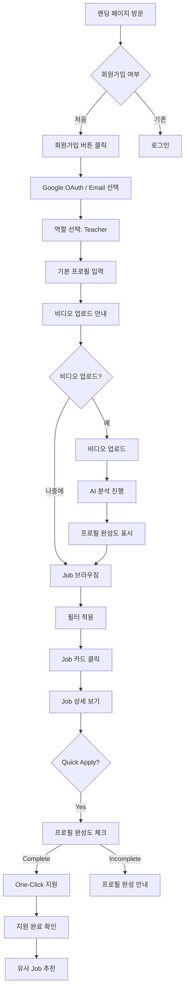
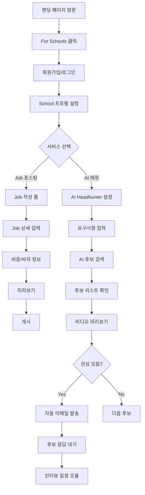

# Wellfound 상세 벤치마크 분석

**분석 기준**: 2025-11-26 스크린샷 기반
**목적**: aijobx 플랫폼 UI/UX 개선을 위한 상세 참조 문서
**대상 플랫폼**: Global Educator Nexus (aijobx)

---

## 목차

1. [섹션별 상세 분석](#1-섹션별-상세-분석)
2. [디자인 시스템 추출](#2-디자인-시스템-추출)
3. [사용자 흐름 분석](#3-사용자-흐름-분석)
4. [구현 우선순위 매트릭스](#4-구현-우선순위-매트릭스)
5. [컴포넌트 매핑](#5-컴포넌트-매핑)
6. [애니메이션 명세](#6-애니메이션-명세)
7. [주차별 구현 계획](#7-주차별-구현-계획)

---

## 1. 섹션별 상세 분석

### 1.1 최상단 배너 (Announcement Bar)

**Wellfound 구현**:
```
┌─────────────────────────────────────────────────────────────────────────────┐
│ 🔔 Introducing Autopilot: Our expert recruiters backed by AI deliver       │
│    qualified candidates to your calendar.                     [Learn more] │
└─────────────────────────────────────────────────────────────────────────────┘
```

**특징**:
- 배경색: Deep Purple (#2D1B54)
- 텍스트: White (#FFFFFF)
- 위치: 고정 상단
- 높이: 약 40px
- CTA 버튼: "Learn more" (underline on hover)
- 닫기 버튼: X (우측)

**aijobx 적용 계획**:
```tsx
// components/ui-v2/announcement-bar.tsx
interface AnnouncementBarProps {
  message: string;
  highlight?: string;  // "Autopilot" 같은 강조 단어
  ctaText?: string;
  ctaHref?: string;
  dismissible?: boolean;
  variant?: 'purple' | 'blue' | 'amber';
}

// 사용 예시
<AnnouncementBar
  highlight="AI Screener"
  message="Our AI analyzes your video resume and matches you with perfect schools"
  ctaText="Try it now"
  ctaHref="/profile/video"
  dismissible
  variant="purple"
/>
```

---

### 1.2 네비게이션 헤더 (Navigation Header)

**Wellfound 구현**:
```
┌─────────────────────────────────────────────────────────────────────────────┐
│ [wellfound]   Discover ▼   For job seekers ▼   For companies ▼  [Log In][Sign Up] │
└─────────────────────────────────────────────────────────────────────────────┘
```

**상세 분석**:

| 요소 | 스타일 | 동작 |
|------|--------|------|
| 로고 | "wellfound" 텍스트 + W: 아이콘 | 홈으로 링크 |
| Discover | 드롭다운, 14px | Browse Jobs, Browse Locations, Job Collections |
| For job seekers | 드롭다운 | Find Jobs, Salary Calculator, Blog |
| For companies | 드롭다운 | Post a Job, Pricing, Solutions |
| Log In | Ghost 버튼 | /login으로 이동 |
| Sign Up | Primary 버튼 (검정) | /signup으로 이동 |

**드롭다운 메뉴 구조**:
```
Discover ▼
├── Browse All Jobs
├── Jobs by Location
│   ├── San Francisco
│   ├── New York
│   ├── Los Angeles
│   └── Remote
├── Jobs by Role
│   ├── Engineering
│   ├── Design
│   ├── Product
│   └── Marketing
└── Curated Collections
    ├── Remote Jobs
    ├── Web3 Jobs
    └── AI/ML Jobs
```

**aijobx 매핑**:
```
Discover ▼
├── Browse All Jobs
├── Jobs by Country
│   ├── Japan
│   ├── South Korea
│   ├── China
│   ├── UAE
│   └── Thailand
├── Jobs by Subject
│   ├── English/ESL
│   ├── Math
│   ├── Science
│   └── IB Programs
└── Collections
    ├── Visa Sponsored
    ├── International Schools
    └── High-Paying (>$50K)

For Teachers ▼
├── Find Jobs
├── Upload Video Resume
├── Visa Guide
├── Salary Calculator
└── Blog

For Schools ▼
├── Post a Job
├── Browse Teachers
├── AI Matching
├── Pricing
└── Success Stories
```

---

### 1.3 히어로 섹션 (Hero Section)

**Wellfound 구현 (상세)**:

```
┌─────────────────────────────────────────────────────────────────────────────┐
│                                                                             │
│                        [Floating Tags - Parallax]                           │
│    "Buyers"     "Flask"          "iOS"        "Remote"                      │
│         "Python Developers"    "Los Angeles"     "Artificial Intelligence"  │
│                                                                             │
│                   ┌─────────────────────────────┐                           │
│                   │  W:  Find what's next       │                           │
│                   └─────────────────────────────┘                           │
│                           ↑ 애니메이션 텍스트                                │
│                                                                             │
│           Where startups and job seekers connect                            │
│                                                                             │
│         [Find your next hire]  [Find your next job]                         │
│              (Primary/Black)      (Secondary/Outline)                       │
│                                                                             │
│                      [↓ Scroll indicator]                                   │
│                                                                             │
└─────────────────────────────────────────────────────────────────────────────┘
```

**플로팅 태그 상세 분석**:

| 태그 | 위치 | 크기 | 색상 | 애니메이션 |
|------|------|------|------|------------|
| Buyers | 좌상단 | Small | Gray bg | 천천히 위아래로 float |
| Flask | 중상단 | Medium | White border | 빠르게 float |
| iOS | 우상단 | Small | Gray bg | 중간 속도 float |
| Remote | 우측 | Medium | Accent (pink) | 느리게 float |
| Python Developers | 좌측 | Large | White border | 매우 느리게 float |
| Los Angeles | 중하단 | Medium | Gray bg | 중간 float |

**헤드라인 애니메이션 분석**:
```javascript
// Wellfound의 추정 애니메이션 시퀀스
const headlines = [
  "Find what's next",
  "Find your co-founder",
  "Find your dream job",
  "Find amazing talent"
];

// 애니메이션: Text slide-up with mask
// Duration: 3초 per headline
// Transition: 0.5초 slide-up out, 0.5초 slide-up in
// Easing: cubic-bezier(0.4, 0, 0.2, 1)
```

**aijobx 적용**:
```tsx
// components/ui-v2/hero-section.tsx
const floatingTags = [
  { text: "Japan", position: "top-left", size: "sm", variant: "gray" },
  { text: "ESL Teaching", position: "top-center", size: "md", variant: "border" },
  { text: "IB Schools", position: "top-right", size: "sm", variant: "gray" },
  { text: "Visa Sponsored", position: "right", size: "md", variant: "accent" },
  { text: "International Schools", position: "left", size: "lg", variant: "border" },
  { text: "High Salary", position: "bottom", size: "md", variant: "gray" },
];

const rotatingHeadlines = [
  "Find your next teaching adventure",
  "Teach in 50+ countries",
  "Get visa sponsorship",
  "Connect with top schools"
];
```

---

### 1.4 소셜 프루프 섹션 (Social Proof)

**Wellfound 구현**:
```
┌─────────────────────────────────────────────────────────────────────────────┐
│                              [Scroll Down Indicator]                        │
├─────────────────────────────────────────────────────────────────────────────┤
│                                                                             │
│        8M+                    1M+                      1M+                   │
│    Matches Made            Tech Jobs           Startup Ready Candidates     │
│                                                                             │
├─────────────────────────────────────────────────────────────────────────────┤
│  [DOORDASH] [ROBLOX] [Honey] [PELOTON] [IFTTT] [...more logos]             │
│                                                                             │
│               "Startups who used our platform"                              │
│                                                                             │
└─────────────────────────────────────────────────────────────────────────────┘
```

**숫자 애니메이션**:
- 타입: CountUp animation
- Duration: 2초
- Easing: ease-out
- Trigger: IntersectionObserver (viewport 진입 시)
- Format: 숫자 + suffix (M+, K+)

**aijobx 적용**:
```tsx
const socialProofMetrics = [
  { value: 10000, suffix: "+", label: "Teachers Placed" },
  { value: 500, suffix: "+", label: "Partner Schools" },
  { value: 50, suffix: "+", label: "Countries" },
];

const partnerLogos = [
  { name: "ISB", logo: "/logos/isb.png" },
  { name: "GSIS", logo: "/logos/gsis.png" },
  { name: "SAS", logo: "/logos/sas.png" },
  // ... more
];
```

---

### 1.5 가치 제안 섹션 (Value Proposition - 2열 레이아웃)

**Wellfound 구현**:
```
┌──────────────────────────────┬──────────────────────────────┐
│                              │                              │
│  Questions?                  │  Need talent?                │
│  Why job seekers love us     │  Why recruiters love us      │
│                              │                              │
│  ✓ Everything you need       │  ✓ And when you're ready     │
│    to know about a            │    to discover your next...  │
│    job, all upfront...       │                              │
│                              │  ✓ A free applicant tracking │
│  ✓ Say goodbye to cover      │    system, or free integrate │
│    letters – your profile    │    with 200+ ATS you use     │
│    is all you need...        │                              │
│                              │  ✓ Go totally fee-free hiring│
│  ✓ Find jobs at startups     │    with Wellfound Discover   │
│    and tech companies you    │    or post jobs to source    │
│    can't find anywhere else  │    candidates in a matter    │
│                              │    of days                   │
│  [Learn more] [Sign up]      │  [Learn more] [Sign up]      │
│                              │                              │
└──────────────────────────────┴──────────────────────────────┘
```

**디자인 특징**:
- 배경: Left (White), Right (Light Gray)
- 제목 크기: 14px semibold, uppercase
- 부제목 크기: 32px bold
- 본문: 16px, line-height 1.6
- 체크마크: Custom icon (green)
- CTA 버튼: "Learn more" (text link), "Sign up" (primary button)

**aijobx 적용**:
```tsx
// components/ui-v2/value-proposition-section.tsx
const teacherBenefits = [
  {
    title: "Video Resume First",
    description: "Stand out with your personality, not just paper qualifications. Schools see the real you from day one."
  },
  {
    title: "AI-Powered Matching",
    description: "Our AI analyzes your video and profile to match you with schools looking for exactly your skills."
  },
  {
    title: "Visa Support Guaranteed",
    description: "Every job listing clearly shows visa sponsorship status. No surprises, no wasted applications."
  }
];

const schoolBenefits = [
  {
    title: "See Candidates in Action",
    description: "Watch video introductions before scheduling interviews. Know who you're hiring before the first call."
  },
  {
    title: "AI Headhunter",
    description: "Let our AI find and reach out to qualified candidates automatically. Save hours of sourcing time."
  },
  {
    title: "Global Talent Pool",
    description: "Access teachers from 100+ countries, all pre-screened with verified credentials and video profiles."
  }
];
```

---

### 1.6 AI Autopilot 섹션 (Feature Highlight)

**Wellfound 구현**:
```
┌─────────────────────────────────────────────────────────────────────────────┐
│  ┌───────────────────────────────────────────────────────────────────────┐  │
│  │                                                                       │  │
│  │  Meet Autopilot:                        [Screenshot of Dashboard]     │  │
│  │  Wellfound's AI recruiter                                             │  │
│  │                                        ┌─────────────────────────┐    │  │
│  │  Just tell us what you need. Our       │ Your qualified candidate│    │  │
│  │  expert recruiters backed by           │ review list             │    │  │
│  │  AI deliver qualified candidates       │                         │    │  │
│  │  to your calendar.                     │ [Avatar] [Avatar] [...]│    │  │
│  │                                        │                         │    │  │
│  │  All at a fraction of the cost         │ ┌─────────────────────┐│    │  │
│  │  of an agency.                         │ │ Roma, Jr.           ││    │  │
│  │                                        │ │ Product Designer    ││    │  │
│  │  [Learn more]                          │ │ [Schedule Interview]││    │  │
│  │                                        │ └─────────────────────┘│    │  │
│  │                                        └─────────────────────────┘    │  │
│  │                                                                       │  │
│  └───────────────────────────────────────────────────────────────────────┘  │
│                                                                             │
│  배경색: Deep Purple (#2D1B54)                                              │
│  텍스트: White                                                              │
│  스크린샷: 실제 대시보드 UI 미리보기                                        │
│                                                                             │
└─────────────────────────────────────────────────────────────────────────────┘
```

**aijobx 적용**:
```tsx
// components/ui-v2/ai-feature-section.tsx
<section className="bg-[#1E3A8A] text-white py-20">
  <div className="container mx-auto grid md:grid-cols-2 gap-12 items-center">
    <div>
      <Badge variant="outline" className="mb-4 text-white border-white">
        NEW
      </Badge>
      <h2 className="text-4xl font-bold mb-6">
        Meet AI Screener:<br/>
        Your 24/7 Recruiting Assistant
      </h2>
      <p className="text-xl mb-6 text-white/80">
        Upload teacher videos. Our AI analyzes teaching style,
        communication skills, and cultural fit instantly.
        Get structured feedback in minutes, not days.
      </p>
      <ul className="space-y-4 mb-8">
        <li className="flex items-center gap-3">
          <CheckCircle className="h-5 w-5 text-green-400" />
          <span>Analyze teaching demonstration videos</span>
        </li>
        <li className="flex items-center gap-3">
          <CheckCircle className="h-5 w-5 text-green-400" />
          <span>Score communication and presentation skills</span>
        </li>
        <li className="flex items-center gap-3">
          <CheckCircle className="h-5 w-5 text-green-400" />
          <span>Generate personalized feedback reports</span>
        </li>
      </ul>
      <Button size="lg" variant="secondary" className="bg-white text-blue-900">
        Try AI Screener Free
      </Button>
    </div>

    <div className="relative">
      {/* Dashboard Preview */}
      <div className="bg-white rounded-xl shadow-2xl p-6 text-gray-900">
        <h3 className="font-semibold mb-4">AI Screening Results</h3>
        <div className="space-y-4">
          <CandidatePreviewCard
            name="Sarah Johnson"
            role="ESL Teacher"
            score={92}
            skills={["Classroom Management", "Engaging Style"]}
          />
          <CandidatePreviewCard
            name="Michael Chen"
            role="Math Teacher"
            score={88}
            skills={["Clear Explanations", "Patient"]}
          />
        </div>
      </div>
    </div>
  </div>
</section>
```

---

### 1.7 사용자 후기 섹션 (Testimonials)

**Wellfound 구현**:
```
┌─────────────────────────────────────────────────────────────────────────────┐
│                                                                             │
│                          From our users                                     │
│                                                                             │
│  ┌─────────────────┐ ┌─────────────────┐ ┌─────────────────┐               │
│  │       "         │ │       "         │ │       "         │               │
│  │ I love Wellfound│ │ I can't imagine │ │ Half of the     │               │
│  │ I got my current│ │ my day to day   │ │ offers I give   │               │
│  │ job at a startup│ │ without this    │ │ are sourced     │               │
│  │ entirely through│ │ platform. Life  │ │ from Wellfound  │               │
│  │ the site last   │ │ would be a lot  │ │ It's the best   │               │
│  │ year - it's     │ │ more difficult. │ │ product for     │               │
│  │ super easy to   │ │                 │ │ anyone looking  │               │
│  │ use and I love  │ │                 │ │ for startup     │               │
│  │ the UI.         │ │                 │ │ talent.         │               │
│  │                 │ │                 │ │                 │               │
│  └─────────────────┘ └─────────────────┘ └─────────────────┘               │
│                                                                             │
│  카드 특징:                                                                 │
│  - 큰 따옴표 (") 아이콘 상단                                                │
│  - Quote 텍스트 (16px, normal weight)                                       │
│  - 이름/직함 없음 (익명 스타일)                                             │
│  - 배경: White                                                              │
│  - Border: Light gray (1px)                                                 │
│  - Radius: 12px                                                             │
│  - Shadow: subtle (on hover: elevated)                                      │
│                                                                             │
└─────────────────────────────────────────────────────────────────────────────┘
```

**aijobx 적용**:
```tsx
const testimonials = [
  {
    quote: "I found my dream teaching job in Japan within 2 weeks. The video resume feature really helped me stand out. The school loved seeing my teaching style before even interviewing me.",
    author: "Sarah M.",
    role: "ESL Teacher, Tokyo",
    avatar: "/avatars/sarah.jpg"
  },
  {
    quote: "As a recruiter, the AI matching saves me hours every week. Instead of sifting through resumes, I get pre-qualified candidates delivered to my inbox. It's like having an extra team member.",
    author: "Park Ji-hoon",
    role: "HR Director, GSIS Seoul",
    avatar: "/avatars/park.jpg"
  },
  {
    quote: "The visa guidance was incredibly helpful. I knew exactly what documents I needed before applying, and the school sponsored my work permit smoothly. No surprises.",
    author: "David L.",
    role: "IB Teacher, Dubai",
    avatar: "/avatars/david.jpg"
  }
];
```

---

### 1.8 CTA 카드 섹션 (Dual CTA Cards)

**Wellfound 구현**:
```
┌─────────────────────────────────────────────────────────────────────────────┐
│                                                                             │
│  ┌───────────────────────────┐    ┌───────────────────────────┐            │
│  │  Get Discovered           │    │  Salary Calculator        │            │
│  │  Let us show you off      │    │  Know your worth          │            │
│  │                           │    │                           │            │
│  │  [Illustration:           │    │  Use our salary           │            │
│  │   People figures]         │    │  calculator to find your  │            │
│  │                           │    │  salary range and be      │            │
│  │  [Link: join here→]       │    │  prepared for your next   │            │
│  │                           │    │  negotiation.             │            │
│  │                           │    │                           │            │
│  │  배경: Light Pink/Salmon  │    │  배경: Light Amber/Gold   │            │
│  │  (#FFF0EB)                │    │  (#FFF8E7)                │            │
│  │                           │    │  [Subscribe]              │            │
│  └───────────────────────────┘    └───────────────────────────┘            │
│                                                                             │
└─────────────────────────────────────────────────────────────────────────────┘
```

**aijobx 적용**:
```tsx
<section className="py-20 bg-gray-50">
  <div className="container mx-auto grid md:grid-cols-2 gap-8">
    {/* For Teachers */}
    <Card className="bg-blue-50 border-0 p-8">
      <Badge className="mb-4">For Teachers</Badge>
      <h3 className="text-2xl font-bold mb-2">Stand Out with Video</h3>
      <p className="text-gray-600 mb-6">
        Let schools see your teaching style before the interview.
        Upload your video resume and get discovered by top schools worldwide.
      </p>
      <div className="mb-6">
        {/* Illustration */}
        
      </div>
      <Button asChild>
        <Link href="/profile/video">
          Upload Your Video <ArrowRight className="ml-2 h-4 w-4" />
        </Link>
      </Button>
    </Card>

    {/* For Schools */}
    <Card className="bg-amber-50 border-0 p-8">
      <Badge className="mb-4" variant="secondary">For Schools</Badge>
      <h3 className="text-2xl font-bold mb-2">Find Perfect Matches</h3>
      <p className="text-gray-600 mb-6">
        Our AI analyzes teaching videos and matches candidates to your
        specific requirements. Get qualified teachers delivered to you.
      </p>
      <div className="mb-6">
        {/* Illustration */}
        
      </div>
      <Button asChild variant="secondary">
        <Link href="/recruiter/matching">
          Try AI Matching <ArrowRight className="ml-2 h-4 w-4" />
        </Link>
      </Button>
    </Card>
  </div>
</section>
```

---

### 1.9 Featured 섹션 ("10 of 10 in 2025")

**Wellfound 구현**:
```
┌─────────────────────────────────────────────────────────────────────────────┐
│                                                                             │
│  ┌───────────────────────────────────────────────────────────────────────┐  │
│  │                                                                       │  │
│  │   [wellfound logo]                                                    │  │
│  │   10 of 10                Our top picks for 2025 are here...         │  │
│  │   in 2025                                                             │  │
│  │                           Wellfound has selected 10 startups across  │  │
│  │   ★★★★★                  10 trending industries that should be on    │  │
│  │                           your radar in 2025. See what teams our     │  │
│  │                           community is most excited about in the     │  │
│  │                           year ahead!                                 │  │
│  │                                                                       │  │
│  │                           [Explore 10 of 10]                          │  │
│  │                                                                       │  │
│  │   배경: Gradient (Dark Purple → Wine Red)                            │  │
│  │   텍스트: White                                                       │  │
│  │   버튼: White outline                                                 │  │
│  │                                                                       │  │
│  └───────────────────────────────────────────────────────────────────────┘  │
│                                                                             │
└─────────────────────────────────────────────────────────────────────────────┘
```

**aijobx 적용**:
```tsx
<section className="py-12">
  <div className="container mx-auto">
    <Card className="bg-gradient-to-r from-blue-900 to-purple-900 text-white border-0 p-12">
      <div className="grid md:grid-cols-2 gap-8 items-center">
        <div>
          <div className="text-6xl font-bold mb-2">Top 10</div>
          <div className="text-2xl mb-4">Teaching Destinations 2025</div>
          <div className="flex text-amber-400 mb-4">
            {[1,2,3,4,5].map(i => <Star key={i} className="h-5 w-5 fill-current" />)}
          </div>
        </div>
        <div>
          <p className="text-xl mb-6 text-white/90">
            We've analyzed salary data, visa policies, and teacher satisfaction
            to bring you the top 10 countries for teaching abroad in 2025.
            Discover where your skills are most valued.
          </p>
          <Button variant="outline" className="border-white text-white hover:bg-white hover:text-blue-900">
            Explore Rankings <ArrowRight className="ml-2 h-4 w-4" />
          </Button>
        </div>
      </div>
    </Card>
  </div>
</section>
```

---

### 1.10 블로그/컬렉션 리스트 섹션

**Wellfound 구현**:
```
┌─────────────────────────────────────────────────────────────────────────────┐
│                                                                             │
│  At a loss where to begin?                                                  │
│                                                                             │
│  ┌──────────────────────────────────────────────────────────────────────┐  │
│  │ Job Collection    20 Women-Led Startups Expanding        [→]        │  │
│  │                   Their Remote Teams in 2022                         │  │
│  │                   We're showcasing how five female-led pre-seed...   │  │
│  └──────────────────────────────────────────────────────────────────────┘  │
│  ┌──────────────────────────────────────────────────────────────────────┐  │
│  │ Job Collection    19 Hot Crypto Startups Hiring          [→]        │  │
│  │                   Remotely in 2022                                   │  │
│  │                   Crypto has had a great 10 years, as the decen...   │  │
│  └──────────────────────────────────────────────────────────────────────┘  │
│  ┌──────────────────────────────────────────────────────────────────────┐  │
│  │ Job Collection    18 Innovative Space Startups           [→]        │  │
│  │                   Hiring Now                                         │  │
│  │                   The tech sector has explored the Earth's cosmic... │  │
│  └──────────────────────────────────────────────────────────────────────┘  │
│  ┌──────────────────────────────────────────────────────────────────────┐  │
│  │ Blog Post         The Truth About Finding Your           [Lightning]│  │
│  │                   First Engineering Job                              │  │
│  │                   Gate 10, where engineers job searches can be...    │  │
│  └──────────────────────────────────────────────────────────────────────┘  │
│  ┌──────────────────────────────────────────────────────────────────────┐  │
│  │ Blog Post         Why Naval Ravikant Thinks              [Lightning]│  │
│  │                   Remote Work Is The Future                          │  │
│  │                   It feels like the rise of remote work has been...  │  │
│  └──────────────────────────────────────────────────────────────────────┘  │
│                                                                             │
│  리스트 아이템 특징:                                                        │
│  - 배경: White                                                              │
│  - Border-bottom: Light gray (1px)                                          │
│  - 좌측: Category badge (Job Collection / Blog Post)                        │
│  - 중앙: Title (bold) + Description (gray, truncated)                       │
│  - 우측: Arrow icon 또는 Lightning icon                                     │
│  - Hover: Background light gray                                             │
│                                                                             │
└─────────────────────────────────────────────────────────────────────────────┘
```

**aijobx 적용**:
```tsx
const featuredContent = [
  {
    type: "collection",
    title: "50 Schools Offering Visa Sponsorship in Japan",
    description: "Complete list of international schools actively sponsoring work visas...",
    href: "/collections/japan-visa-sponsored"
  },
  {
    type: "collection",
    title: "Top IB Schools Hiring for 2025-2026",
    description: "Premium international baccalaureate schools with competitive packages...",
    href: "/collections/ib-schools-2025"
  },
  {
    type: "guide",
    title: "Complete Guide to Teaching Visas in South Korea",
    description: "E-2 visa requirements, application process, and timeline for 2025...",
    href: "/guides/korea-e2-visa"
  },
  {
    type: "blog",
    title: "How I Landed a $60K Teaching Job in the UAE",
    description: "One teacher's journey from application to contract signing...",
    href: "/blog/uae-teaching-job-story"
  }
];
```

---

### 1.11 푸터 (Footer)

**Wellfound 구현**:
```
┌─────────────────────────────────────────────────────────────────────────────┐
│                                                                             │
│  [Job Collections ▼] [Remote Jobs ▼] [Jobs by Location ▼]                  │
│  [Jobs by Role ▼] [Jobs by Role & Location ▼]                              │
│                                                                             │
│  배경: Dark (Near Black)                                                   │
│  Dropdown 버튼들: 펼치면 링크 리스트                                       │
│                                                                             │
├─────────────────────────────────────────────────────────────────────────────┤
│                                                                             │
│  wellfound.ai                                                               │
│                                                                             │
│  For Candidates        For Recruiters        Company                        │
│  ─────────────        ──────────────        ───────                        │
│  Overview             Recruit                About                          │
│  Startup Jobs         Curated                Press                          │
│  Web3 Jobs            Sourcer                Careers (We're hiring!)       │
│  Featured             Hire developers        FAQ                           │
│  Salary Calculator    Pricing                Terms of Use                   │
│                       Terms of Use           Privacy Policy                 │
│                                                                             │
│  Social: [Twitter] [LinkedIn] [Instagram]                                   │
│                                                                             │
└─────────────────────────────────────────────────────────────────────────────┘
```

**aijobx 적용**:
```tsx
const footerLinks = {
  forTeachers: [
    { label: "Find Jobs", href: "/jobs" },
    { label: "Upload Video Resume", href: "/profile/video" },
    { label: "Visa Guide", href: "/resources/visa-guide" },
    { label: "Salary Calculator", href: "/resources/salary" },
    { label: "Blog", href: "/blog" }
  ],
  forSchools: [
    { label: "Post a Job", href: "/recruiter/post-job" },
    { label: "Browse Teachers", href: "/recruiter/browse" },
    { label: "AI Matching", href: "/recruiter/ai-matching" },
    { label: "Pricing", href: "/pricing" },
    { label: "Success Stories", href: "/case-studies" }
  ],
  company: [
    { label: "About", href: "/about" },
    { label: "Contact", href: "/contact" },
    { label: "Careers", href: "/careers", badge: "Hiring!" },
    { label: "FAQ", href: "/faq" },
    { label: "Terms", href: "/terms" },
    { label: "Privacy", href: "/privacy" }
  ]
};
```

---

## 2. 디자인 시스템 추출

### 2.1 컬러 팔레트

**Wellfound 추출 색상**:

```scss
// Primary
$primary-black: #000000;
$primary-white: #FFFFFF;

// Accent Colors
$accent-purple: #2D1B54;      // Announcement bar, AI section
$accent-purple-light: #E8E0F0;
$accent-pink: #FFE4E1;        // CTA card background
$accent-amber: #FFF8E7;       // CTA card background

// Grays
$gray-50: #FAFAFA;
$gray-100: #F5F5F5;
$gray-200: #E5E5E5;
$gray-300: #D4D4D4;
$gray-400: #A3A3A3;
$gray-500: #737373;
$gray-600: #525252;
$gray-700: #404040;
$gray-800: #262626;
$gray-900: #171717;

// Semantic
$success: #22C55E;
$warning: #F59E0B;
$error: #EF4444;
$info: #3B82F6;
```

### 2.2 타이포그래피

**Wellfound 폰트 스택**:
```css
font-family: -apple-system, BlinkMacSystemFont, "Segoe UI", Roboto, Oxygen-Sans, Ubuntu, Cantarell, "Helvetica Neue", sans-serif;
```

**스케일**:
```scss
// Display
$text-display: 56px;     // Hero headline
$text-display-md: 48px;  // Section headlines

// Headings
$text-h1: 36px;
$text-h2: 30px;
$text-h3: 24px;
$text-h4: 20px;

// Body
$text-body-lg: 18px;
$text-body: 16px;
$text-body-sm: 14px;

// Small
$text-xs: 12px;
$text-xxs: 10px;

// Line Heights
$leading-tight: 1.2;
$leading-normal: 1.5;
$leading-relaxed: 1.6;
```

### 2.3 간격 시스템

```scss
// Spacing Scale (8px base)
$space-1: 4px;
$space-2: 8px;
$space-3: 12px;
$space-4: 16px;
$space-5: 20px;
$space-6: 24px;
$space-8: 32px;
$space-10: 40px;
$space-12: 48px;
$space-16: 64px;
$space-20: 80px;
$space-24: 96px;

// Section Padding
$section-padding-y: 80px;      // Desktop
$section-padding-y-mobile: 48px; // Mobile
```

### 2.4 그림자 시스템

```scss
// Shadows
$shadow-sm: 0 1px 2px rgba(0, 0, 0, 0.05);
$shadow-md: 0 4px 6px rgba(0, 0, 0, 0.07);
$shadow-lg: 0 10px 15px rgba(0, 0, 0, 0.1);
$shadow-xl: 0 20px 25px rgba(0, 0, 0, 0.15);
$shadow-card: 0 2px 8px rgba(0, 0, 0, 0.08);
$shadow-card-hover: 0 8px 24px rgba(0, 0, 0, 0.12);
```

### 2.5 Border Radius

```scss
$radius-sm: 4px;
$radius-md: 8px;
$radius-lg: 12px;
$radius-xl: 16px;
$radius-2xl: 24px;
$radius-full: 9999px;
```

---

## 3. 사용자 흐름 분석

### 3.1 Teacher 가입 → 첫 지원 플로우



### 3.2 School 채용 → 매칭 플로우



---

## 4. 구현 우선순위 매트릭스

| 컴포넌트 | 임팩트 | 난이도 | 우선순위 | 예상 시간 |
|----------|--------|--------|----------|-----------|
| **Hero Section 리디자인** | High | Medium | P0 | 16h |
| **네비게이션 개선** | High | Low | P0 | 8h |
| **Job Card V2** | High | Medium | P0 | 12h |
| **Floating Tags 애니메이션** | Medium | High | P1 | 8h |
| **Social Proof 섹션** | High | Low | P0 | 4h |
| **Value Proposition 섹션** | Medium | Low | P1 | 4h |
| **AI Feature 섹션** | High | Medium | P0 | 8h |
| **Testimonials 섹션** | Medium | Low | P1 | 4h |
| **CTA Cards 섹션** | Medium | Low | P1 | 4h |
| **Featured 배너** | Low | Low | P2 | 2h |
| **Blog/Collection 리스트** | Medium | Medium | P1 | 6h |
| **Footer 리디자인** | Low | Low | P2 | 4h |
| **Announcement Bar** | Low | Low | P2 | 2h |
| **CountUp 애니메이션** | Medium | Medium | P1 | 4h |
| **Parallax 배경** | Medium | High | P2 | 8h |

---

## 5. 컴포넌트 매핑

### 기존 컴포넌트 → 새 컴포넌트

| 기존 | 새로 만들 컴포넌트 | 파일 경로 |
|------|-------------------|-----------|
| Header | NavigationHeader | `components/ui-v2/navigation-header.tsx` |
| Hero (없음) | HeroSection | `components/ui-v2/hero-section.tsx` |
| - | FloatingTags | `components/ui-v2/floating-tags.tsx` |
| - | RotatingHeadline | `components/ui-v2/rotating-headline.tsx` |
| - | SocialProofSection | `components/ui-v2/social-proof-section.tsx` |
| - | AnimatedCounter | `components/ui-v2/animated-counter.tsx` |
| JobCard | JobCardV2 | `components/ui-v2/job-card-v2.tsx` |
| - | ValuePropositionSection | `components/ui-v2/value-proposition-section.tsx` |
| - | AIFeatureSection | `components/ui-v2/ai-feature-section.tsx` |
| - | TestimonialsSection | `components/ui-v2/testimonials-section.tsx` |
| - | CTACardsSection | `components/ui-v2/cta-cards-section.tsx` |
| - | FeaturedBanner | `components/ui-v2/featured-banner.tsx` |
| - | ContentList | `components/ui-v2/content-list.tsx` |
| Footer | FooterV2 | `components/ui-v2/footer-v2.tsx` |
| - | AnnouncementBar | `components/ui-v2/announcement-bar.tsx` |

---

## 6. 애니메이션 명세

### 6.1 Hero 텍스트 애니메이션

```typescript
// lib/animations/hero-animations.ts
import gsap from 'gsap';
import { SplitText } from 'gsap/SplitText';

export const animateHeroHeadline = (element: HTMLElement) => {
  gsap.registerPlugin(SplitText);

  const split = new SplitText(element, { type: "chars,words" });

  gsap.from(split.chars, {
    duration: 0.8,
    y: 100,
    opacity: 0,
    stagger: 0.02,
    ease: "power4.out"
  });
};

export const rotateHeadlines = (
  headlines: string[],
  container: HTMLElement,
  interval: number = 3000
) => {
  let currentIndex = 0;

  const animate = () => {
    const currentEl = container.querySelector('.headline-current');
    const nextIndex = (currentIndex + 1) % headlines.length;

    // Slide out current
    gsap.to(currentEl, {
      y: -50,
      opacity: 0,
      duration: 0.5,
      ease: "power2.in",
      onComplete: () => {
        currentEl.textContent = headlines[nextIndex];

        // Slide in new
        gsap.fromTo(currentEl,
          { y: 50, opacity: 0 },
          { y: 0, opacity: 1, duration: 0.5, ease: "power2.out" }
        );
      }
    });

    currentIndex = nextIndex;
  };

  return setInterval(animate, interval);
};
```

### 6.2 Floating Tags 애니메이션

```typescript
// lib/animations/floating-tags.ts
export const animateFloatingTags = (container: HTMLElement) => {
  const tags = container.querySelectorAll('.floating-tag');

  tags.forEach((tag, index) => {
    const speed = 0.5 + Math.random() * 0.5; // 0.5-1s
    const yRange = 10 + Math.random() * 20;  // 10-30px
    const delay = Math.random() * 2;         // 0-2s delay

    gsap.to(tag, {
      y: `+=${yRange}`,
      duration: speed * 2,
      repeat: -1,
      yoyo: true,
      ease: "sine.inOut",
      delay
    });
  });
};

export const parallaxFloatingTags = (container: HTMLElement) => {
  const tags = container.querySelectorAll('.floating-tag');

  window.addEventListener('mousemove', (e) => {
    const { clientX, clientY } = e;
    const centerX = window.innerWidth / 2;
    const centerY = window.innerHeight / 2;

    tags.forEach((tag, index) => {
      const depth = 0.02 + (index % 3) * 0.01; // Depth layers
      const moveX = (clientX - centerX) * depth;
      const moveY = (clientY - centerY) * depth;

      gsap.to(tag, {
        x: moveX,
        y: moveY,
        duration: 0.5,
        ease: "power2.out"
      });
    });
  });
};
```

### 6.3 CountUp 애니메이션

```typescript
// lib/animations/count-up.ts
export const animateCountUp = (
  element: HTMLElement,
  targetValue: number,
  options: {
    duration?: number;
    suffix?: string;
    separator?: string;
  } = {}
) => {
  const { duration = 2, suffix = '', separator = ',' } = options;

  const counter = { value: 0 };

  gsap.to(counter, {
    value: targetValue,
    duration,
    ease: "power2.out",
    onUpdate: () => {
      const formatted = Math.floor(counter.value)
        .toLocaleString('en-US')
        .replace(/,/g, separator);
      element.textContent = formatted + suffix;
    }
  });
};
```

### 6.4 Card Hover 애니메이션

```typescript
// lib/animations/card-animations.ts
export const cardHoverAnimation = {
  onEnter: (element: HTMLElement) => {
    gsap.to(element, {
      y: -8,
      scale: 1.02,
      boxShadow: '0 20px 40px rgba(0,0,0,0.12)',
      duration: 0.3,
      ease: "power2.out"
    });
  },

  onLeave: (element: HTMLElement) => {
    gsap.to(element, {
      y: 0,
      scale: 1,
      boxShadow: '0 2px 8px rgba(0,0,0,0.08)',
      duration: 0.3,
      ease: "power2.out"
    });
  }
};
```

---

## 7. 주차별 구현 계획

### Week 1: 핵심 컴포넌트 (P0)

#### Day 1-2: Hero Section
- [ ] `HeroSection` 컴포넌트 생성
- [ ] `FloatingTags` 애니메이션 구현
- [ ] `RotatingHeadline` 구현
- [ ] Dual CTA 버튼 구현
- [ ] 반응형 디자인

#### Day 3: Navigation
- [ ] `NavigationHeader` 리디자인
- [ ] 드롭다운 메뉴 구현
- [ ] Sticky header 구현
- [ ] 모바일 메뉴

#### Day 4-5: Social Proof + Job Cards
- [ ] `SocialProofSection` 구현
- [ ] `AnimatedCounter` 구현
- [ ] Partner 로고 슬라이더
- [ ] `JobCardV2` 완성
- [ ] Quick Apply 기능

### Week 2: 가치 제안 섹션 (P1)

#### Day 1-2: Value Proposition
- [ ] 2열 레이아웃 구현
- [ ] 체크리스트 스타일
- [ ] CTA 버튼

#### Day 3: AI Feature Section
- [ ] 대시보드 미리보기 UI
- [ ] 기능 리스트
- [ ] CTA 버튼

#### Day 4-5: Testimonials + CTA Cards
- [ ] 후기 카드 디자인
- [ ] 슬라이더 구현
- [ ] Dual CTA Cards

### Week 3: 콘텐츠 섹션 (P1-P2)

#### Day 1-2: Featured Banner
- [ ] Gradient 배경
- [ ] 랭킹 데이터 연동

#### Day 3-4: Content List
- [ ] 블로그/컬렉션 리스트
- [ ] 카테고리 뱃지
- [ ] 호버 효과

#### Day 5: Footer
- [ ] 멀티컬럼 레이아웃
- [ ] 드롭다운 링크 그룹
- [ ] 소셜 아이콘

### Week 4: 애니메이션 및 마무리

#### Day 1-2: 애니메이션 최적화
- [ ] GSAP 성능 최적화
- [ ] Intersection Observer 적용
- [ ] 모바일 애니메이션 축소

#### Day 3-4: 테스팅
- [ ] E2E 테스트
- [ ] 접근성 테스트
- [ ] 성능 테스트 (Lighthouse)

#### Day 5: 배포
- [ ] 스테이징 환경 테스트
- [ ] 프로덕션 배포
- [ ] 모니터링 설정

---

## 다음 단계

1. **기술 스택 확정**: GSAP vs Framer Motion 선택
2. **디자인 토큰 설정**: Tailwind 설정 업데이트
3. **컴포넌트 우선순위 재검토**: 팀과 논의
4. **첫 번째 PR 생성**: Hero Section 구현

---

**문서 버전**: 1.0
**작성일**: 2025-11-26
**작성자**: Claude AI
**검토 필요**: 디자인팀, 프론트엔드팀
