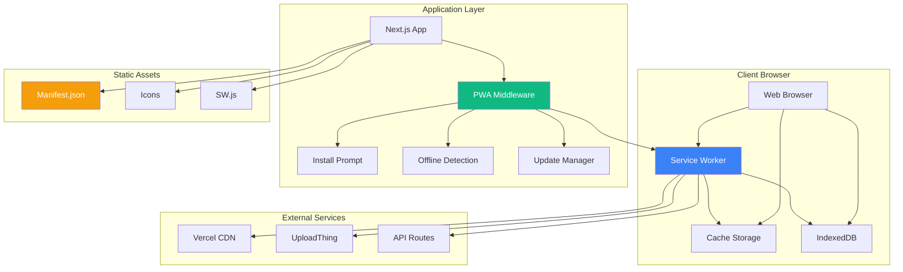
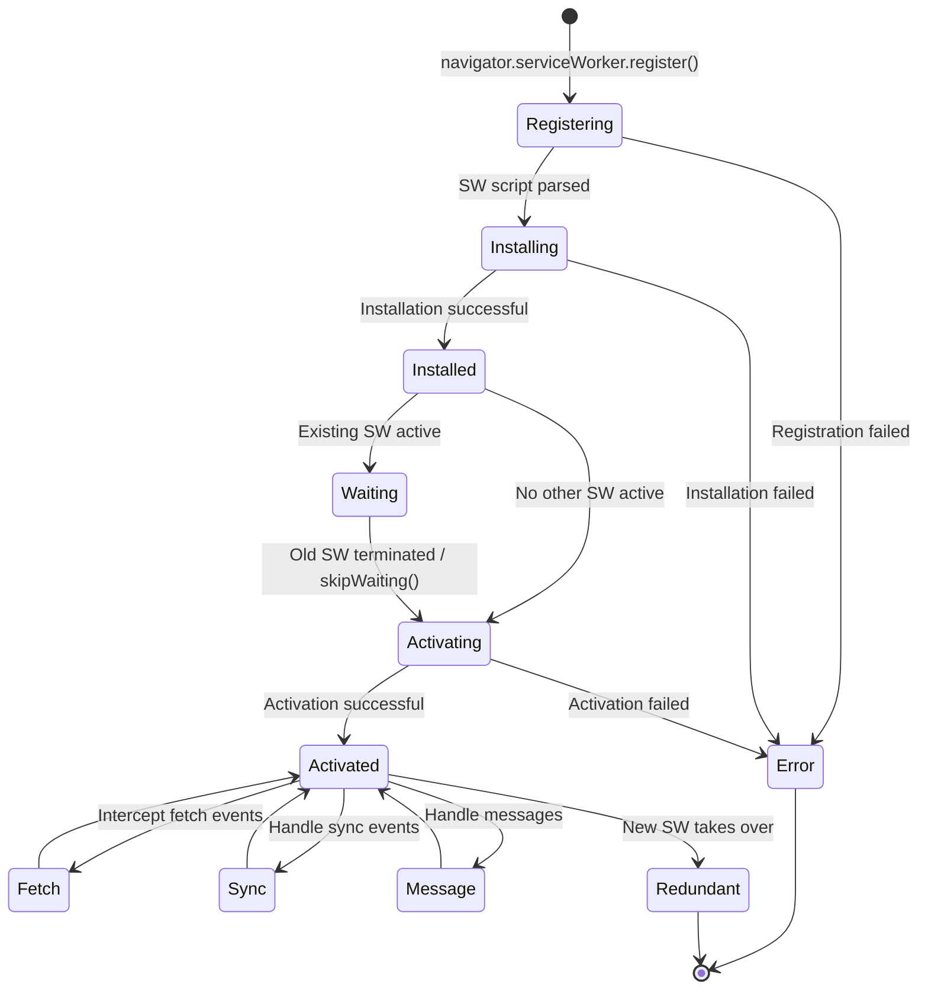
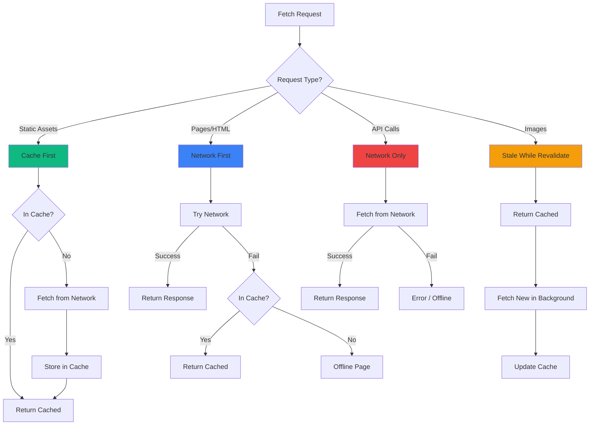
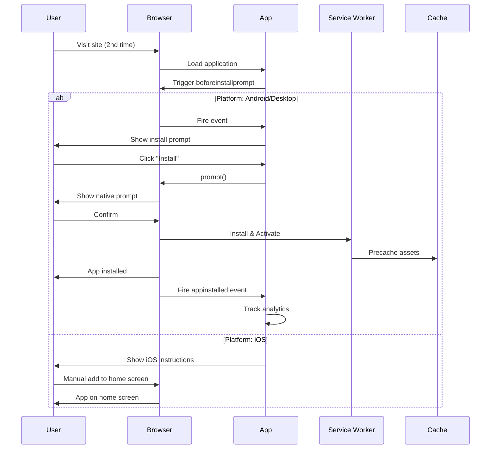
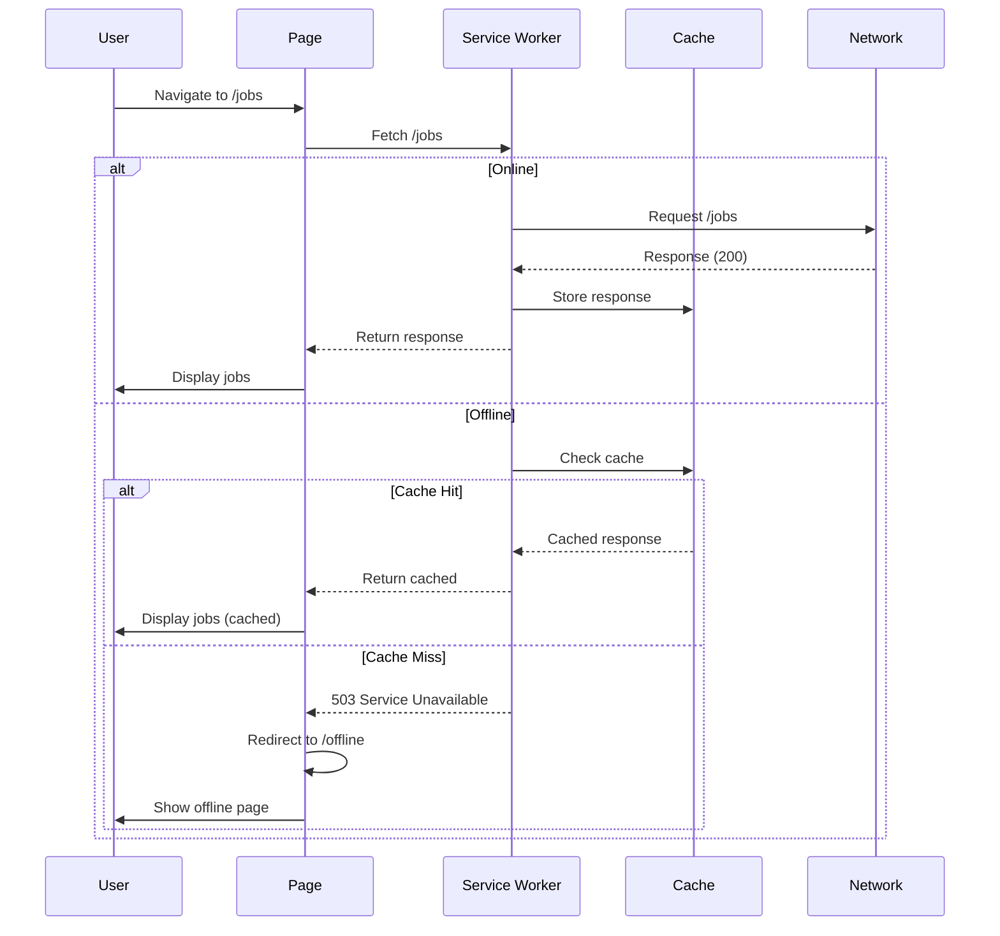
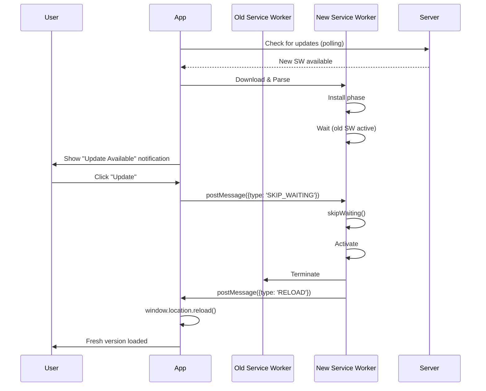
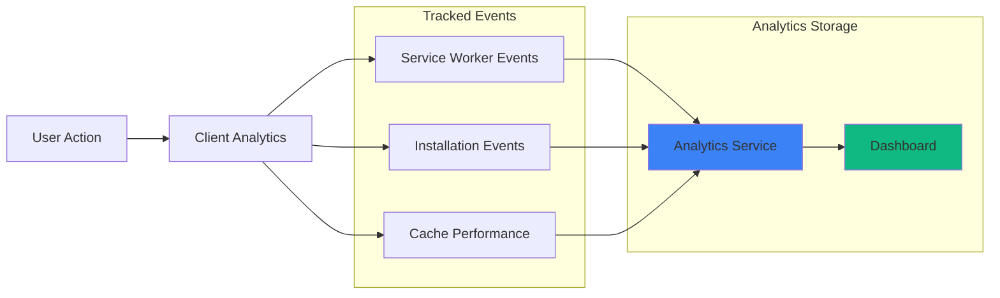
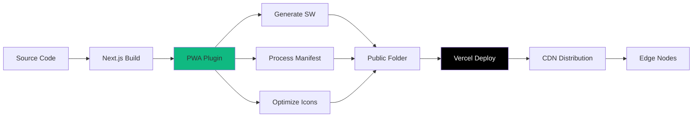
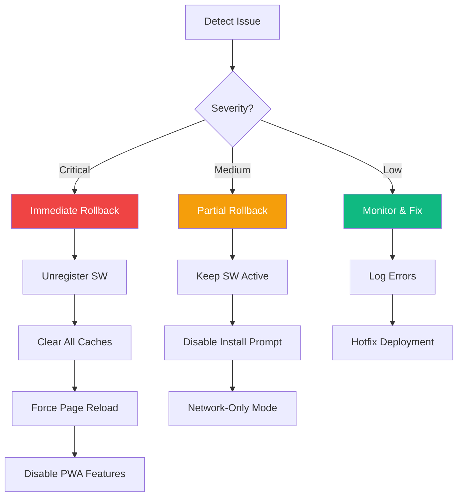

# Phase 1 - Task 1.1: PWA Configuration Architecture

**SPARC Phase:** Architecture (A)
**Date:** 2025-01-23
**Task:** Progressive Web App (PWA) Configuration
**Prerequisites:** Specification & Pseudocode completed

---

## 1. System Architecture Overview



---

## 2. Component Architecture

### 2.1 High-Level Components

```
┌─────────────────────────────────────────────────────────────┐
│                       Next.js App Router                     │
├─────────────────────────────────────────────────────────────┤
│                                                              │
│  ┌──────────────┐  ┌──────────────┐  ┌──────────────┐      │
│  │   Root       │  │  PWA         │  │  Offline     │      │
│  │   Layout     │  │  Provider    │  │  Detector    │      │
│  └──────────────┘  └──────────────┘  └──────────────┘      │
│         │                 │                  │              │
│         └─────────────────┴──────────────────┘              │
│                           │                                 │
│  ┌──────────────────────────────────────────────────────┐   │
│  │         Service Worker Registration Layer            │   │
│  ├──────────────────────────────────────────────────────┤   │
│  │  • SW Lifecycle Management                           │   │
│  │  • Update Detection                                  │   │
│  │  • Cache Strategies                                  │   │
│  └──────────────────────────────────────────────────────┘   │
│                           │                                 │
│  ┌──────────────────────────────────────────────────────┐   │
│  │              Install Prompt Component                 │   │
│  ├──────────────────────────────────────────────────────┤   │
│  │  • Platform Detection                                │   │
│  │  • Prompt Timing Logic                               │   │
│  │  • Analytics Tracking                                │   │
│  └──────────────────────────────────────────────────────┘   │
│                                                              │
└─────────────────────────────────────────────────────────────┘
```

### 2.2 File Structure

```
global-educator-nexus/
├── app/
│   ├── layout.tsx                 # Root layout with PWA metadata
│   ├── offline/
│   │   └── page.tsx               # Offline fallback page
│   └── _document.tsx              # Custom document (if needed)
│
├── components/
│   ├── pwa/
│   │   ├── install-prompt.tsx     # Install prompt component
│   │   ├── sw-registration.tsx    # Service worker registration
│   │   ├── update-notification.tsx # SW update notification
│   │   ├── offline-banner.tsx     # Offline status banner
│   │   └── ios-install-guide.tsx  # iOS installation instructions
│   │
│   └── providers/
│       └── pwa-provider.tsx       # PWA context provider
│
├── lib/
│   ├── pwa/
│   │   ├── service-worker.ts      # SW utilities
│   │   ├── cache-strategies.ts    # Cache configuration
│   │   ├── platform-detector.ts   # Platform detection utilities
│   │   └── install-tracking.ts    # Installation analytics
│   │
│   └── hooks/
│       ├── use-install-prompt.ts  # Install prompt hook
│       ├── use-online-status.ts   # Online/offline hook
│       └── use-sw-update.ts       # SW update hook
│
├── public/
│   ├── manifest.json              # Web app manifest
│   ├── sw.js                      # Service worker (generated)
│   ├── workbox-*.js               # Workbox runtime (generated)
│   ├── icons/
│   │   ├── icon-72x72.png
│   │   ├── icon-96x96.png
│   │   ├── icon-128x128.png
│   │   ├── icon-144x144.png
│   │   ├── icon-152x152.png
│   │   ├── icon-192x192.png
│   │   ├── icon-384x384.png
│   │   ├── icon-512x512.png
│   │   ├── maskable-icon-512x512.png
│   │   ├── apple-touch-icon.png
│   │   ├── shortcut-jobs.png
│   │   ├── shortcut-apps.png
│   │   └── shortcut-profile.png
│   │
│   └── screenshots/
│       ├── desktop-1.png
│       └── mobile-1.png
│
├── next.config.js                 # Next.js config with PWA
└── package.json                   # Dependencies

```

---

## 3. Service Worker Architecture

### 3.1 Service Worker Lifecycle



### 3.2 Cache Strategy Flow



### 3.3 Cache Hierarchy

```
Cache Storage Layers:
├── static-assets-v1 (Max: 60 items, 30 days)
│   ├── CSS files
│   ├── JavaScript bundles
│   ├── Fonts
│   └── Icon files
│
├── google-fonts-v1 (Max: 4 items, 1 year)
│   ├── Font stylesheets
│   └── Font files (woff2)
│
├── images-v1 (Max: 100 items, 7 days)
│   ├── Static images
│   ├── Next.js optimized images
│   └── User uploaded images
│
├── pages-v1 (Max: 50 items, 1 day)
│   ├── HTML pages
│   ├── Server-rendered content
│   └── Dynamic routes
│
└── api-cache-v1 (Max: 50 items, 5 minutes)
    ├── API responses (selective)
    └── GraphQL queries (if applicable)
```

---

## 4. Data Flow Architecture

### 4.1 Installation Flow



### 4.2 Offline Request Flow



### 4.3 Update Flow



---

## 5. Component Specifications

### 5.1 PWA Provider Component

```typescript
// components/providers/pwa-provider.tsx

interface PWAContextValue {
  isOnline: boolean;
  isInstalled: boolean;
  canInstall: boolean;
  updateAvailable: boolean;
  install: () => Promise<void>;
  update: () => void;
  deferredPrompt: BeforeInstallPromptEvent | null;
}

// Context provides PWA state to all child components
// Manages service worker lifecycle
// Handles install prompt timing
// Tracks online/offline status
```

**Architecture Decisions:**
- Use React Context for global PWA state
- Single source of truth for installation status
- Centralized event handling for SW events
- Automatic state synchronization

### 5.2 Install Prompt Component

```typescript
// components/pwa/install-prompt.tsx

interface InstallPromptProps {
  position?: 'top' | 'bottom';
  variant?: 'banner' | 'modal' | 'card';
  showAfterSeconds?: number;
  showAfterVisits?: number;
  dismissDuration?: number; // days
}

// Component responsibilities:
// - Detect platform (iOS, Android, Desktop)
// - Show appropriate install UI
// - Track user interactions
// - Manage dismissal state
// - Handle installation flow
```

**Architecture Decisions:**
- Configurable display logic
- Platform-specific rendering
- localStorage for dismissal tracking
- Analytics integration built-in

### 5.3 Service Worker Registration Component

```typescript
// components/pwa/sw-registration.tsx

// Client-side component that:
// - Registers service worker on mount
// - Listens for SW lifecycle events
// - Handles update notifications
// - Manages cache versioning
// - Provides SW status to parent components
```

**Architecture Decisions:**
- Runs only on client (useEffect)
- Handles all SW lifecycle events
- Provides hooks for custom behavior
- Error boundary for SW failures

---

## 6. Security Architecture

### 6.1 Security Layers

```
Security Layers:
┌─────────────────────────────────────────┐
│     HTTPS (Vercel - Required for PWA)   │
├─────────────────────────────────────────┤
│   Service Worker Scope Restrictions     │
├─────────────────────────────────────────┤
│     Content Security Policy (CSP)       │
├─────────────────────────────────────────┤
│   Cache Validation & Integrity Checks   │
├─────────────────────────────────────────┤
│      Sensitive Data Exclusion Rules     │
└─────────────────────────────────────────┘
```

### 6.2 Cache Security Rules

```typescript
// lib/pwa/cache-strategies.ts

const CACHE_EXCLUSIONS = [
  /\/api\/auth\//, // Never cache auth endpoints
  /\/api\/.*\?token=/, // Never cache authenticated requests
  /private/, // Never cache private routes
  /\.env/, // Never cache env files
];

const SENSITIVE_HEADERS_TO_STRIP = [
  'Authorization',
  'Cookie',
  'Set-Cookie',
  'X-Auth-Token',
];
```

### 6.3 Content Security Policy

```typescript
// next.config.js - CSP Headers

const cspHeader = `
  default-src 'self';
  script-src 'self' 'unsafe-eval' 'unsafe-inline';
  style-src 'self' 'unsafe-inline';
  img-src 'self' blob: data: https://uploadthing.com;
  font-src 'self' data: https://fonts.gstatic.com;
  connect-src 'self' https://api.openai.com https://api.anthropic.com;
  manifest-src 'self';
  worker-src 'self';
`;
```

---

## 7. Performance Architecture

### 7.1 Performance Optimization Layers

```
Performance Stack:
┌────────────────────────────────────────┐
│  Service Worker (Instant cache hits)  │
├────────────────────────────────────────┤
│      Vercel Edge Network (CDN)        │
├────────────────────────────────────────┤
│     Next.js Optimization Layer        │
├────────────────────────────────────────┤
│       Browser HTTP Cache              │
└────────────────────────────────────────┘
```

### 7.2 Cache Performance Targets

| Asset Type | Strategy | Hit Rate Target | Load Time Target |
|-----------|----------|----------------|------------------|
| Static JS/CSS | Cache First | >95% | <50ms |
| Images | Stale-While-Revalidate | >90% | <100ms |
| HTML Pages | Network First | >70% | <200ms |
| API Calls | Network Only | 0% (always fresh) | <500ms |
| Fonts | Cache First | >99% | <20ms |

### 7.3 Bundle Size Impact

```
PWA Addition Impact:
─────────────────────────────────────────
@ducanh2912/next-pwa:  ~3KB (build-time only)
Service Worker:        ~15KB (generated)
Manifest:              ~2KB
Icons:                 ~500KB (all sizes)
Install Prompt:        ~5KB (lazy-loaded)
─────────────────────────────────────────
Total Runtime Impact:  ~25KB (< 1% of bundle)
```

---

## 8. Monitoring Architecture

### 8.1 Monitoring Points



### 8.2 Key Performance Indicators

```typescript
// Metrics to track

interface PWAMetrics {
  // Installation
  installPromptShown: number;
  installPromptAccepted: number;
  installPromptDismissed: number;
  pwaInstalled: number;
  installConversionRate: number; // accepted / shown

  // Service Worker
  swRegistered: boolean;
  swVersion: string;
  swUpdateAvailable: boolean;

  // Cache Performance
  cacheHitRate: number;
  cacheMissRate: number;
  averageCacheLoadTime: number;

  // Usage
  offlinePageViews: number;
  offlineActionQueued: number;
  standaloneLaunches: number; // Launched from home screen

  // Lighthouse
  lighthousePWAScore: number;
  lighthousePerformanceScore: number;
}
```

### 8.3 Error Tracking

```typescript
// Error monitoring points

interface PWAErrors {
  // Service Worker Errors
  swRegistrationFailed: Error[];
  swUpdateFailed: Error[];
  swActivationFailed: Error[];

  // Cache Errors
  cacheWriteFailed: Error[];
  cacheReadFailed: Error[];
  cacheQuotaExceeded: Error[];

  // Install Errors
  installPromptFailed: Error[];
  beforeInstallPromptNotFired: boolean;

  // Platform-specific
  iosInstallNotSupported: boolean;
}
```

---

## 9. Deployment Architecture

### 9.1 Build Pipeline



### 9.2 Environment-Specific Configuration

```typescript
// next.config.js

const pwaConfig = {
  dest: 'public',
  register: true,
  skipWaiting: true,
  // Disable in development for faster reload
  disable: process.env.NODE_ENV === 'development',
  // Enable in production and preview
  ...getEnvironmentSpecificConfig()
};

function getEnvironmentSpecificConfig() {
  if (process.env.VERCEL_ENV === 'production') {
    return {
      // Production: aggressive caching
      runtimeCaching: productionCacheStrategies,
    };
  } else if (process.env.VERCEL_ENV === 'preview') {
    return {
      // Preview: moderate caching for testing
      runtimeCaching: previewCacheStrategies,
    };
  } else {
    return {
      // Development: minimal caching
      runtimeCaching: devCacheStrategies,
    };
  }
}
```

---

## 10. Integration Points

### 10.1 Existing System Integration

```
PWA Integration with Existing Systems:
┌────────────────────────────────────────────────┐
│              Next.js App Router                 │
│  ┌──────────────────────────────────────────┐  │
│  │           PWA Layer (New)                │  │
│  └──────────────────────────────────────────┘  │
│                      ↓                          │
│  ┌──────────────────────────────────────────┐  │
│  │       Authentication (NextAuth.js)       │  │
│  │  - No changes needed                     │  │
│  │  - SW respects auth headers              │  │
│  └──────────────────────────────────────────┘  │
│                      ↓                          │
│  ┌──────────────────────────────────────────┐  │
│  │          Database (Prisma)               │  │
│  │  - No direct integration                 │  │
│  │  - SW caches API responses only          │  │
│  └──────────────────────────────────────────┘  │
│                      ↓                          │
│  ┌──────────────────────────────────────────┐  │
│  │       File Upload (UploadThing)          │  │
│  │  - Network-first caching                 │  │
│  │  - Offline queue (Phase 1.5)             │  │
│  └──────────────────────────────────────────┘  │
│                      ↓                          │
│  ┌──────────────────────────────────────────┐  │
│  │        Analytics (Existing)              │  │
│  │  - Extended with PWA events              │  │
│  │  - Track install, offline usage          │  │
│  └──────────────────────────────────────────┘  │
└────────────────────────────────────────────────┘
```

### 10.2 Non-Breaking Changes Principle

**Key Principles:**
- PWA features are progressive enhancement
- No existing functionality is modified
- All current routes continue to work
- Service worker gracefully handles failures
- App works identically without SW (graceful degradation)

---

## 11. Rollback Strategy

### 11.1 Rollback Architecture



### 11.2 Emergency Uninstall Script

```typescript
// public/emergency-uninstall.js

async function emergencyUninstall() {
  // Unregister all service workers
  const registrations = await navigator.serviceWorker.getRegistrations();
  for (const registration of registrations) {
    await registration.unregister();
  }

  // Clear all caches
  const cacheNames = await caches.keys();
  for (const cacheName of cacheNames) {
    await caches.delete(cacheName);
  }

  // Clear relevant localStorage
  localStorage.removeItem('installPromptDismissed');
  localStorage.removeItem('visit_count');

  // Reload page
  window.location.reload();
}
```

---

## 12. Testing Architecture

### 12.1 Testing Pyramid

```
Testing Layers:
        ┌───────────┐
        │  Manual   │ - iOS/Android device testing
        │  E2E (5%) │ - Real installation flows
        └───────────┘
       ┌─────────────┐
       │ Integration │ - SW lifecycle tests
       │    (20%)    │ - Cache strategy tests
       └─────────────┘
      ┌───────────────┐
      │   Unit Tests  │ - Component tests
      │     (75%)     │ - Utility functions
      └───────────────┘
```

### 12.2 Test Environments

```typescript
// Test environment configuration

const testEnvironments = {
  unit: {
    runner: 'vitest',
    environment: 'happy-dom',
    coverage: {
      provider: 'v8',
      include: ['components/pwa/**', 'lib/pwa/**'],
      threshold: {
        branches: 80,
        functions: 80,
        lines: 80,
        statements: 80
      }
    }
  },

  integration: {
    runner: 'vitest',
    setup: 'tests/setup/sw-mock.ts',
    mocks: ['service-worker-mock', 'cache-mock']
  },

  e2e: {
    tools: ['Playwright', 'Lighthouse CI'],
    browsers: ['Chrome (Android)', 'Safari (iOS)', 'Desktop'],
    scenarios: [
      'Full installation flow',
      'Offline functionality',
      'Update mechanism',
      'Cache persistence'
    ]
  }
};
```

---

## Approval

**Architecture Status:** ✅ Ready for Refinement Phase

**Next SPARC Phase:** Refinement (R) - Implementation

---

**Created:** 2025-01-23
**Version:** 1.0
