# Phase 1 - Task 1.2: Dark Mode & Theming - Architecture (SPARC-A)

**Project**: Global Educator Nexus
**Task**: Dark Mode & Theming Implementation
**Phase**: Phase 1 - Foundation Strengthening
**Methodology**: SPARC (Specification → Pseudocode → Architecture → Refinement → Completion)
**Document Version**: 1.0
**Date**: 2025-11-23

---

## 1. System Architecture Overview

### 1.1 High-Level Architecture

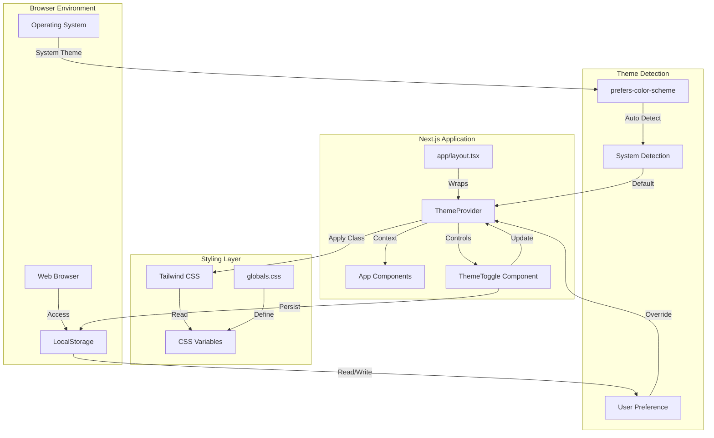

### 1.2 Component Hierarchy

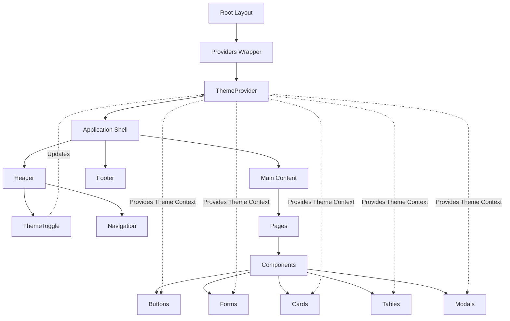

---

## 2. Theme Flow Architecture

### 2.1 Initial Theme Detection Flow

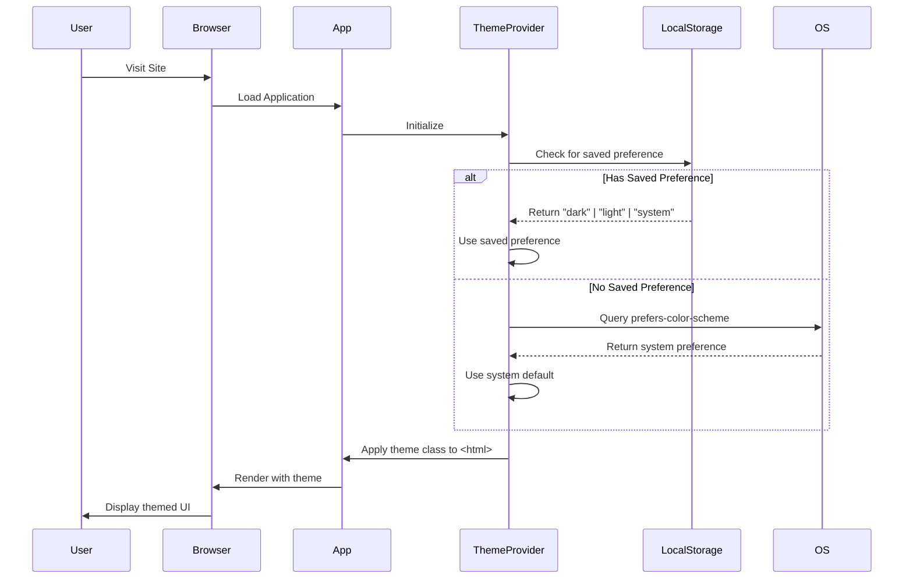

### 2.2 Manual Theme Change Flow

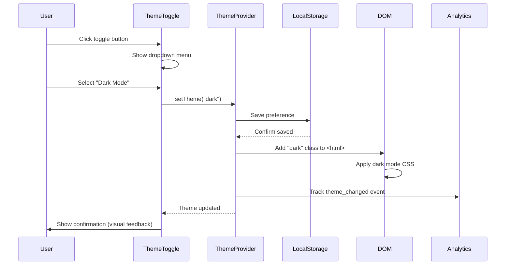

### 2.3 System Preference Change Flow

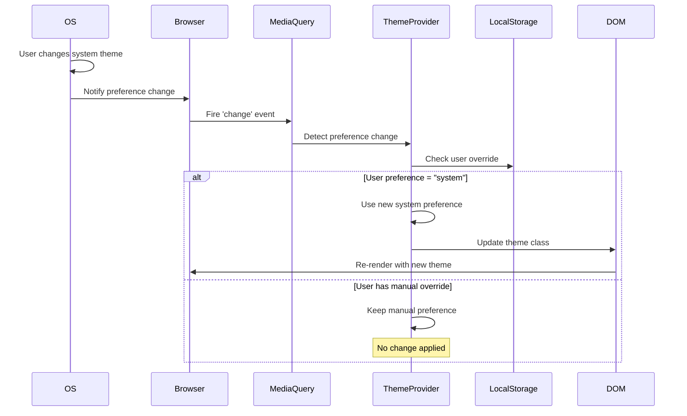

---

## 3. Color System Architecture

### 3.1 CSS Variable Layer

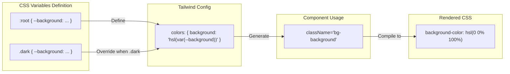

### 3.2 Color Token Structure

```
Color System Hierarchy:

Root Level (Semantic Colors)
├── background (Page background)
├── foreground (Primary text)
├── primary (Brand color)
│   └── primary-foreground (Text on primary)
├── secondary (Supporting color)
│   └── secondary-foreground (Text on secondary)
├── muted (Subtle backgrounds)
│   └── muted-foreground (Subtle text)
├── accent (Highlight color)
│   └── accent-foreground (Text on accent)
├── destructive (Error/danger)
│   └── destructive-foreground (Text on destructive)
├── border (Borders, dividers)
├── input (Form input borders)
├── ring (Focus rings)
└── chart-1 through chart-5 (Data visualization)
```

### 3.3 Color Mapping

| Semantic Token | Light Mode HSL | Dark Mode HSL | Purpose |
|----------------|----------------|---------------|---------|
| `--background` | `0 0% 100%` (White) | `222.2 84% 4.9%` (Near Black) | Page background |
| `--foreground` | `222.2 84% 4.9%` | `210 40% 98%` | Primary text |
| `--primary` | `221.2 83.2% 53.3%` | `217.2 91.2% 59.8%` | Brand blue |
| `--muted` | `210 40% 96.1%` | `217.2 32.6% 17.5%` | Subtle backgrounds |
| `--border` | `214.3 31.8% 91.4%` | `217.2 32.6% 17.5%` | Dividers |
| `--destructive` | `0 84.2% 60.2%` | `0 62.8% 30.6%` | Error states |

---

## 4. State Management Architecture

### 4.1 Theme State Diagram

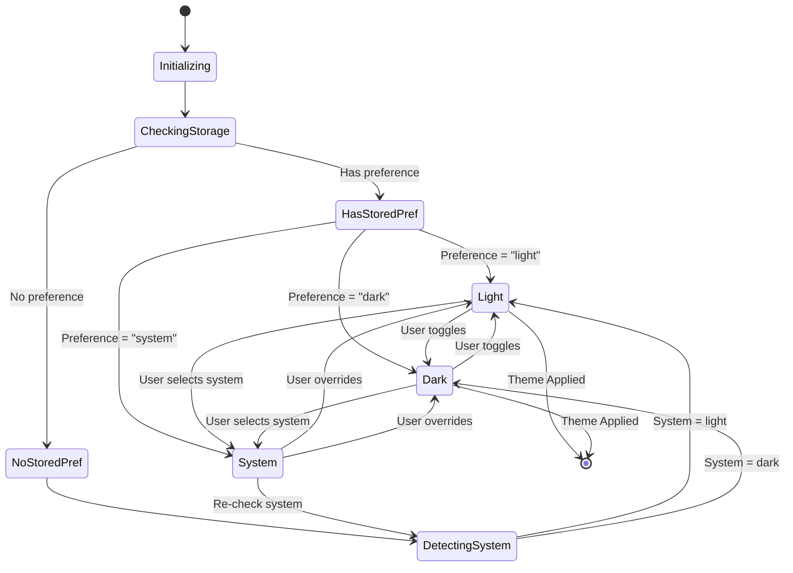

### 4.2 Theme Context Structure

```typescript
// Context shape
interface ThemeContextValue {
  // Current resolved theme ("light" | "dark")
  theme: string | undefined;

  // User's preference ("light" | "dark" | "system")
  setTheme: (theme: string) => void;

  // Available themes
  themes: string[];

  // Force a specific theme (bypass system detection)
  forcedTheme: string | undefined;

  // System preference if user chose "system"
  systemTheme: "light" | "dark" | undefined;

  // Resolved theme (what's actually applied)
  resolvedTheme: "light" | "dark" | undefined;
}
```

### 4.3 Storage Architecture

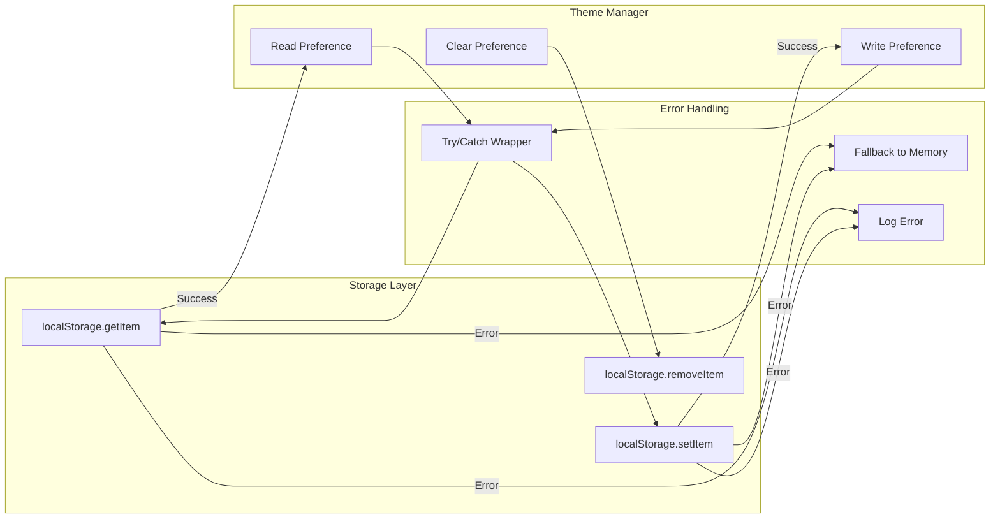

**Storage Key**: `gen-theme-preference`

**Stored Values**:
- `"light"` - User explicitly chose light mode
- `"dark"` - User explicitly chose dark mode
- `"system"` - User chose to follow system preference
- `null` - No preference set (defaults to system)

---

## 5. Component Architecture

### 5.1 ThemeProvider Component

```
ThemeProvider (from next-themes)
│
├── Props
│   ├── attribute: "class"                    // Use .dark class
│   ├── defaultTheme: "system"                // Default to system
│   ├── enableSystem: true                    // Allow system detection
│   ├── disableTransitionOnChange: false      // Smooth transitions
│   ├── storageKey: "gen-theme-preference"    // Storage key
│   └── themes: ["light", "dark"]             // Available themes
│
├── Internal State
│   ├── theme: string | undefined             // Current theme
│   ├── resolvedTheme: string | undefined     // Actual applied theme
│   └── systemTheme: string | undefined       // System preference
│
├── Effects
│   ├── Load from localStorage on mount
│   ├── Listen to system preference changes
│   ├── Apply theme class to <html>
│   └── Persist changes to localStorage
│
└── Provides Context
    └── useTheme hook access
```

### 5.2 ThemeToggle Component Architecture

```
ThemeToggle Component
│
├── Hooks
│   ├── useTheme() → { theme, setTheme }
│   ├── useState(mounted) → Prevent hydration mismatch
│   └── useEffect() → Set mounted after client render
│
├── State
│   ├── mounted: boolean                      // Client-side ready
│   └── isOpen: boolean                       // Dropdown open state
│
├── UI Elements
│   ├── Trigger Button
│   │   ├── Sun icon (visible in light mode)
│   │   ├── Moon icon (visible in dark mode)
│   │   └── Screen reader text
│   │
│   └── Dropdown Menu
│       ├── Light option
│       ├── Dark option
│       └── System option
│
└── Event Handlers
    ├── onClick(theme) → setTheme(theme)
    └── onKeyDown() → Keyboard navigation
```

### 5.3 Component Dark Mode Integration Pattern

```
Generic Component Architecture
│
├── Base Styles (Always applied)
│   ├── Layout: flex, grid, padding, margin
│   ├── Typography: font-size, font-weight, line-height
│   └── Borders: border-radius, border-width
│
├── Light Mode Colors (Default)
│   ├── bg-white
│   ├── text-gray-900
│   └── border-gray-200
│
├── Dark Mode Colors (Conditional)
│   ├── dark:bg-gray-900
│   ├── dark:text-gray-100
│   └── dark:border-gray-700
│
└── Interactive States
    ├── hover:bg-gray-50 dark:hover:bg-gray-800
    ├── focus:ring-primary dark:focus:ring-primary
    └── active:bg-gray-100 dark:active:bg-gray-700
```

---

## 6. Performance Architecture

### 6.1 Rendering Optimization

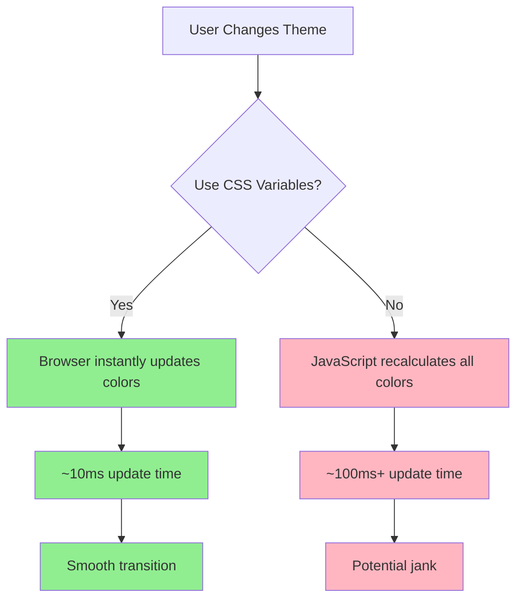

**Decision**: ✅ Use CSS Variables for optimal performance

### 6.2 Bundle Size Impact

```
Package Size Analysis:

next-themes
├── Minified: 4.2 KB
├── Gzipped: 1.8 KB
└── Impact: <0.2% of total bundle

Custom Implementation
├── Theme Provider: 2 KB
├── CSS Variables: 1 KB
├── Theme Toggle: 3 KB
└── Total: ~7 KB (gzipped)

Acceptable: Yes ✅
```

### 6.3 Critical Rendering Path

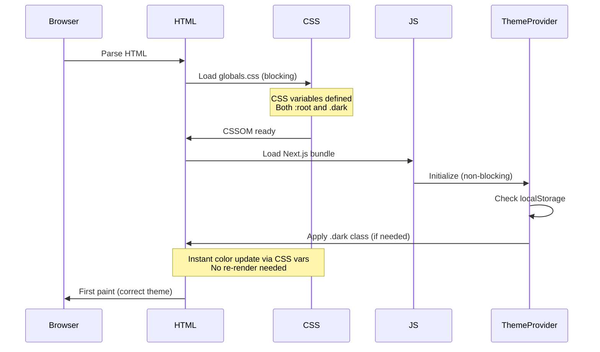

**Key**: Theme class applied before first paint = Zero FOUC

---

## 7. Accessibility Architecture

### 7.1 ARIA Structure

```html
<!-- ThemeToggle ARIA Structure -->
<div role="group" aria-labelledby="theme-toggle-label">
  <span id="theme-toggle-label" className="sr-only">
    Theme Selector
  </span>

  <button
    type="button"
    role="button"
    aria-label="Toggle theme"
    aria-expanded={isOpen}
    aria-haspopup="menu"
    aria-controls="theme-menu"
  >
    <Sun className="icon-light" aria-hidden="true" />
    <Moon className="icon-dark" aria-hidden="true" />
  </button>

  <div
    id="theme-menu"
    role="menu"
    aria-orientation="vertical"
    aria-labelledby="theme-toggle-label"
  >
    <button role="menuitem" onClick={() => setTheme("light")}>
      <Sun aria-hidden="true" />
      <span>Light</span>
    </button>

    <button role="menuitem" onClick={() => setTheme("dark")}>
      <Moon aria-hidden="true" />
      <span>Dark</span>
    </button>

    <button role="menuitem" onClick={() => setTheme("system")}>
      <Monitor aria-hidden="true" />
      <span>System</span>
    </button>
  </div>
</div>
```

### 7.2 Keyboard Navigation Flow

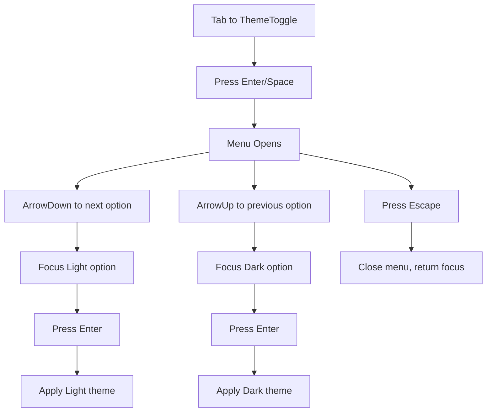

### 7.3 Screen Reader Announcements

```typescript
// Announcement architecture
interface ThemeAnnouncement {
  // Live region element
  element: HTMLDivElement;

  // ARIA attributes
  role: "status";
  ariaLive: "polite";
  ariaAtomic: "true";

  // Announcement text
  messages: {
    lightActivated: "Light theme activated";
    darkActivated: "Dark theme activated";
    systemActivated: "System theme activated";
  };
}
```

---

## 8. Error Handling Architecture

### 8.1 Error Boundaries

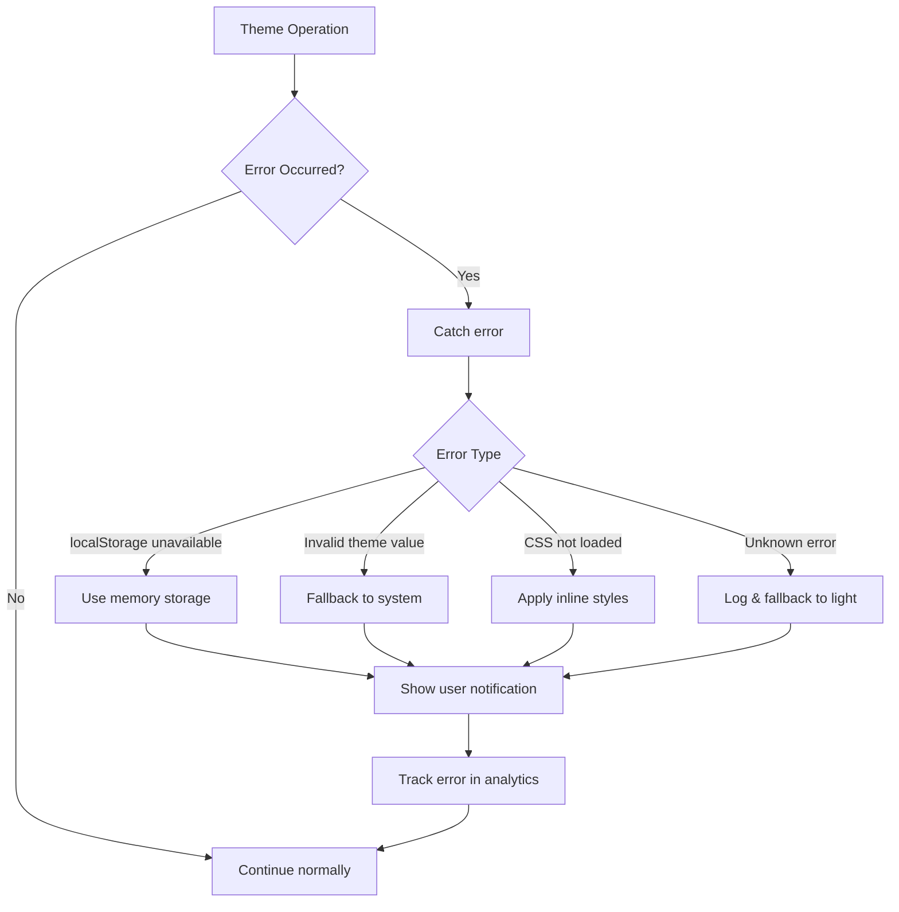

### 8.2 Fallback Chain

```
Theme Resolution Fallback Chain:

1. User's explicit preference (localStorage)
   ↓ (if unavailable)
2. System preference (prefers-color-scheme)
   ↓ (if unavailable)
3. Default theme ("light")
   ↓
4. Hard-coded light mode
```

### 8.3 Recovery Strategies

| Error Scenario | Detection | Recovery | User Impact |
|----------------|-----------|----------|-------------|
| localStorage blocked | Try/catch on getItem | Memory-only storage | ⚠️ Preference not persisted |
| Invalid stored value | JSON parse error | Clear storage, use default | ⚠️ Preference reset |
| CSS variables not loaded | Check computed style | Inline style fallback | ⚠️ Colors may be off |
| Theme class not applying | MutationObserver | Force re-apply | ⚠️ Brief flash |
| System detection fails | matchMedia undefined | Default to light | ✅ Graceful degradation |

---

## 9. Testing Architecture

### 9.1 Test Pyramid

```
                    ┌─────────────┐
                    │   E2E Tests │ (5%)
                    │  Playwright │
                    └─────────────┘
                   ┌───────────────┐
                   │Integration Tests│ (25%)
                   │  Testing Library│
                   └───────────────┘
              ┌─────────────────────────┐
              │     Unit Tests          │ (70%)
              │  Vitest + React Testing │
              └─────────────────────────┘
```

### 9.2 Test Coverage Architecture

```typescript
Test Structure:

lib/
├── hooks/
│   ├── use-theme.test.tsx          // Hook behavior
│   └── use-mounted.test.tsx        // SSR safety
│
components/
├── theme-toggle.test.tsx           // Component rendering
└── theme-provider.test.tsx         // Context provision

integration/
├── theme-persistence.test.ts       // localStorage integration
├── system-detection.test.ts        // Media query integration
└── theme-switching.test.ts         // Full theme change flow

e2e/
└── dark-mode.spec.ts               // Full user journey
```

### 9.3 Visual Regression Architecture

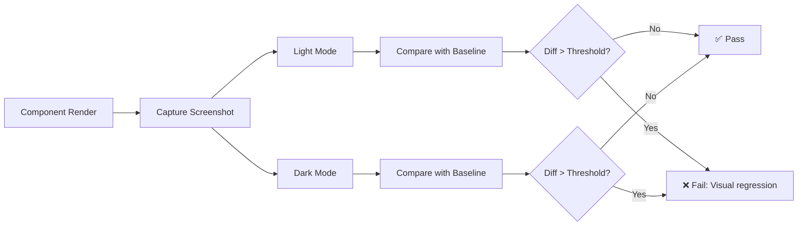

---

## 10. Deployment Architecture

### 10.1 Build Process

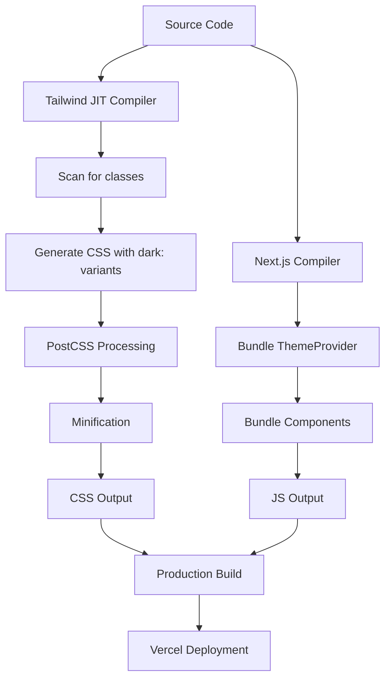

### 10.2 CDN Architecture

```
Static Assets on CDN:
├── CSS Files
│   ├── globals.css (with CSS variables)
│   ├── tailwind.css (with dark: utilities)
│   └── Cache-Control: immutable, max-age=31536000
│
├── JS Bundles
│   ├── theme-provider.js
│   ├── theme-toggle.js
│   └── Cache-Control: immutable, max-age=31536000
│
└── Font Files (if any)
    └── Cache-Control: immutable, max-age=31536000
```

### 10.3 Runtime Architecture

```
Client-Side Execution:
1. HTML loads → <html> rendered (no theme class yet)
2. CSS loads → Variables defined for both :root and .dark
3. ThemeProvider JS loads → Check localStorage
4. Theme class applied → Colors update instantly (CSS vars)
5. ThemeToggle hydrates → Interactive

Time to Interactive: <1 second
Flash of Incorrect Theme: ZERO (CSS vars + pre-render)
```

---

## 11. Monitoring & Analytics Architecture

### 11.1 Metrics Collection

```typescript
interface ThemeMetrics {
  // User preferences
  theme_preference: "light" | "dark" | "system";

  // Engagement
  theme_toggle_clicks: number;
  time_in_light_mode: number;  // seconds
  time_in_dark_mode: number;   // seconds

  // Performance
  theme_switch_duration: number;  // milliseconds

  // System
  os_preference: "light" | "dark";
  browser: string;
  device_type: "mobile" | "desktop";
}
```

### 11.2 Event Tracking

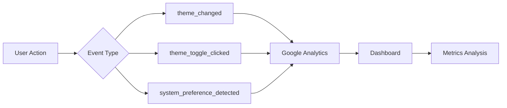

---

## 12. Security Architecture

### 12.1 XSS Prevention

```typescript
// Sanitization layer
function sanitizeThemeValue(value: unknown): string {
  const allowedThemes = ["light", "dark", "system"];

  if (typeof value !== "string") {
    return "light";  // Default
  }

  if (!allowedThemes.includes(value)) {
    console.warn("Invalid theme value:", value);
    return "light";  // Safe default
  }

  return value;
}
```

### 12.2 localStorage Integrity

```
Storage Security Measures:

1. Input Validation
   ├── Whitelist allowed values
   ├── Type checking
   └── Sanitization

2. Error Handling
   ├── Try/catch wrappers
   ├── Fallback to safe defaults
   └── Error logging

3. Privacy
   ├── No sensitive data in theme preference
   ├── No tracking IDs
   └── User can clear anytime
```

---

## 13. Integration Points

### 13.1 Next.js App Router Integration

```
app/
├── layout.tsx                     → ThemeProvider wrapper
├── providers.tsx                  → Centralize all providers
├── globals.css                    → CSS variables
│
├── (routes)/
│   ├── page.tsx                  → Uses theme colors
│   └── layout.tsx                → Inherits theme context
│
└── components/
    ├── header.tsx                → Contains ThemeToggle
    └── theme-toggle.tsx          → Theme control UI
```

### 13.2 Tailwind CSS Integration

```javascript
// tailwind.config.ts architecture
module.exports = {
  darkMode: "class",  // Key integration point

  theme: {
    extend: {
      colors: {
        // Semantic tokens reference CSS variables
        background: "hsl(var(--background))",
        foreground: "hsl(var(--foreground))",
        // ... more color mappings
      },
    },
  },
};
```

### 13.3 Component Library Integration

```
shadcn/ui Components:
├── Already support dark mode via CSS variables ✅
├── Use same color token system ✅
├── Automatically adapt to theme changes ✅
└── No additional configuration needed ✅

Custom Components:
├── Must add dark: variants manually ⚠️
├── Should use semantic color tokens ✅
├── Test in both themes required ⚠️
└── Follow established patterns ✅
```

---

## 14. Scalability Architecture

### 14.1 Future Theme Support

```
Extensibility Design:

Current: Binary themes (light/dark)
├── CSS variables for all colors
├── Single .dark class toggle
└── Two sets of variable values

Future: Multiple themes
├── .theme-high-contrast class
├── .theme-sepia class
├── .theme-custom-brand class
└── Additional CSS variable sets
```

### 14.2 Component Scaling

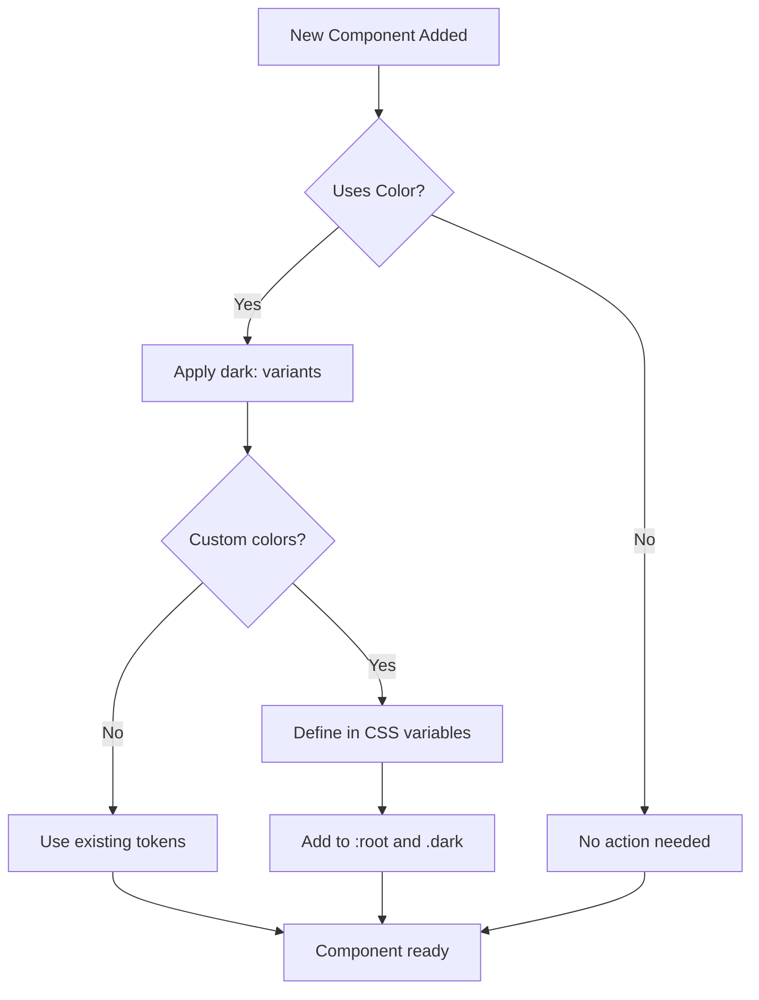

---

## 15. Architecture Decision Records (ADRs)

### ADR-001: Use CSS Variables Over JavaScript

**Status**: ✅ Accepted

**Context**: Need to switch themes efficiently without re-rendering components.

**Decision**: Use CSS custom properties (variables) for all theme colors.

**Consequences**:
- ✅ Instant color updates (<10ms)
- ✅ No component re-renders
- ✅ Better performance
- ⚠️ Limited browser support (IE11 not supported)

### ADR-002: Class-Based Dark Mode

**Status**: ✅ Accepted

**Context**: Choose between media query dark mode or class-based.

**Decision**: Use class-based (`darkMode: "class"` in Tailwind).

**Consequences**:
- ✅ User can override system preference
- ✅ More control over theme application
- ✅ Easier to test
- ⚠️ Requires JavaScript for toggle

### ADR-003: next-themes Library

**Status**: ✅ Accepted

**Context**: Build custom theme system or use library.

**Decision**: Use `next-themes` package.

**Consequences**:
- ✅ Battle-tested, maintained
- ✅ Handles SSR edge cases
- ✅ Small bundle size (~2KB)
- ⚠️ External dependency

### ADR-004: Semantic Color Tokens

**Status**: ✅ Accepted

**Context**: Use raw colors (blue-500) or semantic tokens (primary).

**Decision**: Use semantic tokens (background, primary, etc.).

**Consequences**:
- ✅ Easier to maintain
- ✅ Consistent theming
- ✅ Flexible for future themes
- ⚠️ Learning curve for developers

---

## 16. Summary

### Architecture Highlights

1. **CSS Variables** - Foundation for instant theme switching
2. **next-themes** - Robust, battle-tested theme management
3. **Class-based Dark Mode** - User control with system default
4. **Component Isolation** - Each component self-contained
5. **Performance First** - Zero layout shift, minimal JavaScript
6. **Accessibility Built-in** - ARIA, keyboard nav, screen readers
7. **Error Resilient** - Graceful degradation at every level

### Key Metrics

| Metric | Target | Architecture Support |
|--------|--------|---------------------|
| Theme switch time | <100ms | CSS variables enable instant updates |
| Bundle size | <3KB | next-themes is 1.8KB gzipped |
| FOUC (Flash) | Zero | SSR-safe, pre-render theme class |
| Accessibility | WCAG AA | Built-in ARIA, keyboard nav |
| Browser support | 95%+ users | Graceful degradation for old browsers |

---

**Document Status**: ✅ Complete
**Next Phase**: SPARC-R (Refinement/Implementation)
**Estimated Implementation Time**: 7-10 days
