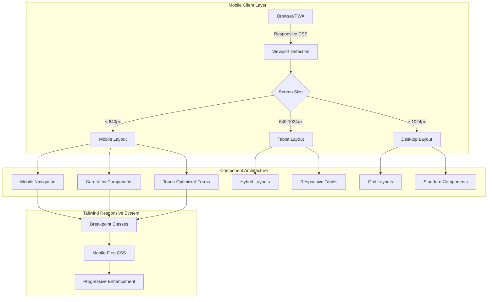
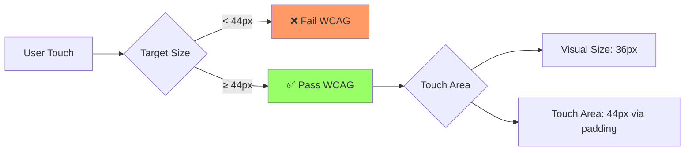
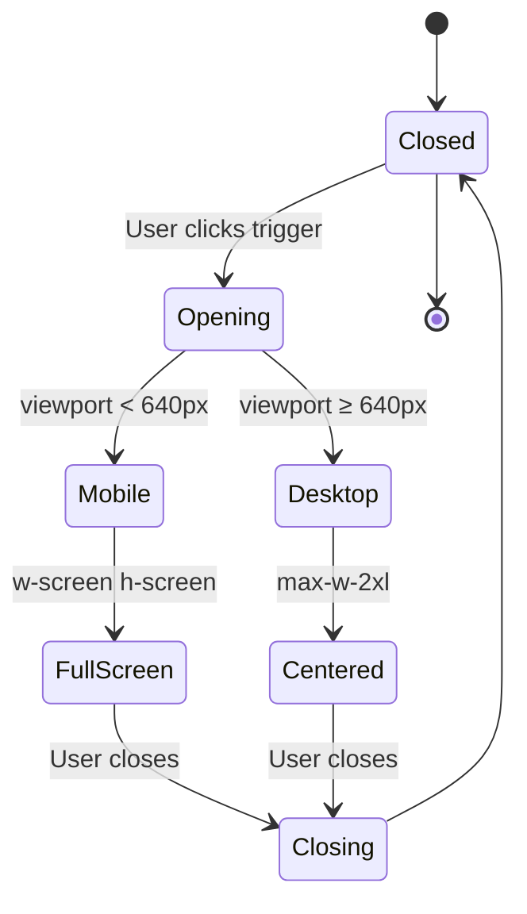
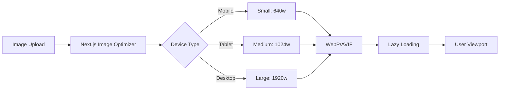
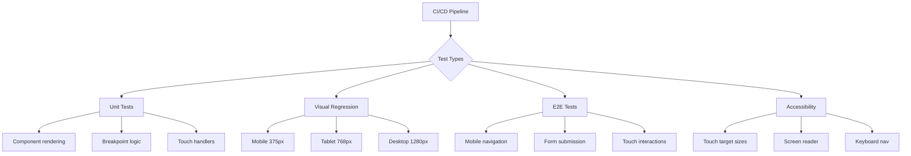

# Phase 1 Task 1.3: Mobile Layout Optimization - Architecture

**SPARC Phase:** Architecture (SPARC-A)
**Task ID:** Phase 1.3

---

## 1. System Architecture Diagram



---

## 2. Component Hierarchy

```
App Layout
├── ResponsiveHeader
│   ├── Logo (always visible)
│   ├── DesktopNav (hidden md:flex)
│   ├── MobileNav (flex md:hidden)
│   │   └── Sheet (slide-in menu)
│   └── ThemeToggle
│
├── Main Content
│   ├── JobListingPage
│   │   ├── SearchFilters
│   │   │   ├── Desktop: Sidebar
│   │   │   └── Mobile: BottomSheet
│   │   └── JobGrid
│   │       ├── Desktop: grid-cols-3
│   │       └── Mobile: grid-cols-1
│   │
│   ├── ProfileSetupPage
│   │   └── MultiStepForm
│   │       ├── MobileProgress (sticky top)
│   │       ├── FormStep (scrollable)
│   │       └── MobileNav (sticky bottom)
│   │
│   └── DashboardPage
│       ├── Stats Cards
│       │   ├── Desktop: grid-cols-4
│       │   └── Mobile: grid-cols-2
│       └── DataTable
│           ├── Desktop: <Table />
│           └── Mobile: <CardList />
│
└── ResponsiveFooter
```

---

## 3. Breakpoint Strategy

| Breakpoint | Width | Target Device | Layout Strategy |
|------------|-------|---------------|----------------|
| **xs** (default) | 0px - 639px | Mobile phones | Single column, stacked, full-width |
| **sm** | 640px - 767px | Large phones, small tablets | 2-column grids, compact spacing |
| **md** | 768px - 1023px | Tablets, small laptops | 2-3 column grids, side navigation |
| **lg** | 1024px - 1279px | Laptops, desktops | 3-4 column grids, full feature set |
| **xl** | 1280px+ | Large desktops | 4+ columns, maximum content width |

**Implementation:**
```css
/* Mobile-first approach */
.container {
  @apply p-4;           /* Base: 16px padding */
  @apply md:p-6;        /* Tablet: 24px */
  @apply lg:p-8;        /* Desktop: 32px */
}
```

---

## 4. Touch Target Architecture



**Touch Target Guidelines:**
- Minimum: 44x44px (WCAG 2.1 AA)
- Comfortable: 48x48px
- Large: 56x56px (primary actions)

---

## 5. Navigation Architecture

### Desktop Navigation
```
+--------------------------------------------------+
| Logo | Find Jobs | Schools | Sign In | Theme    |
+--------------------------------------------------+
```

### Mobile Navigation
```
+--------------------------------+
| Logo              | [☰] [🌓]   |
+--------------------------------+

When hamburger clicked:
┌─────────────────┐
│ ✕  Menu         │
│                 │
│ 🏠 Home         │
│ 💼 Find Jobs    │
│ 🏫 Schools      │
│ 👤 Profile      │
│ ⚙️  Settings     │
│                 │
└─────────────────┘
```

---

## 6. Form Layout Patterns

### Multi-Step Form (Mobile)
```
┌─────────────────────────────┐
│ Step 2 of 5      [40%] ●●○○○ │ ← Sticky progress
├─────────────────────────────┤
│                             │
│   [Scrollable Form Content] │
│                             │
│                             │
├─────────────────────────────┤
│ [ Back ]      [   Next →  ] │ ← Sticky footer
└─────────────────────────────┘
```

### Desktop Form
```
┌──────────────────────┬──────────┐
│                      │          │
│  Form Fields         │ Progress │
│  (2-column grid)     │ Sidebar  │
│                      │          │
│                      │          │
│  [Submit Button]     │          │
└──────────────────────┴──────────┘
```

---

## 7. Data Table Strategies

### Option 1: Horizontal Scroll (Simple)
```typescript
<div className="overflow-x-auto">
  <Table className="min-w-[600px]">
    {/* Standard table */}
  </Table>
</div>
```

### Option 2: Card View (Recommended)
```typescript
// Desktop: Table
// Mobile: Card list with key-value pairs

{isMobile ? (
  <div className="space-y-4">
    {data.map(row => <DataCard key={row.id} data={row} />)}
  </div>
) : (
  <Table>{/* Standard table */}</Table>
)}
```

---

## 8. Modal/Dialog Behavior



**Mobile Modal:**
- Full screen (100vw x 100vh)
- Sticky header with close button
- Scrollable body
- Optional sticky footer for actions

**Desktop Modal:**
- Centered with max-width
- Semi-transparent backdrop
- Standard dialog behavior

---

## 9. Image Responsiveness



**Implementation:**
```tsx
<Image
  src="/image.jpg"
  alt="Description"
  sizes="(max-width: 640px) 100vw, (max-width: 1024px) 50vw, 33vw"
  fill
  className="object-cover"
/>
```

---

## 10. Performance Architecture

### Critical Rendering Path (Mobile)
```
1. HTML (5KB) - First paint
2. Critical CSS (inline, 14KB) - Styled render
3. Hydration JS (split chunks)
4. Non-critical assets (lazy loaded)
```

### Bundle Splitting Strategy
```
Main bundle:
  - Core navigation
  - Layout components
  - Critical UI

Route bundles:
  - /jobs -> job-listing.chunk.js
  - /profile -> profile.chunk.js
  - /dashboard -> dashboard.chunk.js

Mobile-specific bundles:
  - mobile-navigation.chunk.js (lazy)
  - touch-gestures.chunk.js (lazy)
```

---

## 11. Testing Architecture



---

## 12. Decision Records (ADRs)

### ADR-001: Mobile-First Approach
**Status:** ✅ Accepted
**Context:** Need to support mobile devices as primary target
**Decision:** Use mobile-first CSS with progressive enhancement
**Consequences:**
- ✅ Better mobile performance (default styles are mobile)
- ✅ Simpler media queries (adding features vs removing)
- ⚠️ Requires discipline to avoid desktop-first thinking

### ADR-002: Sheet Component for Mobile Menu
**Status:** ✅ Accepted
**Context:** Need accessible, animated mobile navigation
**Decision:** Use Radix UI Sheet component from shadcn/ui
**Consequences:**
- ✅ Accessibility built-in (focus management, ARIA)
- ✅ Smooth animations
- ✅ Prevents body scroll when open
- ⚪ Adds 5KB to bundle (acceptable)

### ADR-003: Card View for Mobile Tables
**Status:** ✅ Accepted
**Context:** Tables are difficult to read on mobile
**Decision:** Render tables as card lists on mobile (<768px)
**Consequences:**
- ✅ Better UX for mobile users
- ✅ Maintains all data visibility
- ⚠️ Requires dual rendering logic
- ⚠️ Slightly larger component code

---

**Document Status:** ✅ APPROVED
**Next Phase:** SPARC-R (Refinement/Implementation)
