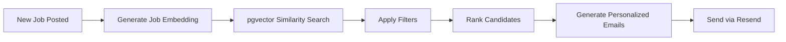
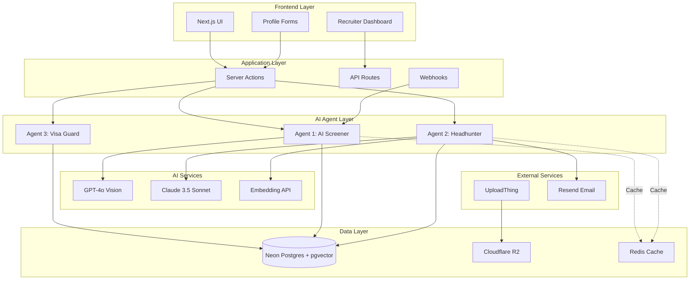
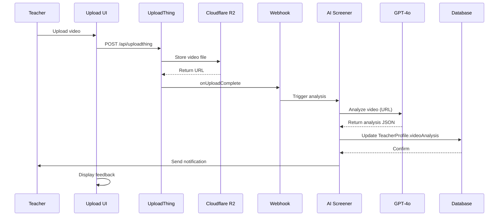
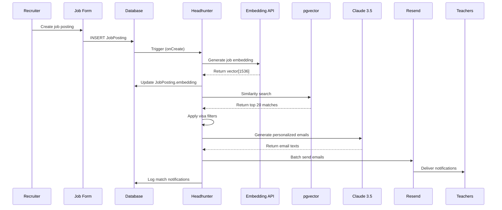
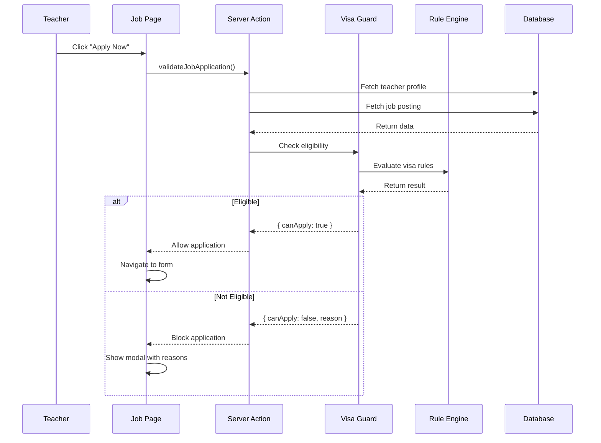
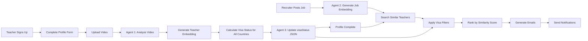

# AI Agents Implementation Specification

## Table of Contents
1. [System Overview](#system-overview)
2. [Agent 1: AI Screener](#agent-1-ai-screener)
3. [Agent 2: Autonomous Headhunter](#agent-2-autonomous-headhunter)
4. [Agent 3: Rule-based Visa Guard](#agent-3-rule-based-visa-guard)
5. [Architecture Diagrams](#architecture-diagrams)
6. [API Specifications](#api-specifications)
7. [Data Flow](#data-flow)
8. [Error Handling](#error-handling)
9. [Performance Optimization](#performance-optimization)
10. [Security Considerations](#security-considerations)

---

## System Overview

### Architecture Principles

The Global Educator Nexus platform implements three specialized AI agents that work in concert to create an intelligent job matching and screening system. Each agent is designed with specific responsibilities:

- **Stateless Operations**: All agents are designed to be stateless for horizontal scalability
- **Event-driven Architecture**: Agents respond to database events and webhooks
- **Async Processing**: Heavy AI operations are processed asynchronously
- **Caching Strategy**: Results are cached in JSONB fields to avoid redundant API calls

### Technology Stack

```
┌─────────────────────────────────────────────────────────────┐
│                    Next.js 15 App Router                     │
├─────────────────────────────────────────────────────────────┤
│  AI Layer          │  Database Layer    │  Storage Layer    │
│  ───────────       │  ──────────────    │  ─────────────    │
│  • GPT-4o          │  • Neon Postgres   │  • Cloudflare R2  │
│  • Claude 3.5      │  • pgvector        │  • UploadThing    │
│  • Embeddings      │  • Prisma ORM      │                   │
└─────────────────────────────────────────────────────────────┘
```

### Key Dependencies

```json
{
  "ai": "^4.0.0",
  "@ai-sdk/openai": "^1.0.0",
  "@ai-sdk/anthropic": "^1.0.0",
  "uploadthing": "^7.0.0",
  "resend": "^4.0.0",
  "pgvector": "^0.2.0",
  "@prisma/client": "^6.0.0"
}
```

---

## Agent 1: AI Screener

### Purpose
Transform unstructured video data into structured, searchable metadata that can be used for candidate evaluation and matching.

### Technical Specification

#### Trigger Events
1. **Upload Complete**: UploadThing webhook fires `onUploadComplete`
2. **Manual Re-analysis**: Teacher requests profile re-evaluation
3. **Scheduled Updates**: Quarterly re-analysis for all profiles

#### Implementation Details

##### 1. Video Upload Handler
```typescript
// File: app/api/uploadthing/core.ts
Location: Server-side Upload Handler

Input:
  - Video file (max 100MB)
  - userId: string
  - profileId: string

Output:
  - videoUrl: string (R2 CDN URL)
  - fileKey: string (R2 object key)

Processing:
  1. Validate file type (mp4, webm, mov)
  2. Upload to R2 with organization: /videos/{userId}/{timestamp}-{filename}
  3. Generate signed URL (24-hour expiry)
  4. Trigger AI analysis
```

##### 2. AI Analysis Engine

**System Prompt Strategy**:
```typescript
const SCREENER_SYSTEM_PROMPT = `You are an expert international school recruiter with 15+ years of experience evaluating teaching candidates.

Your task is to analyze a video resume and provide objective, structured feedback.

EVALUATION CRITERIA:
1. Accent & Pronunciation (1-10)
   - Clarity of speech
   - Accent type (North American, British, Australian, etc.)
   - Potential communication barriers

2. Energy & Enthusiasm (1-10)
   - Body language
   - Vocal variety
   - Passion for teaching

3. Professionalism (1-10)
   - Appearance (appropriate attire, grooming)
   - Background setting
   - Eye contact with camera

4. Technical Quality (1-10)
   - Lighting
   - Audio quality
   - Video stability

OUTPUT FORMAT (JSON only, no additional text):
{
  "accent_type": "North American | British | Australian | Other",
  "accent_clarity_score": 1-10,
  "energy_level": "High | Medium | Low",
  "energy_score": 1-10,
  "professionalism_score": 1-10,
  "technical_quality_score": 1-10,
  "overall_score": 1-100,
  "key_strengths": ["strength1", "strength2"],
  "improvement_areas": ["area1", "area2"],
  "summary": "2-3 sentence professional summary",
  "recommended_for_roles": ["Elementary", "Secondary", "ESL", "Special Education"]
}`;
```

**API Call Structure**:
```typescript
// File: lib/ai/video-analyzer.ts

import { generateObject } from 'ai';
import { openai } from '@ai-sdk/openai';

async function analyzeVideo(videoUrl: string) {
  const result = await generateObject({
    model: openai('gpt-4o'),
    schema: VideoAnalysisSchema, // Zod schema
    messages: [
      {
        role: 'system',
        content: SCREENER_SYSTEM_PROMPT
      },
      {
        role: 'user',
        content: [
          { type: 'text', text: 'Please analyze this teaching candidate video.' },
          { type: 'video', videoUrl: videoUrl }
        ]
      }
    ],
    temperature: 0.3, // Low temperature for consistency
  });

  return result.object;
}
```

##### 3. Database Update Flow

```typescript
// File: app/actions/analyze-video.ts

export async function analyzeTeacherVideo(profileId: string) {
  // 1. Fetch profile with video URL
  const profile = await prisma.teacherProfile.findUnique({
    where: { id: profileId },
    select: { videoUrl: true, userId: true }
  });

  if (!profile?.videoUrl) {
    throw new Error('No video found');
  }

  // 2. Call AI analysis
  const analysis = await analyzeVideo(profile.videoUrl);

  // 3. Update profile with results
  const updated = await prisma.teacherProfile.update({
    where: { id: profileId },
    data: {
      videoAnalysis: analysis, // JSONB field
      lastAnalyzedAt: new Date(),
      profileCompleteness: calculateCompleteness(analysis)
    }
  });

  // 4. Notify user
  await notifyTeacher(profile.userId, analysis);

  return updated;
}
```

##### 4. User Feedback System

```typescript
// UI Component: components/video-feedback.tsx

Interface:
  - Visual score bars (accent, energy, professionalism)
  - Actionable improvement tips
  - Re-record button if score < 70

Example Feedback:
  "Your energy level is great (9/10), but the lighting is too dark (4/10).
   Try recording near a window or use a desk lamp."
```

#### Performance Metrics

- **Processing Time**: ~30-45 seconds for 2-minute video
- **Cost per Analysis**: ~$0.15 (GPT-4o video pricing)
- **Accuracy Target**: 85% correlation with human recruiter scores
- **Cache Duration**: 90 days (re-analysis available on demand)

#### Error Handling

```typescript
Error Scenarios:
1. Video too long (>5 min): Return 413 + guidance
2. Poor quality (resolution <480p): Warning but process
3. AI rate limit: Queue with exponential backoff
4. AI hallucination detection: Flag for manual review if confidence <70%
```

---

## Agent 2: Autonomous Headhunter

### Purpose
Proactively match qualified teachers to new job postings using semantic search (RAG) and personalized email outreach.

### Technical Specification

#### Trigger Events
1. **New Job Posted**: Database trigger on `JobPosting` INSERT
2. **Teacher Profile Updated**: Re-run matching for active jobs
3. **Scheduled Batch**: Daily digest for non-urgent postings

#### Implementation Details

##### 1. RAG Pipeline Architecture



##### 2. Embedding Generation

```typescript
// File: lib/ai/embeddings.ts

import { embed } from 'ai';
import { openai } from '@ai-sdk/openai';

export async function generateJobEmbedding(job: JobPosting) {
  // Create rich semantic representation
  const textToEmbed = `
    Position: ${job.title}
    Subject: ${job.subject}
    Location: ${job.city}, ${job.country}
    School Type: ${job.schoolType}
    Requirements: ${job.requirements}
    Benefits: ${job.benefits}
    Culture: ${job.cultureFit}
  `.trim();

  const { embedding } = await embed({
    model: openai.embedding('text-embedding-3-small'),
    value: textToEmbed,
  });

  return embedding; // Returns number[] of length 1536
}

export async function generateTeacherEmbedding(teacher: TeacherProfile) {
  const textToEmbed = `
    Experience: ${teacher.yearsExperience} years teaching ${teacher.subjects.join(', ')}
    Certifications: ${teacher.certifications.join(', ')}
    Locations: Interested in ${teacher.preferredCountries.join(', ')}
    Strengths: ${teacher.teachingStrengths}
    Bio: ${teacher.bio}
  `.trim();

  const { embedding } = await embed({
    model: openai.embedding('text-embedding-3-small'),
    value: textToEmbed,
  });

  return embedding;
}
```

##### 3. Vector Similarity Search

```typescript
// File: lib/db/vector-search.ts

export async function findMatchingTeachers(jobId: string, limit = 20) {
  const job = await prisma.jobPosting.findUnique({
    where: { id: jobId }
  });

  if (!job.embedding) {
    throw new Error('Job embedding not generated');
  }

  // Raw SQL for pgvector cosine similarity
  const matches = await prisma.$queryRaw`
    SELECT
      t.id,
      t."userId",
      t.embedding <=> ${job.embedding}::vector AS distance,
      1 - (t.embedding <=> ${job.embedding}::vector) AS similarity,
      t."videoAnalysis",
      t."visaStatus"
    FROM "TeacherProfile" t
    WHERE
      t.embedding IS NOT NULL
      AND 1 - (t.embedding <=> ${job.embedding}::vector) >= 0.85
    ORDER BY similarity DESC
    LIMIT ${limit}
  `;

  return matches;
}
```

##### 4. Multi-stage Filtering

```typescript
// File: lib/matching/filter-candidates.ts

export function applyFilters(
  candidates: RawMatch[],
  job: JobPosting
): FilteredCandidate[] {
  return candidates
    .filter(c => {
      // Stage 1: Visa eligibility
      const visaCheck = checkVisaEligibility(c.visaStatus, job.country);
      if (!visaCheck.eligible) return false;

      // Stage 2: Minimum qualifications
      if (job.minYearsExperience && c.yearsExperience < job.minYearsExperience) {
        return false;
      }

      // Stage 3: Subject match
      if (job.requiredSubjects.length > 0) {
        const hasMatch = job.requiredSubjects.some(subject =>
          c.subjects.includes(subject)
        );
        if (!hasMatch) return false;
      }

      // Stage 4: Salary expectations
      if (c.minSalaryUSD && job.salaryUSD < c.minSalaryUSD) {
        return false;
      }

      return true;
    })
    .map(c => ({
      ...c,
      matchReasons: generateMatchReasons(c, job)
    }));
}
```

##### 5. Personalized Email Generation

```typescript
// File: lib/ai/email-generator.ts

import { generateText } from 'ai';
import { anthropic } from '@ai-sdk/anthropic';

export async function generateOutreachEmail(
  teacher: TeacherProfile,
  job: JobPosting,
  matchReasons: string[]
) {
  const prompt = `You are a professional recruiter writing to ${teacher.firstName}.

JOB DETAILS:
- Position: ${job.title} at ${job.isAnonymous ? 'a prestigious school' : job.schoolName}
- Location: ${job.city}, ${job.country}
- Salary: $${job.salaryUSD}/month
- Benefits: ${job.benefits}

TEACHER PROFILE:
- Experience: ${teacher.yearsExperience} years
- Current location: ${teacher.currentCountry}
- Preferences: ${teacher.preferredCountries.join(', ')}

MATCH REASONS:
${matchReasons.map((r, i) => `${i + 1}. ${r}`).join('\n')}

Write a warm, personalized email (max 150 words) that:
1. Addresses their specific interests (location/subject/salary)
2. Highlights why this is a better opportunity than their current situation
3. Creates urgency without being pushy
4. Includes a clear CTA to view the posting

Tone: Professional but friendly. No corporate jargon.`;

  const { text } = await generateText({
    model: anthropic('claude-3-5-sonnet-20241022'),
    prompt,
    temperature: 0.7,
  });

  return text;
}
```

##### 6. Email Delivery

```typescript
// File: app/actions/send-job-matches.ts

import { Resend } from 'resend';

const resend = new Resend(process.env.RESEND_API_KEY);

export async function notifyMatchedTeachers(jobId: string) {
  // 1. Find matches
  const rawMatches = await findMatchingTeachers(jobId);
  const filtered = applyFilters(rawMatches, job);

  // 2. Generate emails in parallel
  const emails = await Promise.all(
    filtered.map(async (candidate) => {
      const emailBody = await generateOutreachEmail(
        candidate,
        job,
        candidate.matchReasons
      );

      return {
        to: candidate.email,
        subject: `New ${job.title} opportunity in ${job.city} - ${Math.round(candidate.similarity * 100)}% match`,
        html: emailBody,
      };
    })
  );

  // 3. Send in batches (Resend limit: 100/sec)
  const batches = chunk(emails, 50);
  for (const batch of batches) {
    await resend.batch.send(batch);
    await sleep(1000); // Rate limiting
  }

  // 4. Log for analytics
  await prisma.matchNotification.createMany({
    data: filtered.map(c => ({
      jobId,
      teacherId: c.id,
      matchScore: c.similarity,
      sentAt: new Date()
    }))
  });

  return { sent: emails.length };
}
```

#### Performance Metrics

- **Match Discovery Time**: <2 seconds for 10,000 teacher profiles
- **Email Generation**: ~3 seconds per email (Claude)
- **Batch Processing**: 100 emails/minute
- **False Positive Rate**: <10% (candidates marked as "not interested")
- **Click-through Rate Target**: >25%

#### Optimization Strategies

```typescript
// Caching Strategy
1. Cache job embeddings in JobPosting table (avoid re-generation)
2. Update teacher embeddings only on profile changes
3. Pre-compute match scores for popular job categories

// Batching Strategy
1. Group non-urgent jobs into daily digest
2. Urgent jobs (labeled "immediate") trigger instant matching
3. Deduplication: Don't notify same teacher about similar jobs within 7 days
```

---

## Agent 3: Rule-based Visa Guard

### Purpose
Prevent legal issues and poor user experience by blocking ineligible applications based on hard-coded visa requirements.

### Technical Specification

#### Trigger Events
1. **On Profile Creation**: Calculate all visa statuses
2. **Before Application Submission**: Real-time validation
3. **On Regulation Update**: Batch re-calculation

#### Implementation Details

##### 1. Rule Engine Architecture

```typescript
// File: lib/visa/rules.ts

export type VisaRule = {
  country: string;
  visaType: string;
  requirements: VisaRequirement[];
  disqualifiers: VisaDisqualifier[];
};

export type VisaRequirement = {
  field: keyof TeacherProfile;
  operator: 'eq' | 'gte' | 'lte' | 'in' | 'notIn';
  value: any;
  errorMessage: string;
};

export const VISA_RULES: VisaRule[] = [
  // South Korea E-2 Visa
  {
    country: 'South Korea',
    visaType: 'E-2',
    requirements: [
      {
        field: 'citizenship',
        operator: 'in',
        value: ['US', 'UK', 'CA', 'AU', 'NZ', 'IE', 'ZA'],
        errorMessage: 'E-2 visa requires citizenship from an English-speaking country'
      },
      {
        field: 'degreeLevel',
        operator: 'in',
        value: ['BA', 'BS', 'MA', 'MS', 'PhD'],
        errorMessage: 'Bachelor degree minimum required'
      },
      {
        field: 'criminalRecord',
        operator: 'eq',
        value: 'clean',
        errorMessage: 'Clean criminal background check required'
      }
    ],
    disqualifiers: [
      {
        field: 'age',
        operator: 'gte',
        value: 62,
        errorMessage: 'Age limit for E-2 visa is typically under 62'
      }
    ]
  },

  // China Z Visa (Work Visa)
  {
    country: 'China',
    visaType: 'Z',
    requirements: [
      {
        field: 'degreeLevel',
        operator: 'in',
        value: ['BA', 'BS', 'MA', 'MS', 'PhD'],
        errorMessage: 'Bachelor degree required'
      },
      {
        field: 'yearsExperience',
        operator: 'gte',
        value: 2,
        errorMessage: 'Minimum 2 years post-graduation work experience required'
      },
      {
        field: 'age',
        operator: 'lte',
        value: 60,
        errorMessage: 'Age limit is 60 years old'
      },
      {
        field: 'hasTEFL',
        operator: 'eq',
        value: true,
        errorMessage: 'TEFL/TESOL certification required (120 hours minimum)'
      }
    ],
    disqualifiers: [
      {
        field: 'criminalRecord',
        operator: 'eq',
        value: 'felony',
        errorMessage: 'Criminal record may disqualify applicants'
      }
    ]
  },

  // UAE (United Arab Emirates)
  {
    country: 'UAE',
    visaType: 'Employment',
    requirements: [
      {
        field: 'degreeLevel',
        operator: 'in',
        value: ['BA', 'BS', 'MA', 'MS', 'PhD'],
        errorMessage: 'Bachelor degree required, must be attested'
      },
      {
        field: 'hasTeachingLicense',
        operator: 'eq',
        value: true,
        errorMessage: 'Valid teaching license from home country required'
      },
      {
        field: 'yearsExperience',
        operator: 'gte',
        value: 2,
        errorMessage: 'Minimum 2 years experience required'
      }
    ],
    disqualifiers: []
  },

  // Vietnam (Work Permit)
  {
    country: 'Vietnam',
    visaType: 'Work Permit',
    requirements: [
      {
        field: 'degreeLevel',
        operator: 'in',
        value: ['BA', 'BS', 'MA', 'MS', 'PhD'],
        errorMessage: 'Bachelor degree required'
      },
      {
        field: 'criminalRecord',
        operator: 'eq',
        value: 'clean',
        errorMessage: 'Clean criminal record required'
      }
    ],
    disqualifiers: [
      {
        field: 'hasVisaViolationHistory',
        operator: 'eq',
        value: true,
        errorMessage: 'Previous visa violations may result in denial'
      }
    ]
  },

  // Thailand (Non-B Visa)
  {
    country: 'Thailand',
    visaType: 'Non-B',
    requirements: [
      {
        field: 'degreeLevel',
        operator: 'in',
        value: ['BA', 'BS', 'MA', 'MS', 'PhD'],
        errorMessage: 'Bachelor degree required'
      },
      {
        field: 'criminalRecord',
        operator: 'eq',
        value: 'clean',
        errorMessage: 'Clean criminal record required'
      }
    ],
    disqualifiers: []
  }
];
```

##### 2. Visa Checker Engine

```typescript
// File: lib/visa/checker.ts

export type VisaCheckResult = {
  eligible: boolean;
  country: string;
  visaType: string;
  failedRequirements: string[];
  disqualifications: string[];
  confidence: number; // 0-100
};

export function checkVisaEligibility(
  teacher: TeacherProfile,
  country: string
): VisaCheckResult {
  const rule = VISA_RULES.find(r => r.country === country);

  if (!rule) {
    return {
      eligible: false,
      country,
      visaType: 'Unknown',
      failedRequirements: ['No visa rules configured for this country'],
      disqualifications: [],
      confidence: 0
    };
  }

  const failedRequirements: string[] = [];
  const disqualifications: string[] = [];

  // Check requirements
  for (const req of rule.requirements) {
    const teacherValue = teacher[req.field];
    const passed = evaluateCondition(teacherValue, req.operator, req.value);

    if (!passed) {
      failedRequirements.push(req.errorMessage);
    }
  }

  // Check disqualifiers
  for (const disq of rule.disqualifiers) {
    const teacherValue = teacher[disq.field];
    const disqualified = evaluateCondition(teacherValue, disq.operator, disq.value);

    if (disqualified) {
      disqualifications.push(disq.errorMessage);
    }
  }

  const eligible = failedRequirements.length === 0 && disqualifications.length === 0;

  return {
    eligible,
    country,
    visaType: rule.visaType,
    failedRequirements,
    disqualifications,
    confidence: eligible ? 95 : (disqualifications.length > 0 ? 10 : 50)
  };
}

function evaluateCondition(
  actualValue: any,
  operator: string,
  expectedValue: any
): boolean {
  switch (operator) {
    case 'eq': return actualValue === expectedValue;
    case 'gte': return actualValue >= expectedValue;
    case 'lte': return actualValue <= expectedValue;
    case 'in': return Array.isArray(expectedValue) && expectedValue.includes(actualValue);
    case 'notIn': return Array.isArray(expectedValue) && !expectedValue.includes(actualValue);
    default: return false;
  }
}
```

##### 3. Batch Processing for All Countries

```typescript
// File: app/actions/calculate-visa-status.ts

export async function calculateAllVisaStatuses(teacherId: string) {
  const teacher = await prisma.teacherProfile.findUnique({
    where: { id: teacherId }
  });

  if (!teacher) throw new Error('Teacher not found');

  // Get all unique countries from active job postings
  const activeCountries = await prisma.jobPosting.findMany({
    where: { status: 'ACTIVE' },
    select: { country: true },
    distinct: ['country']
  });

  // Check eligibility for each country
  const visaStatuses: Record<string, VisaCheckResult> = {};

  for (const { country } of activeCountries) {
    visaStatuses[country] = checkVisaEligibility(teacher, country);
  }

  // Update profile
  await prisma.teacherProfile.update({
    where: { id: teacherId },
    data: {
      visaStatus: visaStatuses, // Stored as JSONB
      visaLastCheckedAt: new Date()
    }
  });

  return visaStatuses;
}
```

##### 4. Real-time UI Validation

```typescript
// File: app/actions/validate-application.ts

export async function validateJobApplication(
  teacherId: string,
  jobId: string
): Promise<{ canApply: boolean; reason?: string }> {
  const [teacher, job] = await Promise.all([
    prisma.teacherProfile.findUnique({ where: { id: teacherId } }),
    prisma.jobPosting.findUnique({ where: { id: jobId } })
  ]);

  if (!teacher || !job) {
    return { canApply: false, reason: 'Invalid application' };
  }

  // Check visa eligibility
  const visaCheck = checkVisaEligibility(teacher, job.country);

  if (!visaCheck.eligible) {
    const reasons = [
      ...visaCheck.failedRequirements,
      ...visaCheck.disqualifications
    ].join('; ');

    return {
      canApply: false,
      reason: `Visa Requirements Not Met: ${reasons}`
    };
  }

  // Additional checks
  if (job.minYearsExperience && teacher.yearsExperience < job.minYearsExperience) {
    return {
      canApply: false,
      reason: `This position requires ${job.minYearsExperience}+ years of experience`
    };
  }

  return { canApply: true };
}
```

##### 5. User Interface Components

```typescript
// File: components/visa-status-indicator.tsx

'use client';

export function VisaStatusIndicator({
  country,
  status
}: {
  country: string;
  status: VisaCheckResult;
}) {
  if (status.eligible) {
    return (
      <div className="flex items-center gap-2 text-green-600">
        <CheckCircle className="h-5 w-5" />
        <span>Eligible for {status.visaType} visa</span>
      </div>
    );
  }

  return (
    <div className="space-y-2">
      <div className="flex items-center gap-2 text-red-600">
        <XCircle className="h-5 w-5" />
        <span>Not eligible for {country}</span>
      </div>

      {status.failedRequirements.length > 0 && (
        <div className="ml-7 space-y-1">
          <p className="text-sm font-medium">Missing requirements:</p>
          <ul className="list-disc list-inside text-sm text-gray-600">
            {status.failedRequirements.map((req, i) => (
              <li key={i}>{req}</li>
            ))}
          </ul>
        </div>
      )}

      {status.disqualifications.length > 0 && (
        <div className="ml-7 space-y-1">
          <p className="text-sm font-medium text-red-600">Disqualifications:</p>
          <ul className="list-disc list-inside text-sm text-red-500">
            {status.disqualifications.map((disq, i) => (
              <li key={i}>{disq}</li>
            ))}
          </ul>
        </div>
      )}
    </div>
  );
}
```

```typescript
// File: components/apply-button.tsx

'use client';

export function ApplyButton({ jobId, teacherId }: Props) {
  const [validation, setValidation] = useState<ValidationResult | null>(null);
  const [loading, setLoading] = useState(false);

  const handleClick = async () => {
    setLoading(true);
    const result = await validateJobApplication(teacherId, jobId);
    setValidation(result);
    setLoading(false);

    if (result.canApply) {
      // Proceed to application form
      router.push(`/jobs/${jobId}/apply`);
    }
  };

  return (
    <>
      <Button onClick={handleClick} disabled={loading}>
        {loading ? 'Checking eligibility...' : 'Apply Now'}
      </Button>

      {validation && !validation.canApply && (
        <Dialog open={true} onOpenChange={() => setValidation(null)}>
          <DialogContent>
            <DialogHeader>
              <DialogTitle>Application Not Allowed</DialogTitle>
            </DialogHeader>
            <div className="space-y-4">
              <p className="text-sm text-gray-600">{validation.reason}</p>
              <div className="bg-blue-50 p-4 rounded-md">
                <p className="text-sm text-blue-900">
                  💡 Tip: Update your profile to meet these requirements and
                  unlock more opportunities.
                </p>
              </div>
            </div>
            <DialogFooter>
              <Button variant="outline" onClick={() => setValidation(null)}>
                Close
              </Button>
              <Button onClick={() => router.push('/profile/edit')}>
                Update Profile
              </Button>
            </DialogFooter>
          </DialogContent>
        </Dialog>
      )}
    </>
  );
}
```

#### Performance Metrics

- **Validation Time**: <50ms (in-memory rule evaluation)
- **Cache Duration**: 30 days (re-calculate on profile update or regulation change)
- **False Negative Rate**: <2% (blocking eligible candidates)
- **User Satisfaction**: Prevent frustration from rejected applications

#### Maintenance Strategy

```typescript
// File: scripts/update-visa-rules.ts

// When visa regulations change:
// 1. Update VISA_RULES constant
// 2. Run batch re-calculation for affected teachers

export async function updateVisaRulesForCountry(country: string) {
  console.log(`Updating visa rules for ${country}...`);

  // Get all teachers who have status for this country
  const teachers = await prisma.teacherProfile.findMany({
    where: {
      visaStatus: {
        path: [country],
        not: Prisma.JsonNull
      }
    },
    select: { id: true }
  });

  console.log(`Found ${teachers.length} teachers to update`);

  // Re-calculate in batches
  for (const teacher of teachers) {
    await calculateAllVisaStatuses(teacher.id);
  }

  console.log('Update complete');
}
```

---

## Architecture Diagrams

### System Overview



### Agent 1: AI Screener Flow



### Agent 2: Autonomous Headhunter Flow



### Agent 3: Visa Guard Flow



### Data Flow: Profile Creation to Job Match



---

## API Specifications

### 1. Video Analysis API

**Endpoint**: `POST /api/analyze-video`

```typescript
Request:
{
  "profileId": "string",
  "videoUrl": "string"
}

Response:
{
  "success": boolean,
  "analysis": {
    "accent_type": "North American" | "British" | "Australian" | "Other",
    "accent_clarity_score": number (1-10),
    "energy_level": "High" | "Medium" | "Low",
    "energy_score": number (1-10),
    "professionalism_score": number (1-10),
    "technical_quality_score": number (1-10),
    "overall_score": number (1-100),
    "key_strengths": string[],
    "improvement_areas": string[],
    "summary": string,
    "recommended_for_roles": string[]
  },
  "processingTime": number (milliseconds)
}

Error Responses:
- 400: Invalid video URL
- 402: Analysis quota exceeded
- 413: Video too large
- 500: AI service error
```

### 2. Job Matching API

**Endpoint**: `POST /api/match-teachers`

```typescript
Request:
{
  "jobId": "string",
  "limit": number (default: 20, max: 100),
  "minSimilarity": number (default: 0.85, range: 0-1)
}

Response:
{
  "success": boolean,
  "matches": [
    {
      "teacherId": "string",
      "similarity": number (0-1),
      "matchReasons": string[],
      "visaEligible": boolean,
      "profile": {
        "firstName": "string",
        "subjects": string[],
        "yearsExperience": number,
        "videoAnalysis": object
      }
    }
  ],
  "totalMatches": number,
  "processingTime": number
}
```

### 3. Visa Validation API

**Endpoint**: `POST /api/validate-visa`

```typescript
Request:
{
  "teacherId": "string",
  "country": "string"
}

Response:
{
  "eligible": boolean,
  "country": "string",
  "visaType": "string",
  "failedRequirements": string[],
  "disqualifications": string[],
  "confidence": number (0-100)
}
```

### 4. Batch Application Validation

**Endpoint**: `POST /api/validate-application`

```typescript
Request:
{
  "teacherId": "string",
  "jobId": "string"
}

Response:
{
  "canApply": boolean,
  "reason"?: "string",
  "checks": {
    "visaEligible": boolean,
    "experienceMatch": boolean,
    "subjectMatch": boolean,
    "salaryMatch": boolean
  }
}
```

---

## Data Flow

### Profile Completion Flow

```
1. User Registration
   ↓
2. Basic Info (Name, Email, Citizenship)
   ↓ (Save to DB)
3. Education & Experience
   ↓ (Save to DB)
4. Video Upload
   ↓ (UploadThing → R2)
5. Agent 1: Video Analysis
   ↓ (GPT-4o → videoAnalysis JSONB)
6. Generate Teacher Embedding
   ↓ (Embedding API → embedding vector)
7. Agent 3: Calculate Visa Statuses
   ↓ (Rule Engine → visaStatus JSONB)
8. Profile 100% Complete ✓
   ↓
9. Teacher appears in search results
```

### Job Matching Flow

```
1. Recruiter creates job posting
   ↓
2. Save to DB (status: PENDING)
   ↓
3. Generate job embedding
   ↓ (Embedding API)
4. Update JobPosting.embedding
   ↓
5. Change status to ACTIVE
   ↓ (Triggers onCreate hook)
6. Agent 2: Find matching teachers
   ↓ (pgvector similarity search)
7. Filter by visa eligibility
   ↓ (Agent 3 cached results)
8. Rank by similarity + other factors
   ↓
9. Generate personalized emails
   ↓ (Claude 3.5 for each teacher)
10. Send batch emails
    ↓ (Resend API)
11. Log notifications to DB
    ↓
12. Teachers receive email
```

### Application Submission Flow

```
1. Teacher clicks "Apply Now"
   ↓
2. Client calls validateJobApplication()
   ↓
3. Server checks:
   - Visa eligibility (Agent 3)
   - Experience requirements
   - Subject match
   - Salary expectations
   ↓
4a. If eligible:
    - Show application form
    - Teacher submits
    - Create Application record (status: NEW)
    - Notify recruiter
    ↓
4b. If not eligible:
    - Show blocking modal
    - Display specific reasons
    - Suggest profile improvements
```

---

## Error Handling

### AI Service Failures

```typescript
// File: lib/ai/error-handler.ts

export async function withAIRetry<T>(
  operation: () => Promise<T>,
  maxRetries = 3
): Promise<T> {
  let lastError: Error;

  for (let i = 0; i < maxRetries; i++) {
    try {
      return await operation();
    } catch (error) {
      lastError = error as Error;

      // Check if retryable
      if (error.message.includes('rate_limit')) {
        // Exponential backoff
        await sleep(Math.pow(2, i) * 1000);
        continue;
      }

      if (error.message.includes('timeout')) {
        await sleep(1000);
        continue;
      }

      // Non-retryable error
      throw error;
    }
  }

  throw new Error(`Operation failed after ${maxRetries} retries: ${lastError.message}`);
}
```

### Graceful Degradation

```typescript
// If AI Screener fails:
1. Save video URL
2. Mark profile as "pending_analysis"
3. Queue for retry (background job)
4. Allow manual review by admin

// If Headhunter fails:
1. Fall back to basic SQL filtering
2. Send generic emails (template-based)
3. Log failure for analysis

// If Visa Guard data missing:
1. Show warning: "Visa requirements unknown"
2. Allow application but flag for manual review
3. Alert admin to add rules for that country
```

---

## Performance Optimization

### Database Indexes

```sql
-- Vector search optimization
CREATE INDEX idx_teacher_embedding ON "TeacherProfile"
USING ivfflat (embedding vector_cosine_ops)
WITH (lists = 100);

-- Frequently filtered fields
CREATE INDEX idx_teacher_visa_status ON "TeacherProfile"
USING GIN (visaStatus);

CREATE INDEX idx_job_country ON "JobPosting" (country);
CREATE INDEX idx_job_status ON "JobPosting" (status);

-- Composite indexes for common queries
CREATE INDEX idx_teacher_active_complete ON "TeacherProfile"
(status, profileCompleteness)
WHERE status = 'ACTIVE';
```

### Caching Strategy

```typescript
// Redis cache keys
const CACHE_KEYS = {
  VISA_RULES: 'visa:rules:v1',
  TEACHER_EMBEDDING: (id: string) => `teacher:embedding:${id}`,
  JOB_MATCHES: (jobId: string) => `job:matches:${jobId}`,
  AI_ANALYSIS: (videoUrl: string) => `ai:analysis:${hash(videoUrl)}`
};

// Cache durations
const CACHE_TTL = {
  VISA_RULES: 60 * 60 * 24 * 30, // 30 days
  TEACHER_EMBEDDING: 60 * 60 * 24 * 7, // 7 days
  JOB_MATCHES: 60 * 60, // 1 hour
  AI_ANALYSIS: 60 * 60 * 24 * 90 // 90 days
};
```

### Background Jobs

```typescript
// File: lib/jobs/queue.ts

import { Queue } from 'bullmq';

export const videoAnalysisQueue = new Queue('video-analysis', {
  connection: redisConnection,
  defaultJobOptions: {
    attempts: 3,
    backoff: {
      type: 'exponential',
      delay: 2000
    }
  }
});

export const matchingQueue = new Queue('job-matching', {
  connection: redisConnection,
  defaultJobOptions: {
    priority: 1, // Higher priority than video analysis
    attempts: 2
  }
});

// Workers
videoAnalysisQueue.process(async (job) => {
  const { profileId } = job.data;
  await analyzeTeacherVideo(profileId);
});

matchingQueue.process(async (job) => {
  const { jobId } = job.data;
  await notifyMatchedTeachers(jobId);
});
```

---

## Security Considerations

### Data Privacy

```typescript
// PII Masking for non-authorized users
export function maskTeacherData(
  teacher: TeacherProfile,
  viewerRole: UserRole
): Partial<TeacherProfile> {
  const masked = { ...teacher };

  if (viewerRole !== 'ADMIN' && viewerRole !== 'RECRUITER') {
    // Mask contact info
    masked.email = '***@***.com';
    masked.phone = '***-***-****';

    // Remove sensitive fields
    delete masked.visaStatus;
    delete masked.criminalRecord;
  }

  return masked;
}
```

### Rate Limiting

```typescript
// File: middleware.ts

import { Ratelimit } from '@upstash/ratelimit';
import { Redis } from '@upstash/redis';

const ratelimit = new Ratelimit({
  redis: Redis.fromEnv(),
  limiter: Ratelimit.slidingWindow(10, '10 s'),
  analytics: true,
});

export async function middleware(request: NextRequest) {
  // API routes only
  if (request.nextUrl.pathname.startsWith('/api')) {
    const ip = request.ip ?? '127.0.0.1';
    const { success } = await ratelimit.limit(ip);

    if (!success) {
      return new Response('Too many requests', { status: 429 });
    }
  }

  return NextResponse.next();
}
```

### Input Validation

```typescript
// File: lib/validation/schemas.ts

import { z } from 'zod';

export const TeacherProfileSchema = z.object({
  firstName: z.string().min(1).max(50),
  lastName: z.string().min(1).max(50),
  email: z.string().email(),
  citizenship: z.enum(['US', 'UK', 'CA', 'AU', 'NZ', 'IE', 'ZA', 'OTHER']),
  yearsExperience: z.number().int().min(0).max(50),
  subjects: z.array(z.string()).min(1).max(10),
  degreeLevel: z.enum(['BA', 'BS', 'MA', 'MS', 'PhD']),
  // Prevent injection attacks
  bio: z.string().max(2000).refine(
    (val) => !val.includes('<script'),
    'Invalid characters detected'
  )
});

export const JobPostingSchema = z.object({
  title: z.string().min(5).max(100),
  country: z.string().min(2).max(50),
  salaryUSD: z.number().int().min(500).max(20000),
  // Prevent SQL injection in JSON fields
  benefits: z.string().max(1000)
});
```

---

## Summary

This specification provides a complete blueprint for implementing the three AI agents:

1. **Agent 1 (AI Screener)**: Transforms video resumes into structured data using GPT-4o's multimodal capabilities
2. **Agent 2 (Autonomous Headhunter)**: Proactively matches teachers to jobs using RAG (pgvector + embeddings)
3. **Agent 3 (Visa Guard)**: Prevents legal issues with hard-coded visa requirement validation

**Key Implementation Files to Create**:
- `lib/ai/video-analyzer.ts` - Agent 1
- `lib/ai/embeddings.ts` - Agent 2 embedding generation
- `lib/matching/filter-candidates.ts` - Agent 2 filtering logic
- `lib/visa/rules.ts` - Agent 3 rule definitions
- `lib/visa/checker.ts` - Agent 3 validation engine
- `app/actions/*.ts` - Server actions for all agents
- `components/*.tsx` - UI components

**Next Steps**:
1. Set up Neon database with pgvector extension
2. Configure environment variables (OpenAI, Anthropic, Resend, UploadThing)
3. Implement Prisma schema with vector fields
4. Build agents incrementally (start with Agent 3, then 1, then 2)
5. Add comprehensive testing
6. Deploy and monitor

Total estimated development time: 6-8 weeks for full implementation with testing.
