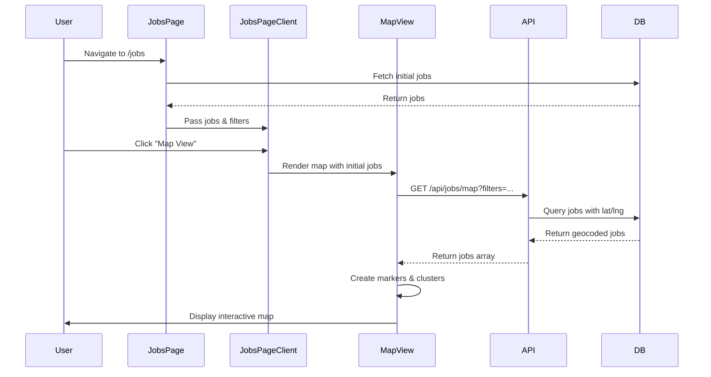
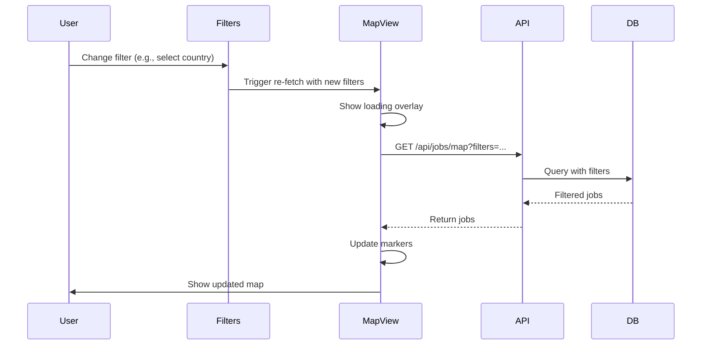
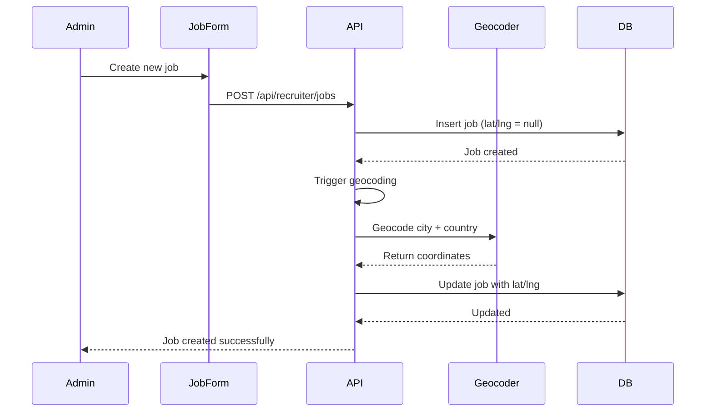
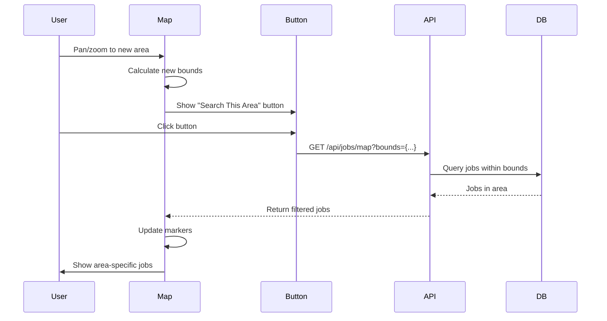

# Map View Feature - Architecture

> **SPARC Phase 3**: System architecture, component hierarchy, and integration points
>
> This document describes the complete architecture of the Map View feature,
> including file structure, component relationships, and data flow patterns.

---

## Table of Contents
1. [File Structure](#file-structure)
2. [Component Hierarchy](#component-hierarchy)
3. [Data Flow Diagrams](#data-flow-diagrams)
4. [Integration Points](#integration-points)
5. [Deployment Strategy](#deployment-strategy)

---

## File Structure

### New Files Created

```
C:\aijobx/
├── app/
│   ├── actions/
│   │   └── map.ts                          # Server actions for geocoding & map data
│   ├── api/
│   │   └── jobs/
│   │       └── map/
│   │           └── route.ts                # API endpoint for map jobs
│   └── jobs/
│       └── MapViewWrapper.tsx              # Client wrapper for map view
│
├── components/
│   └── jobs/
│       ├── JobMap.tsx                      # Main map component (client)
│       ├── JobViewToggle.tsx               # List/Map toggle button
│       ├── JobPreviewCard.tsx              # Job preview on map
│       ├── MapControls.tsx                 # Zoom, location controls
│       └── MapMarker.tsx                   # Custom marker component
│
├── lib/
│   └── map/
│       ├── utils.ts                        # Map utility functions
│       ├── geocoding.ts                    # Geocoding service wrapper
│       ├── clustering.ts                   # Marker clustering logic
│       └── constants.ts                    # Map constants & config
│
├── prisma/
│   ├── migrations/
│   │   └── 20250124_add_geolocation/
│   │       └── migration.sql               # Add lat/lng columns
│   └── schema.prisma                       # Updated with geolocation fields
│
├── scripts/
│   └── backfill-coordinates.ts             # One-time script to geocode existing jobs
│
└── public/
    └── map/
        ├── cluster-icons/                  # Custom cluster marker images
        └── pin-icons/                      # Custom pin marker images
```

### Modified Files

```
C:\aijobx/
├── app/
│   └── jobs/
│       ├── page.tsx                        # Add map view toggle
│       └── JobsPageClient.tsx              # Integrate MapViewWrapper
│
├── components/jobs/
│   └── JobFiltersEnhanced.tsx              # Add "Search This Area" filter
│
├── lib/
│   └── types/
│       └── map.ts                          # New type definitions
│
├── package.json                            # Add Leaflet dependencies
│
└── .env.local                              # Add OPENCAGE_API_KEY
```

---

## Component Hierarchy

### Map View Component Tree

```
JobsPage (Server Component)
└── Navigation
└── JobsPageClient (Client Component)
    ├── JobFiltersEnhanced
    │   └── [Search This Area button]
    │
    └── JobViewToggle
        ├── ListView (default)
        │   └── JobList
        │       └── JobCard[]
        │
        └── MapView (conditional)
            └── MapViewWrapper
                └── JobMap (Client Component)
                    ├── MapContainer (Leaflet)
                    │   ├── TileLayer
                    │   ├── MarkerClusterGroup
                    │   │   └── Marker[]
                    │   │       └── Popup
                    │   │           └── JobPreviewCard
                    │   │
                    │   └── MapControls
                    │       ├── ZoomControl
                    │       ├── LocationControl
                    │       └── SearchControl
                    │
                    └── SelectedJobPreview
                        └── JobPreviewCard
```

### Component Responsibilities

| Component | Type | Responsibilities |
|-----------|------|------------------|
| `JobsPage` | Server | Initial data fetch, metadata |
| `JobsPageClient` | Client | View state, filter management |
| `JobViewToggle` | Client | Switch between list/map views |
| `MapViewWrapper` | Client | Lazy load map, handle SSR |
| `JobMap` | Client | Map rendering, markers, interactions |
| `MapControls` | Client | Zoom, location, search controls |
| `JobPreviewCard` | Client | Job preview UI on map |

---

## Data Flow Diagrams

### 1. Initial Map Load



### 2. Filter Update Flow



### 3. Geocoding Flow (New Job)



### 4. "Search This Area" Flow



---

## Integration Points

### 1. Database Integration

**Schema Changes**:
```prisma
model JobPosting {
  // ... existing fields

  // Geolocation fields
  latitude          Float?    @map("latitude")
  longitude         Float?    @map("longitude")
  geocodedAt        DateTime? @map("geocoded_at")
  geocodeConfidence Float?    @map("geocode_confidence")

  @@index([latitude, longitude], name: "lat_lng_idx")
  @@index([geocodedAt], name: "geocoded_idx")
}
```

**New Queries**:
- `findMany` with lat/lng filters
- Spatial bounding box queries
- Geocoded vs non-geocoded jobs

### 2. External API Integration

**OpenCage Geocoder API**:
```typescript
Endpoint: https://api.opencagedata.com/geocode/v1/json
Method: GET
Rate Limit: 2,500 requests/day (free tier)
Caching: Results cached in database

Request:
  GET https://api.opencagedata.com/geocode/v1/json?q={city},{country}&key={API_KEY}

Response:
  {
    results: [{
      geometry: { lat: number, lng: number },
      confidence: number (0-10),
      formatted: string
    }]
  }
```

**Error Handling**:
- Rate limit exceeded → Use country center fallback
- No results found → Use country center fallback
- Network error → Retry 3 times, then fail gracefully

### 3. Frontend Integration

**Leaflet.js Integration**:
```typescript
Dependencies:
  - leaflet: ^1.9.4                    # Core library
  - react-leaflet: ^4.2.1              # React bindings
  - react-leaflet-cluster: ^2.1.0      # Marker clustering
  - leaflet-geosearch: ^3.11.0         # Search control

CSS:
  - leaflet/dist/leaflet.css           # Core styles
  - Custom cluster styles              # Override default
```

**SSR Considerations**:
```typescript
// Map must be client-side only
import dynamic from 'next/dynamic'

const JobMap = dynamic(() => import('@/components/jobs/JobMap'), {
  ssr: false,
  loading: () => <MapSkeleton />
})
```

### 4. State Management Integration

**React Query Integration**:
```typescript
// Fetch map jobs with caching
const { data: jobs, isLoading } = useQuery({
  queryKey: ['map-jobs', filters, bounds],
  queryFn: () => fetchMapJobs(filters, bounds),
  staleTime: 5 * 60 * 1000,  // 5 minutes
  cacheTime: 10 * 60 * 1000   // 10 minutes
})
```

**LocalStorage Integration**:
```typescript
// Persist user's view preference
const [view, setView] = useState(() => {
  return localStorage.getItem('jobs-view-preference') || 'list'
})

useEffect(() => {
  localStorage.setItem('jobs-view-preference', view)
}, [view])
```

---

## Deployment Strategy

### Phase 1: Database Migration (Week 1, Day 1-2)

**Step 1.1**: Create migration
```bash
npx prisma migrate dev --name add_geolocation_to_jobs
```

**Step 1.2**: Apply to staging
```bash
npx prisma migrate deploy
```

**Step 1.3**: Run backfill script
```bash
npm run backfill:coordinates
```

**Step 1.4**: Verify data
```sql
SELECT
  COUNT(*) as total,
  COUNT(latitude) as geocoded,
  COUNT(latitude) * 100.0 / COUNT(*) as percentage
FROM "JobPosting"
WHERE status = 'ACTIVE';
```

### Phase 2: Feature Flag Rollout (Week 1, Day 3-4)

**Feature Flag**:
```typescript
// lib/features/flags.ts
export const FEATURES = {
  MAP_VIEW: process.env.NEXT_PUBLIC_ENABLE_MAP_VIEW === 'true'
}

// Usage in component
import { FEATURES } from '@/lib/features/flags'

{FEATURES.MAP_VIEW && <JobViewToggle ... />}
```

**Rollout Plan**:
1. Deploy with flag OFF (0% users)
2. Enable for internal team (5-10 users)
3. Enable for 10% of users (A/B test)
4. Monitor metrics for 3 days
5. Gradual rollout: 25% → 50% → 100%

### Phase 3: Monitoring & Optimization (Week 1, Day 5-7)

**Metrics to Track**:
```typescript
// Analytics events
analytics.track('map_view_opened', {
  filters: activeFilters,
  jobCount: visibleJobs.length
})

analytics.track('map_marker_clicked', {
  jobId,
  zoomLevel: map.getZoom()
})

analytics.track('search_this_area_clicked', {
  bounds,
  resultCount
})
```

**Performance Monitoring**:
- Map load time (target: < 2s)
- API response time (target: < 500ms)
- Marker render time (target: < 300ms)
- Error rate (target: < 1%)

**Alerts**:
- Geocoding API rate limit approaching
- Map load time > 5s for 5+ users
- JavaScript errors in map component
- API endpoint returning 500 errors

### Phase 4: Gradual Feature Enhancement (Week 2+)

**Week 2**: Basic optimizations
- Marker icon caching
- Viewport culling optimization
- Mobile gesture improvements

**Week 3**: Advanced features
- Street view integration (if budget allows)
- Saved map locations
- Job density heat map

---

## Architectural Decisions

### Decision 1: Leaflet vs Google Maps

**Chosen**: Leaflet.js

**Rationale**:
| Factor | Leaflet | Google Maps |
|--------|---------|-------------|
| Cost | Free, open source | $7/1000 loads |
| Bundle size | 38KB | 150KB+ |
| Customization | Full control | Limited |
| Mobile performance | Excellent | Good |
| Community | Large, active | Large |

**Trade-offs**:
- ❌ No Google integration (Street View, Places)
- ✅ No usage limits or costs
- ✅ Lighter weight, faster
- ✅ More customizable

### Decision 2: Client-Side Rendering (CSR) vs Server-Side Rendering (SSR)

**Chosen**: Client-Side Rendering (CSR)

**Rationale**:
- Leaflet requires `window` object (not available in SSR)
- Interactive map benefits from client-side state
- Initial data can still be server-fetched
- Use `dynamic` import with `ssr: false`

**Trade-offs**:
- ❌ Slightly slower initial load
- ✅ Better interactivity
- ✅ Simpler implementation
- ✅ No hydration issues

### Decision 3: Geocoding Strategy

**Chosen**: OpenCage Geocoder with database caching

**Rationale**:
- Free tier: 2,500 requests/day (sufficient)
- Results cached in database (no repeated calls)
- ~1,000 active jobs × 1 geocode = well within limit
- Fallback to country centers for failures

**Alternative considered**:
- Google Geocoding API: More accurate, but $5/1000 requests
- Manual coordinate entry: Too time-consuming for recruiters

### Decision 4: Real-time Updates vs Cached Data

**Chosen**: Cached data with periodic refresh

**Rationale**:
- Job postings don't change frequently (minutes, not seconds)
- 5-minute cache reduces API calls by 99%
- "Search This Area" forces fresh fetch
- Acceptable staleness for this use case

**Cache Strategy**:
```typescript
React Query:
  - staleTime: 5 minutes
  - cacheTime: 10 minutes
  - refetchOnWindowFocus: true

CDN:
  - s-maxage: 300 (5 minutes)
  - stale-while-revalidate: 600 (10 minutes)
```

---

## Security Architecture

### 1. API Security

**Rate Limiting**:
```typescript
// middleware.ts
export async function rateLimit(req: Request) {
  const ip = req.headers.get('x-forwarded-for') || 'unknown'
  const key = `map-api:${ip}`

  const requests = await redis.incr(key)
  if (requests === 1) {
    await redis.expire(key, 60)  // 1 minute window
  }

  if (requests > 100) {
    throw new Error('Rate limit exceeded')
  }
}
```

**Input Validation**:
```typescript
// Validate map bounds
const boundsSchema = z.object({
  north: z.number().min(-90).max(90),
  south: z.number().min(-90).max(90),
  east: z.number().min(-180).max(180),
  west: z.number().min(-180).max(180)
}).refine(data => data.north > data.south && data.east > data.west)
```

### 2. Data Privacy

**Location Privacy**:
- User location: Optional, not stored
- Job location: City-level, not exact addresses
- No IP-based tracking
- Geolocation permission: Explicit consent required

**PII Protection**:
- School logos: Public URLs only
- Job details: Publicly available info only
- No candidate data on map
- GDPR compliant (right to be forgotten applies to jobs)

### 3. XSS Prevention

**Content Security Policy**:
```typescript
// next.config.js
const cspHeader = `
  default-src 'self';
  script-src 'self' 'unsafe-eval' 'unsafe-inline';
  style-src 'self' 'unsafe-inline';
  img-src 'self' blob: data: https://*.tile.openstreetmap.org;
  font-src 'self';
  connect-src 'self' https://api.opencagedata.com;
  frame-ancestors 'none';
`
```

**Data Sanitization**:
```typescript
// Sanitize job data before rendering
const sanitizedJob = {
  ...job,
  title: sanitizeHtml(job.title),
  schoolName: sanitizeHtml(job.schoolName),
  city: sanitizeHtml(job.city)
}
```

---

## Accessibility Architecture

### WCAG 2.1 AA Compliance

**Keyboard Navigation**:
```typescript
// Map controls accessible via keyboard
<MapControls
  onZoomIn={() => map.zoomIn()}
  onZoomOut={() => map.zoomOut()}
  onRecenter={() => map.flyTo(center)}
  tabIndex={0}
  role="toolbar"
  aria-label="Map controls"
/>
```

**Screen Reader Support**:
```typescript
// Announce map updates
<div role="status" aria-live="polite" aria-atomic="true">
  {`Showing ${jobs.length} jobs on map`}
</div>

// Marker accessibility
<Marker
  aria-label={`Job: ${job.title} at ${job.schoolName}`}
  tabIndex={0}
  role="button"
/>
```

**Color Contrast**:
- All map controls: Minimum 4.5:1 contrast
- Cluster badges: WCAG AAA (7:1+)
- Focus indicators: 3px outline, high contrast

**Mobile Accessibility**:
- Touch targets: Minimum 44×44px
- Gesture alternatives: Buttons for all actions
- Zoom controls: Large, easy to tap

---

## Performance Architecture

### Optimization Strategies

**1. Code Splitting**:
```typescript
// Lazy load map component
const JobMap = dynamic(() => import('@/components/jobs/JobMap'), {
  ssr: false,
  loading: () => <MapSkeleton />
})

// Split Leaflet from main bundle
// Before: main.js = 500KB
// After: main.js = 350KB, map.js = 150KB (loaded on demand)
```

**2. Marker Clustering**:
```typescript
// Reduce DOM nodes
// Without clustering: 1,000 jobs = 1,000 DOM nodes
// With clustering: 1,000 jobs = 50-100 clusters
// Performance gain: 10x faster rendering
```

**3. Viewport Culling**:
```typescript
// Only render visible markers
const visibleMarkers = jobs.filter(job => {
  return bounds.contains([job.latitude, job.longitude])
})
// Off-screen markers not rendered = better performance
```

**4. Image Optimization**:
```typescript
// School logos: Next.js Image optimization
<Image
  src={job.schoolLogo}
  width={32}
  height={32}
  alt={job.schoolName}
  loading="lazy"
/>
```

### Performance Budget

| Metric | Target | Max |
|--------|--------|-----|
| Bundle size (map chunk) | 100KB | 150KB |
| Map load time (P95) | 2s | 3s |
| Marker render time | 200ms | 500ms |
| API response time | 300ms | 500ms |
| Lighthouse Performance | 90+ | 80+ |

---

**Document Version**: 1.0
**Last Updated**: 2025-01-24
**Status**: Draft → Ready for Implementation Phase
